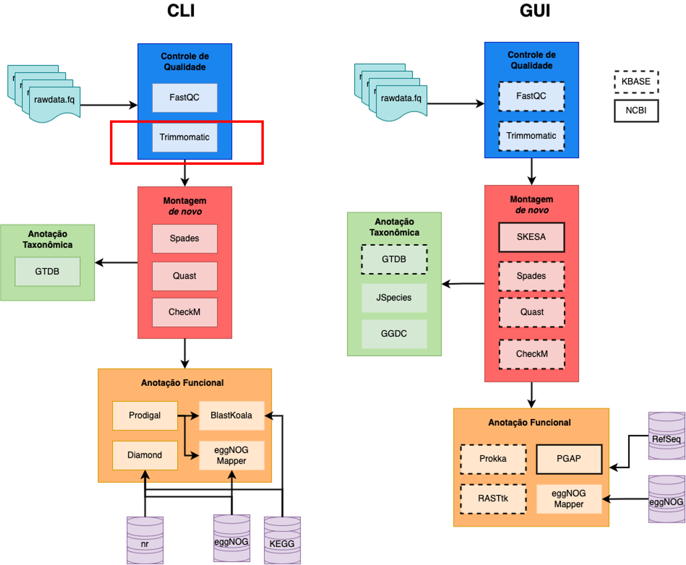

<!-- README.md is generated from README.Rmd. Please edit that file -->

```{r, include = FALSE}
knitr::opts_chunk$set(
  collapse = TRUE,
  comment = "#>",
  fig.path = "imgs/",
  out.width = "100%"
)


```

<!-- badges: start -->
[](https://shields.io/)
[](http://commonmark.org)
[](https://github.com/ellerbrock/open-source-badges/)
<!-- badges: end -->

# Curso Genômica e Metagnômica: Linhas de comando e ferramentas On-line 

### Contéudo programático

**1. Sequenciamento de DNA e RNA** 

|   1.1. Histórico

|   1.2. Sanger

|   1.3. Next Generation Sequence

|   1.4. Sequenciamento por síntese

|   1.5. Detecção de íons de hidrogênio

|   1.6. Sequenciamento por nanoporos

|   1.7. Estratégia de Sequenciamento foco: Genômica e Metagenômica

**2. Noções de linguagem de programação**

|   2.1. Sistema Operacional - GNU/LINUX

|   2.2.  Instalação de ferramentas con Anaconda/Miniconda

**3. Estratégias de Análises Genómicas – Command Line Interface (CLI)**

|   3.1. Controle de Qualidade

|   3.2. Montagem de novo

|   3.3. Avaliação da Montagem

|   3.4. Anotação Taxonômica

|   3.5. Anotação Funcional

|   3.6. Predição de ORFs

|   3.7. Atribuição Funcional das ORFs

|   3.8. Aplicações

**4. Estratégias de Análises Genómicas – Graphical User Interface (GUI)**

|   4.1. KBase

|       4.1.2. Controle de qualidade

|       4.1.3. Trimagem e Filtragem de sequências

|       4.1.4. Motagem de novo

|       4.1.5. Avaliação de montagem

|       4.1.6. Anotação taxonômica

|       4.1.7. Anotação funcional

|   4.2. Introdução a RAPT

|       4.2.1. Montagem de novo com Skesa

|       4.2.2. Anotação Taxonômica (ANI)

|       4.2.3. Anotação Funcional (PGAP)

**5. Estratégias de Análises Metagenómicas – Command Line Interface (CLI)**

|   5.1. Avaliação da qualidade

|   5.2. Cobertura dos Metagenoma

|   5.3. Análise de Distâncias MinHash (abordagem de co-assembly)

|   5.4. Montagem dos Metagenomas

|   5.5. Controle de Qualidade das montagens

|   5.6. Predição das ORFs (Open Reading Frame)

|   5.7. Anotação Funcional

|   5.8. Anotação Taxonômica

|   5.9. Mapeamento

|   5.10. Recuperação de MAGs (Metagenome Assembled Genomes)

|       5.10.1. Qualidade dos MAGs

|       5.10.2. Anotação Taxonômica de MAGs

|       5.10.3. Abundância relativa dos MAGs nas amostras

|   5.11. Análises Downstream

|       5.11.1. R Software

|       5.11.2. RawGraphs.io

**6. Estratégias de Análises Metagenómicas – Graphical User Interface (GUI)**

|   6.1. MGRAST

|   6.2. Kbase

**7. Bonus: Python**

|   7.1. Conceitos básicos

## Pré-requisitos

* Para as análisis usando linha de comando (CLI) é necessário contar com accesso a um terminal baseado em Unix. Por exemplo alguma distribuição de Linux, MacOS, ou no Windows via WSL (*Windows Subsystem for Linux*)

* Conexão a internet


### [SLIDES](https://khidalgo85.github.io/CURSO_SENAI/#1)

---

# Prática I

## 0. Organização dos dados

### 0.1. Descarregando os arquivos

* Descarregue do **Slack** no canal *aula_genomica* os arquivos do genoma que será usado para esta prática (`pair1.fastq` e `pair2.fastq`)

* Usando o explorador de arquivos de Windows, copie os arquivos desde o diretório de *Descargas* de Windows até o diretório `/root/curso_senai/` do subdisco **Ubuntu**

* Abra o aplicativo de **Ubuntu**

### 0.2. Sequências

As sequências foram obtidas por sequenciamento do DNA genômico de uma bactéria pela plataforma Illumina usando o protocolo *paired-end* (2 x 250) 

> **Dica:** Usualmente os arquivos são entregues com nomes codificados do equipamento usado para o sequenciamento que não são informativos para o usuário. Sempre renomee os arquivos com palavras de fácil identificação. Evite espaços e caracteres especiais. Para separar palavras prefira *underline* `_`.

* Onde estou?
```
pwd
```

* Senão estiver no diretório `/root/curso_senai/`, use cd para ir até ele
``` 
cd curso_senai
```

* Troque os nomes dos arquivos `pair1.fastq` e `pair2.fastq` para `genoma_R1.fq` e `genoma_R2.fq`
```
mv pair1.fastq genoma_R1.fq
```
Repita o processo com o outro par

### 0.3. Criação de diretórios

**A organização de seus diretórios durante o processamento bioinformático, fará toda diferença!**

* Crie um diretório base para todo o *pipeline* de genômica, usando o comando `mkdir` (*make dir*)

```
mkdir genomica
```
* Entre ao novo diretório usando o comando `cd` (*change directory*)

```
cd genomica/
```
* Crie um novo diretório para armazenar as sequências brutas.

> **Dica:** Dado que a maiora das etapas do workflow são sequenciais, é recomendável nomear os diretórios começando com um número e assim manter a organização.

```
mkdir 00.DadosBrutos
```

* Crie os demais diretórios em uma linha de comando só
```
mkdir 01.FastqcRelatorios 02.DadosLimpos 03.Montagem 04.QualidadeMontagem 05.AnotacaoTaxonomica 06.PredicaoGenes 07.AnotacaoFuncional
```

* Use o comando `ll` (*list*) para listar o conteúdo do diretório atual

```
ll
```

* Coloque as sequências no diretório `~/curso_senai/genomica/00.DadosBrutos`

Antes de executar os seguintes dois comandos, pense se teria uma maneira mais eficiente de fazer essa tarefa
```
mv genoma_R1.fq 00.DadosBrutos/
```
Seguinte pair
```
mv genoma_R2.fq 00.DadosBrutos/
```

> **Desafio:** 
>
> Use os comandos básicos para explorar o arquivo. 
>
> *Dicas:*
>
> * Visualizar 
>
> * Contar número de sequências 
>
> * Tamanho dos arquivos

## 1. Controle de Qualidade

```{r, echo=FALSE, fig.align = 'center', out.width = "60%"}

```

### 1.1. Checagem da qualidade

Para a avaliação de qualidade das sequências será usado o programa [FastQC](http://www.bioinformatics.babraham.ac.uk/projects/fastqc/), que é uma ferramenta que lê os códigos *ASCII*, transforma em valores de *Phred* e apresenta graficamente estas informações.

#### 1.1.1. Instalação de FastQC com `conda`

Se o `conda` estiver ativo na máquina, deve aparecer no começo da linha de comando `(base)` p.e. `(base) aluno@senai $`. Senão digite o seguinte código:

```
source /root/anaconda3/bin/activate
```
A instalação de ferramentas usando o `conda` requer a criação de ambientes/containers, onde podem ser organizadas as ferramentas para cada etapa do *Workflow* p.e. `qualidade`, `montagem`, `anotacao`.

Crie um ambiente chamado **qualidade**, onde serão instaladas as ferramentas relacionadas com controle de qualidade.

O comando para criar ambientes é:
```
conda create -n qualidade
```
Durante o processo, o sistema preguntará se deseja proceder com a creação do ambiente, com as opções *y/n* (sim ou não). Dígite `y` para o ambiente ser criado.

Para a instalação de ferramentas dentro dos ambientes, é necessário ativar eles:
```
conda activate qualidade
```

O ambiente estará ativo quando o nome se encontre ao começo da linha de comando,
assim: `(qualidade) user@server:~/$`

Para a instalação dígite
```
conda install -c bioconda fastqc
```
Dígite `y` quando o sistema pedir confirmação.

Pronto a ferramenta está instalada.

`bioconda` é um canal dentro de Anaconda onde os desenvolvedores de ferramentas de bioinformática colocam elas para uso público em uma nuvem. Colocando esse canal no comando de instalação, estaremos acessando a ele para instalar a ferramenta que desejamos.

Alguns comandos úteis de `conda`:
* Para listar programas instalados dentro do ambiente atual: `conda list`
* Para listar os ambientes criados na máquina: `conda env list`

#### 1.1.2. Execução
A maioria das ferramentas tem um manual de ajuda, o qual pode ser acessado usando o argumento `-- help` ou `-h`.

Acesse ao manual de ajuda de `fastqc` digitando. (Lembre que ambiente de conda onde foi instalado tem que estar ativo)
```
fastqc --help
```
**Help** do `fastqc`
```
FastQC - A high throughput sequence QC analysis tool
SYNOPSIS
	fastqc seqfile1 seqfile2 .. seqfileN
    fastqc [-o output dir] [--(no)extract] [-f fastq|bam|sam]
           [-c contaminant file] seqfile1 .. seqfileN
DESCRIPTION
    FastQC reads a set of sequence files and produces from each one a quality
    control report consisting of a number of different modules, each one of
    which will help to identify a different potential type of problem in your
    data.
    If no files to process are specified on the command line then the program
    will start as an interactive graphical application.  If files are provided
    on the command line then the program will run with no user interaction
    required.  In this mode it is suitable for inclusion into a standardised
    analysis pipeline.
    
    The options for the program as as follows:
    
    -h --help       Print this help file and exit
    
    -v --version    Print the version of the program and exit
    
    -o --outdir     Create all output files in the specified output directory.
                    Please note that this directory must exist as the program
                    will not create it.  If this option is not set then the 
                    output file for each sequence file is created in the same
                    directory as the sequence file which was processed.
                    
    --casava        Files come from raw casava output. Files in the same sample
                    group (differing only by the group number) will be analysed
                    as a set rather than individually. Sequences with the filter
                    flag set in the header will be excluded from the analysis.
                    Files must have the same names given to them by casava
                    (including being gzipped and ending with .gz) otherwise they
                    won't be grouped together correctly.
                    
    --nano          Files come from nanopore sequences and are in fast5 format. In
                    this mode you can pass in directories to process and the program
                    will take in all fast5 files within those directories and produce
                    a single output file from the sequences found in all files.                    
                    
    --nofilter      If running with --casava then don't remove read flagged by
                    casava as poor quality when performing the QC analysis.
                   
    --extract       If set then the zipped output file will be uncompressed in
                    the same directory after it has been created. If --delete is 
                    also specified then the zip file will be removed after the 
                    contents are unzipped. 
                    
    -j --java       Provides the full path to the java binary you want to use to
                    launch fastqc. If not supplied then java is assumed to be in
                    your path.
                   
    --noextract     Do not uncompress the output file after creating it.  You
                    should set this option if you do not wish to uncompress
                    the output when running in non-interactive mode.
                    
    --nogroup       Disable grouping of bases for reads >50bp. All reports will
                    show data for every base in the read.  WARNING: Using this
                    option will cause fastqc to crash and burn if you use it on
                    really long reads, and your plots may end up a ridiculous size.
                    You have been warned!
                    
    --min_length    Sets an artificial lower limit on the length of the sequence
                    to be shown in the report.  As long as you set this to a value
                    greater or equal to your longest read length then this will be
                    the sequence length used to create your read groups.  This can
                    be useful for making directly comaparable statistics from 
                    datasets with somewhat variable read lengths.

    --dup_length    Sets a length to which the sequences will be truncated when 
                    defining them to be duplicates, affecting the duplication and
                    overrepresented sequences plot.  This can be useful if you have
                    long reads with higher levels of miscalls, or contamination with
                    adapter dimers containing UMI sequences.

                    
    -f --format     Bypasses the normal sequence file format detection and
                    forces the program to use the specified format.  Valid
                    formats are bam,sam,bam_mapped,sam_mapped and fastq
                    

    --memory        Sets the base amount of memory, in Megabytes, used to process 
                    each file.  Defaults to 512MB.  You may need to increase this if
                    you have a file with very long sequences in it.
                
    --svg           Save the graphs in the report in SVG format.

    -t --threads    Specifies the number of files which can be processed
                    simultaneously.  Each thread will be allocated 250MB of
                    memory so you shouldn't run more threads than your
                    available memory will cope with, and not more than
                    6 threads on a 32 bit machine
                  
    -c              Specifies a non-default file which contains the list of
    --contaminants  contaminants to screen overrepresented sequences against.
                    The file must contain sets of named contaminants in the
                    form name[tab]sequence.  Lines prefixed with a hash will
                    be ignored.

    -a              Specifies a non-default file which contains the list of
    --adapters      adapter sequences which will be explicity searched against
                    the library. The file must contain sets of named adapters
                    in the form name[tab]sequence.  Lines prefixed with a hash
                    will be ignored.
                    
    -l              Specifies a non-default file which contains a set of criteria
    --limits        which will be used to determine the warn/error limits for the
                    various modules.  This file can also be used to selectively 
                    remove some modules from the output all together.  The format
                    needs to mirror the default limits.txt file found in the
                    Configuration folder.
                    
   -k --kmers       Specifies the length of Kmer to look for in the Kmer content
                    module. Specified Kmer length must be between 2 and 10. Default
                    length is 7 if not specified.
                    
   -q --quiet       Suppress all progress messages on stdout and only report errors.
   
   -d --dir         Selects a directory to be used for temporary files written when
                    generating report images. Defaults to system temp directory if
                    not specified.
                    
BUGS

    Any bugs in fastqc should be reported either to simon.andrews@babraham.ac.uk
    or in www.bioinformatics.babraham.ac.uk/bugzilla/
```

**Sintaxe**

```
fastqc -t <num núcleos> <arquivo_de_entrada.fq> -o <diretório_de_saida>
```

Sendo:

* `arquivo_entrada.fq`: o arquivo de sequências a ser analisado. Pode ser um arquivo ou vários.
* `diretório_de_saida`: o diretório onde serão armazenados os arquivos de saída

> **Atenção:** Para o uso correto e seguro da máquina verifique o número de núcleos disponíveis para o usuário no momento da análise. **NUNCA** trabalhe com o total dos núcleos da máquina.

* Execute `fastqc`. Use como diretório base `~/curso_senai/genomica`

```
$ fastqc 00.DadosBrutos/* -o 01.FastqcRelatorios/
```

* Os elementos de saída serão um arquivo `.html` e um `.zip` para cada par (R1 e R2)

* Vamos a explorar os arquivos `genome_R1.fastqc.html` e `genome_R2_fastqc.html`, os quais são os relatórios com todas as informações de qualidade.

* Estes arquivos podem ser abertos no explorador de internet (p.e *Google Chrome*, *Internet Explorer*)

* O *read R* normalmente tem uma qualidade inferior, explicado pelo fato de que o tamanho dos clusters diminui durante a amplificação em ponte durante a rotação das sequências, que ocorre antes da leitura 2 ser sequenciada.

Para maiores detalhes sobre a interpretação e análise dos relatórios do FastQC consulte [aqui](https://www.bioinformatics.babraham.ac.uk/projects/fastqc/Help/3%20Analysis%20Modules/).

### 1.2. Trimagem e filtragem de sequências

[Trimmomatic](http://www.usadellab.org/cms/?page=trimmomatic) é um programa pra filtrar (remover) *reads* e/ou bases de baixa qualidade.

Trimmomatic tem vários parâmetros que podem ser considerados para filtrar leituras com baixa qualidade. No presente tutorial usaremos alguns deles. Se quiser saber que otros parâmetros e como funciona cada um deles, consulte o [manual](http://www.usadellab.org/cms/uploads/supplementary/Trimmomatic/TrimmomaticManual_V0.32.pdf).

> **Alguns dos parâmetros são:**
>
>* *SLIDINGWINDOW*: Executa uma abordagem de corte de janela deslizante e corta a leitura quando a qualidade média dentro da janela cai abaixo de um limite.
>
>* *LEADING*: Corta as bases no início de uma leitura, se estiver abaixo de um limite de qualidade
>
>* *TRAILING*: Corta bases no final de uma leitura, se estiver abaixo de um limite de qualidade
>
>* *CROP*: Corta a leitura em um comprimento especificado removendo as bases da extremidade
>
>* *HEADCROP*: Corta o número especificado de bases desde o início da leitura
>
>* *MINLEN*: Elimina a leitura se estiver abaixo de um comprimento especificado

#### 1.2.1. Instalação de Trimmomatic com `conda`

Como se trata de uma ferramenta que participa dentro do processo de control de qualidade, será instalada dentro do ambiente virtual *qualidade*.

* Senão estiver ativo o ambiente qualidade, ativé-o

```
conda activate qualidade
```
* Para a instalação use o código embaixo:

```
$ conda install -c bioconda trimmomatic
```

#### 1.2.2. Execução

**Sintaxe**

```
trimmomatic PE -threads <num_nucleos> <arquivo_entrada_R1> <arquivo_entrada_R2> <arquivo_saida_pair_R1> <arquivo_saida_unpair_R2> <arquivo_saida_pair_R1> <arquivo_saida_unpair_R1> [argumentos]
```

* Segundo os resultados obtidos da qualidade execute o seguinte comando do Trimmomatic:
```
trimmomatic PE -threads 10 00.DadosBrutos/genoma_R1.fq 00.DadosBrutos/genoma_R2.fq 02.DadosLimpos/genoma_R1.pair.fq 02.DadosLimpos/genoma_R1.unpair.fq 02.DadosLimpos/genoma_R2.pair.fq 02.DadosLimpos/genoma_R2.unpair.fq LEADING:3 TRAILING:3 CROP:249 HEADCROP:15 SLIDINGWINDOW:4:15 MINLEN:100
```

> **Desafio:** 
>
> Use os comandos básicos para explorar os arquivos das sequências limpas 
>
> *Dicas:*
>
> * Visualizar
>
> * Contar número de sequências (compare com o número de sequências brutas)

Verifique que a etapa de trimagem e filtragem foi bem sucedida executando FastQC para as sequências pareadas (`02.DadosLimpos/genoma_R1.pair.fq` e `02.DadosLimpos/genoma_R2.pair.fq`).

```
fastqc 02.DadosLimpos/*.pair.fq -o 01.FastqcRelatorios/
```

## 2. Montagem *de novo*

### 2.1. Montagem com `Spades`

Uma montagem é o processo de alinhamento de sequências curtas com o objetivo de recuperar uma sequência maior. No caso da montagem *de novo* são usados algorítmos baseados em *k-mers*, que são subsequências com tamanho definido pelo usuário (i.e. 21-mers).

O programa [Spades](https://github.com/ablab/spades) usao o algorítmo do grafo de De Bruijn para a montagem de *short reads*

#### 2.1.1. Instalação de Spades com `conda`

* Crie um novo ambiente chamado `montagem`. Se não aparece `(base)` ou o nome de outro ambiente no inicio da linha de comando, deve ativar o conda, com (`source /root/anaconda3/bin/activate `)
```
conda create -n montagem
```
* Confirme com `y`

* Quando terminar o processo de criação do ambiente, ative ele
```
conda activate montagem
```
* Instale Spades com:
```
conda install -c bioconda spades
```

* Confirme com `y`

#### 2.1.2. Execução

**Sintaxe**
```
spades.py -1 <pair1> -2 <pair2> -k <lista de kmers> -o <diretorio_de_saida> -t <num_nucleos>
```

O flag `--careful` tenta reduzir o número de mismatches e indels curtos. É recomendado para montagem de genomas de procariotas.

No [manual](http://cab.spbu.ru/files/release3.15.2/manual.html) encontra mais detalhes.

Antes de fazer a montagem, exploremos o `help` de spades
```
spades.py --help
```

A montagem será realizada executando o comando:

>**Dica:** O program nohup permite executar tarefas em segundo plano, com o objetivo de manter a execução do comando ainda com a perda da conexão.

```
nohup spades.py --careful -1 02.DadosLimpos/genoma_R1.pair.fq -2 02.DadosLimpos/genoma_R2.pair.fq -k 21,33,55,77,99,111,127 -o 03.Montagem/ -t 3 &
```

Vamos a explorar os arquivos de saída. O que é um arquivo fasta?

> **Desafio**
>
> Agora que sabe como está organizado um arquivo `.fasta`, usando comandos básicos avalie o número de contigs e de scafolds da montagem.

### 2.2. Avaliação da montagem

A montagem precisa ser avaliada através de métricas que representam qualidade do genoma. Neste paso será calculado o N50, o número de contigs, o tamanho do genoma, a completude e o nível de contaminação. 

Primeiro será usado o progama [Quast](http://quast.sourceforge.net/), que gera um relatório com a maioria das métricas (i.e. N50, número de contigs, tamanho dos contigs, etc). Depois será usado o a ferramenta [CheckM](https://github.com/Ecogenomics/CheckM/wiki) para avaliar a completude e a contaminação da montagem. Este programa usa base de dados própria de genes ortologos de cópia única.

#### 2.2.1. Instalação de Quast com `conda`

Devido a incompatibilidades do `quast` com a maioria das ferramentas, é necessário instalar ele num ambiente virtual diferente e só para ele

```
conda create -n quast
```

* Ative o ambiente

```
conda activate quast
```

* Instale quast

```
conda install -c bioconda quast
```

#### 2.2.2. Instalação de CheckM com `conda`

O `checkm` também precisa de um ambiente separado 

* Crie o ambiente `checkm`

```
conda create -n checkm
```

* Ative o ambiente

```
conda activate checkm
```

* Instale checkm

```
conda install -c bioconda checkm-genome
```

#### 2.2.3. Execução

**Sintaxe**
```
quast <input_assembly> -o <output_directory> -t <num_nucleos> [opções]
```

Para gerar o relatório com as métricas de `quast` use o seguinte comando (**lembre: primeiro deve ativar o ambiente onde está instalado `quast`**):

```
quast 03.Montagem/scaffolds.fasta -o 04.QualidadeMontagem/ --threads 3
```

Abra o arquivo `04.QualidadeMontagem/report.html` no explorador de internet, onde poderá explorar todas as métricas de qualidade. 

> **Dica:** Esta ferramenta permite comparar diversas montagens das mesmas sequências obtidas de diferentes montadores e/ou executados com diferentes parâmetros. Esta estrategia permite escolher a melhor montagem. Para maiores detalhes, visete o [manual](http://quast.sourceforge.net/docs/manual.html)

Contigs com tamanho menor de 600 bp não tem um valor representativo na montagem, é recomendável filtrar essas sequências. 

O programa bbmap tem um script que permite realizar a filtragem por tamanho. Crie um ambiente de conda chamado `bioinfo`, ative ele, e instale com o seguinte comando a ferramenta `bbmap`

```
conda install -c bioconda bbmap
```

Para filtrar contigs menores de 600 use o seguinte código:

``` 
reformat.sh in=03.Montagem/scaffolds.fasta out=03.Montagem/genoma_scaffolds_filtrado.fasta minlength=600
```

Agora para avaliar a completude e a contaminação, execute `checkm`. Lembre de ativar o ambiente `checkm`

**Sintaxe**

```
checkm lineage_wf <input_directory/> <output_directory/> -t <num_nucleos> -x <format> --tab > output.txt
```

Execute a ánalise para a montagem completa e filtrada com o seguinte comando:
```
checkm lineage_wf 03.Montagem/ 04.QualidadeMontagem/ -t 3 -x fasta --tab > 04.QualidadeMontagem/output.txt
```

Explore o arquivo de saída `04.QualidadeMontagem/output.txt` usando o comando `less`. Descarregue o relatório no seu computador.

Para mais detalhes sobre a interpretação do relatório visite este [link.](https://www.biostars.org/p/447744/)
