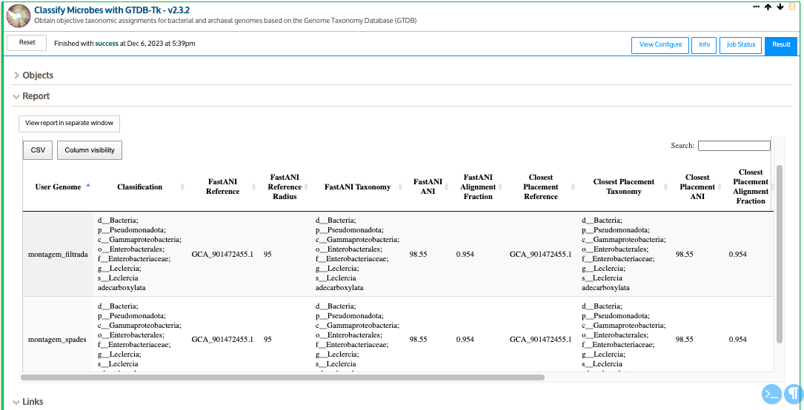

<!-- README.md is generated from README.Rmd. Please edit that file -->

```{r, include = FALSE}
knitr::opts_chunk$set(
  collapse = TRUE,
  comment = "#>",
  fig.path = "imgs/",
  out.width = "100%"
)


```

<!-- badges: start -->
[](https://shields.io/)
[](http://commonmark.org)
[](https://github.com/ellerbrock/open-source-badges/)
<!-- badges: end -->

# Curso Genômica e Metagnômica: Linhas de comando e ferramentas On-line 

### Contéudo programático

**1. Sequenciamento de DNA e RNA** 

|   1.1. Histórico

|   1.2. Sanger

|   1.3. Next Generation Sequence

|   1.4. Sequenciamento por síntese

|   1.5. Detecção de íons de hidrogênio

|   1.6. Sequenciamento por nanoporos

|   1.7. Estratégia de Sequenciamento foco: Genômica e Metagenômica

**2. Noções de linguagem de programação**

|   2.1. Sistema Operacional - GNU/LINUX

|   2.2.  Instalação de ferramentas con Anaconda/Miniconda

**3. Estratégias de Análises Genómicas – Command Line Interface (CLI)**

|   3.1. Controle de Qualidade

|   3.2. Montagem de novo

|   3.3. Avaliação da Montagem

|   3.4. Anotação Taxonômica

|   3.5. Anotação Funcional

|   3.6. Predição de ORFs

|   3.7. Atribuição Funcional das ORFs

|   3.8. Aplicações

**4. Estratégias de Análises Genómicas – Graphical User Interface (GUI)**

|   4.1. KBase

|       4.1.2. Controle de qualidade

|       4.1.3. Trimagem e Filtragem de sequências

|       4.1.4. Motagem de novo

|       4.1.5. Avaliação de montagem

|       4.1.6. Anotação taxonômica

|       4.1.7. Anotação funcional

|   4.2. Introdução a RAPT

|       4.2.1. Montagem de novo com Skesa

|       4.2.2. Anotação Taxonômica (ANI)

|       4.2.3. Anotação Funcional (PGAP)

**5. Estratégias de Análises Metagenómicas – Command Line Interface (CLI)**

|   5.1. Avaliação da qualidade

|   5.2. Cobertura dos Metagenoma

|   5.3. Análise de Distâncias MinHash (abordagem de co-assembly)

|   5.4. Montagem dos Metagenomas

|   5.5. Controle de Qualidade das montagens

|   5.6. Predição das ORFs (Open Reading Frame)

|   5.7. Anotação Funcional

|   5.8. Anotação Taxonômica

|   5.9. Mapeamento

|   5.10. Recuperação de MAGs (Metagenome Assembled Genomes)

|       5.10.1. Qualidade dos MAGs

|       5.10.2. Anotação Taxonômica de MAGs

|       5.10.3. Abundância relativa dos MAGs nas amostras

|   5.11. Análises Downstream

|       5.11.1. R Software

|       5.11.2. RawGraphs.io

**6. Estratégias de Análises Metagenómicas – Graphical User Interface (GUI)**

|   6.1. MGRAST

|   6.2. Kbase

**7. Bonus: Python**

|   7.1. Conceitos básicos

## Pré-requisitos

* Para as análisis usando linha de comando (CLI) é necessário contar com accesso a um terminal baseado em Unix. Por exemplo alguma distribuição de Linux, MacOS, ou no Windows via WSL (*Windows Subsystem for Linux*)

* Conexão a internet


### [SLIDES](https://khidalgo85.github.io/CURSO_SENAI/#1)

---

# Prática I

## 0. Organização dos dados

### 0.1. Descarregando os arquivos

* Descarregue do **Slack** no canal *aula_genomica* os arquivos do genoma que será usado para esta prática (`pair1.fastq` e `pair2.fastq`)

* Usando o explorador de arquivos de Windows, copie os arquivos desde o diretório de *Descargas* de Windows até o diretório `/root/curso_senai/` do subdisco **Ubuntu**

* Abra o aplicativo de **Ubuntu**

### 0.2. Sequências

As sequências foram obtidas por sequenciamento do DNA genômico de uma bactéria pela plataforma Illumina usando o protocolo *paired-end* (2 x 250) 

> **Dica:** Usualmente os arquivos são entregues com nomes codificados do equipamento usado para o sequenciamento que não são informativos para o usuário. Sempre renomee os arquivos com palavras de fácil identificação. Evite espaços e caracteres especiais. Para separar palavras prefira *underline* `_`.

* Onde estou?
```
pwd
```

* Senão estiver no diretório `/root/curso_senai/`, use cd para ir até ele
``` 
cd curso_senai
```

* Troque os nomes dos arquivos `pair1.fastq` e `pair2.fastq` para `genoma_R1.fq` e `genoma_R2.fq`
```
mv pair1.fastq genoma_R1.fq
```
Repita o processo com o outro par

### 0.3. Criação de diretórios

**A organização de seus diretórios durante o processamento bioinformático, fará toda diferença!**

* Crie um diretório base para todo o *pipeline* de genômica, usando o comando `mkdir` (*make dir*)

```
mkdir genomica
```
* Entre ao novo diretório usando o comando `cd` (*change directory*)

```
cd genomica/
```
* Crie um novo diretório para armazenar as sequências brutas.

> **Dica:** Dado que a maiora das etapas do workflow são sequenciais, é recomendável nomear os diretórios começando com um número e assim manter a organização.

```
mkdir 00.DadosBrutos
```

* Crie os demais diretórios em uma linha de comando só
```
mkdir 01.FastqcRelatorios 02.DadosLimpos 03.Montagem 04.QualidadeMontagem 05.AnotacaoTaxonomica 06.PredicaoGenes 07.AnotacaoFuncional
```

* Use o comando `ll` (*list*) para listar o conteúdo do diretório atual

```
ll
```

* Coloque as sequências no diretório `~/curso_senai/genomica/00.DadosBrutos`

Antes de executar os seguintes dois comandos, pense se teria uma maneira mais eficiente de fazer essa tarefa
```
mv genoma_R1.fq 00.DadosBrutos/
```
Seguinte pair
```
mv genoma_R2.fq 00.DadosBrutos/
```

> **Desafio:** 
>
> Use os comandos básicos para explorar o arquivo. 
>
> *Dicas:*
>
> * Visualizar 
>
> * Contar número de sequências 
>
> * Tamanho dos arquivos

## 1. Controle de Qualidade

```{r, echo=FALSE, fig.align = 'center', out.width = "60%"}
knitr::include_graphics("docs/03.Images/workflow3.png")
```

### 1.1. Checagem da qualidade

Para a avaliação de qualidade das sequências será usado o programa [FastQC](http://www.bioinformatics.babraham.ac.uk/projects/fastqc/), que é uma ferramenta que lê os códigos *ASCII*, transforma em valores de *Phred* e apresenta graficamente estas informações.

#### 1.1.1. Instalação de FastQC com `conda`

Se o `conda` estiver ativo na máquina, deve aparecer no começo da linha de comando `(base)` p.e. `(base) aluno@senai $`. Senão digite o seguinte código:

```
source /root/anaconda3/bin/activate
```
A instalação de ferramentas usando o `conda` requer a criação de ambientes/containers, onde podem ser organizadas as ferramentas para cada etapa do *Workflow* p.e. `qualidade`, `montagem`, `anotacao`.

Crie um ambiente chamado **qualidade**, onde serão instaladas as ferramentas relacionadas com controle de qualidade.

O comando para criar ambientes é:
```
conda create -n qualidade
```
Durante o processo, o sistema preguntará se deseja proceder com a creação do ambiente, com as opções *y/n* (sim ou não). Dígite `y` para o ambiente ser criado.

Para a instalação de ferramentas dentro dos ambientes, é necessário ativar eles:
```
conda activate qualidade
```

O ambiente estará ativo quando o nome se encontre ao começo da linha de comando,
assim: `(qualidade) user@server:~/$`

Para a instalação dígite
```
conda install -c bioconda fastqc
```
Dígite `y` quando o sistema pedir confirmação.

Pronto a ferramenta está instalada.

`bioconda` é um canal dentro de Anaconda onde os desenvolvedores de ferramentas de bioinformática colocam elas para uso público em uma nuvem. Colocando esse canal no comando de instalação, estaremos acessando a ele para instalar a ferramenta que desejamos.

Alguns comandos úteis de `conda`:
* Para listar programas instalados dentro do ambiente atual: `conda list`
* Para listar os ambientes criados na máquina: `conda env list`

#### 1.1.2. Execução
A maioria das ferramentas tem um manual de ajuda, o qual pode ser acessado usando o argumento `-- help` ou `-h`.

Acesse ao manual de ajuda de `fastqc` digitando. (Lembre que ambiente de conda onde foi instalado tem que estar ativo)
```
fastqc --help
```
**Help** do `fastqc`
```
FastQC - A high throughput sequence QC analysis tool
SYNOPSIS
	fastqc seqfile1 seqfile2 .. seqfileN
    fastqc [-o output dir] [--(no)extract] [-f fastq|bam|sam]
           [-c contaminant file] seqfile1 .. seqfileN
DESCRIPTION
    FastQC reads a set of sequence files and produces from each one a quality
    control report consisting of a number of different modules, each one of
    which will help to identify a different potential type of problem in your
    data.
    If no files to process are specified on the command line then the program
    will start as an interactive graphical application.  If files are provided
    on the command line then the program will run with no user interaction
    required.  In this mode it is suitable for inclusion into a standardised
    analysis pipeline.
    
    The options for the program as as follows:
    
    -h --help       Print this help file and exit
    
    -v --version    Print the version of the program and exit
    
    -o --outdir     Create all output files in the specified output directory.
                    Please note that this directory must exist as the program
                    will not create it.  If this option is not set then the 
                    output file for each sequence file is created in the same
                    directory as the sequence file which was processed.
                    
    --casava        Files come from raw casava output. Files in the same sample
                    group (differing only by the group number) will be analysed
                    as a set rather than individually. Sequences with the filter
                    flag set in the header will be excluded from the analysis.
                    Files must have the same names given to them by casava
                    (including being gzipped and ending with .gz) otherwise they
                    won't be grouped together correctly.
                    
    --nano          Files come from nanopore sequences and are in fast5 format. In
                    this mode you can pass in directories to process and the program
                    will take in all fast5 files within those directories and produce
                    a single output file from the sequences found in all files.                    
                    
    --nofilter      If running with --casava then don't remove read flagged by
                    casava as poor quality when performing the QC analysis.
                   
    --extract       If set then the zipped output file will be uncompressed in
                    the same directory after it has been created. If --delete is 
                    also specified then the zip file will be removed after the 
                    contents are unzipped. 
                    
    -j --java       Provides the full path to the java binary you want to use to
                    launch fastqc. If not supplied then java is assumed to be in
                    your path.
                   
    --noextract     Do not uncompress the output file after creating it.  You
                    should set this option if you do not wish to uncompress
                    the output when running in non-interactive mode.
                    
    --nogroup       Disable grouping of bases for reads >50bp. All reports will
                    show data for every base in the read.  WARNING: Using this
                    option will cause fastqc to crash and burn if you use it on
                    really long reads, and your plots may end up a ridiculous size.
                    You have been warned!
                    
    --min_length    Sets an artificial lower limit on the length of the sequence
                    to be shown in the report.  As long as you set this to a value
                    greater or equal to your longest read length then this will be
                    the sequence length used to create your read groups.  This can
                    be useful for making directly comaparable statistics from 
                    datasets with somewhat variable read lengths.

    --dup_length    Sets a length to which the sequences will be truncated when 
                    defining them to be duplicates, affecting the duplication and
                    overrepresented sequences plot.  This can be useful if you have
                    long reads with higher levels of miscalls, or contamination with
                    adapter dimers containing UMI sequences.

                    
    -f --format     Bypasses the normal sequence file format detection and
                    forces the program to use the specified format.  Valid
                    formats are bam,sam,bam_mapped,sam_mapped and fastq
                    

    --memory        Sets the base amount of memory, in Megabytes, used to process 
                    each file.  Defaults to 512MB.  You may need to increase this if
                    you have a file with very long sequences in it.
                
    --svg           Save the graphs in the report in SVG format.

    -t --threads    Specifies the number of files which can be processed
                    simultaneously.  Each thread will be allocated 250MB of
                    memory so you shouldn't run more threads than your
                    available memory will cope with, and not more than
                    6 threads on a 32 bit machine
                  
    -c              Specifies a non-default file which contains the list of
    --contaminants  contaminants to screen overrepresented sequences against.
                    The file must contain sets of named contaminants in the
                    form name[tab]sequence.  Lines prefixed with a hash will
                    be ignored.

    -a              Specifies a non-default file which contains the list of
    --adapters      adapter sequences which will be explicity searched against
                    the library. The file must contain sets of named adapters
                    in the form name[tab]sequence.  Lines prefixed with a hash
                    will be ignored.
                    
    -l              Specifies a non-default file which contains a set of criteria
    --limits        which will be used to determine the warn/error limits for the
                    various modules.  This file can also be used to selectively 
                    remove some modules from the output all together.  The format
                    needs to mirror the default limits.txt file found in the
                    Configuration folder.
                    
   -k --kmers       Specifies the length of Kmer to look for in the Kmer content
                    module. Specified Kmer length must be between 2 and 10. Default
                    length is 7 if not specified.
                    
   -q --quiet       Suppress all progress messages on stdout and only report errors.
   
   -d --dir         Selects a directory to be used for temporary files written when
                    generating report images. Defaults to system temp directory if
                    not specified.
                    
BUGS

    Any bugs in fastqc should be reported either to simon.andrews@babraham.ac.uk
    or in www.bioinformatics.babraham.ac.uk/bugzilla/
```

**Sintaxe**

```
fastqc -t <num núcleos> <arquivo_de_entrada.fq> -o <diretório_de_saida>
```

Sendo:

* `arquivo_entrada.fq`: o arquivo de sequências a ser analisado. Pode ser um arquivo ou vários.
* `diretório_de_saida`: o diretório onde serão armazenados os arquivos de saída

> **Atenção:** Para o uso correto e seguro da máquina verifique o número de núcleos disponíveis para o usuário no momento da análise. **NUNCA** trabalhe com o total dos núcleos da máquina.

* Execute `fastqc`. Use como diretório base `~/curso_senai/genomica`

```
$ fastqc 00.DadosBrutos/* -o 01.FastqcRelatorios/
```

* Os elementos de saída serão um arquivo `.html` e um `.zip` para cada par (R1 e R2)

* Vamos a explorar os arquivos `genome_R1.fastqc.html` e `genome_R2_fastqc.html`, os quais são os relatórios com todas as informações de qualidade.

* Estes arquivos podem ser abertos no explorador de internet (p.e *Google Chrome*, *Internet Explorer*)

* O *read R* normalmente tem uma qualidade inferior, explicado pelo fato de que o tamanho dos clusters diminui durante a amplificação em ponte durante a rotação das sequências, que ocorre antes da leitura 2 ser sequenciada.

Para maiores detalhes sobre a interpretação e análise dos relatórios do FastQC consulte [aqui](https://www.bioinformatics.babraham.ac.uk/projects/fastqc/Help/3%20Analysis%20Modules/).

### 1.2. Trimagem e filtragem de sequências

[Trimmomatic](http://www.usadellab.org/cms/?page=trimmomatic) é um programa pra filtrar (remover) *reads* e/ou bases de baixa qualidade.

Trimmomatic tem vários parâmetros que podem ser considerados para filtrar leituras com baixa qualidade. No presente tutorial usaremos alguns deles. Se quiser saber que otros parâmetros e como funciona cada um deles, consulte o [manual](http://www.usadellab.org/cms/uploads/supplementary/Trimmomatic/TrimmomaticManual_V0.32.pdf).

> **Alguns dos parâmetros são:**
>
>* *SLIDINGWINDOW*: Executa uma abordagem de corte de janela deslizante e corta a leitura quando a qualidade média dentro da janela cai abaixo de um limite.
>
>* *LEADING*: Corta as bases no início de uma leitura, se estiver abaixo de um limite de qualidade
>
>* *TRAILING*: Corta bases no final de uma leitura, se estiver abaixo de um limite de qualidade
>
>* *CROP*: Corta a leitura em um comprimento especificado removendo as bases da extremidade
>
>* *HEADCROP*: Corta o número especificado de bases desde o início da leitura
>
>* *MINLEN*: Elimina a leitura se estiver abaixo de um comprimento especificado

#### 1.2.1. Instalação de Trimmomatic com `conda`

Como se trata de uma ferramenta que participa dentro do processo de control de qualidade, será instalada dentro do ambiente virtual *qualidade*.

* Senão estiver ativo o ambiente qualidade, ativé-o

```
conda activate qualidade
```
* Para a instalação use o código embaixo:

```
$ conda install -c bioconda trimmomatic
```

#### 1.2.2. Execução

**Sintaxe**

```
trimmomatic PE -threads <num_nucleos> <arquivo_entrada_R1> <arquivo_entrada_R2> <arquivo_saida_pair_R1> <arquivo_saida_unpair_R2> <arquivo_saida_pair_R1> <arquivo_saida_unpair_R1> [argumentos]
```

* Segundo os resultados obtidos da qualidade execute o seguinte comando do Trimmomatic:
```
trimmomatic PE -threads 10 00.DadosBrutos/genoma_R1.fq 00.DadosBrutos/genoma_R2.fq 02.DadosLimpos/genoma_R1.pair.fq 02.DadosLimpos/genoma_R1.unpair.fq 02.DadosLimpos/genoma_R2.pair.fq 02.DadosLimpos/genoma_R2.unpair.fq LEADING:3 TRAILING:3 CROP:249 HEADCROP:15 SLIDINGWINDOW:4:15 MINLEN:100
```

> **Desafio:** 
>
> Use os comandos básicos para explorar os arquivos das sequências limpas 
>
> *Dicas:*
>
> * Visualizar
>
> * Contar número de sequências (compare com o número de sequências brutas)

Verifique que a etapa de trimagem e filtragem foi bem sucedida executando FastQC para as sequências pareadas (`02.DadosLimpos/genoma_R1.pair.fq` e `02.DadosLimpos/genoma_R2.pair.fq`).

```
fastqc 02.DadosLimpos/*.pair.fq -o 01.FastqcRelatorios/
```
---

# Prática II

## 2. Montagem *de novo*

### 2.1. Montagem com `Spades`

Uma montagem é o processo de alinhamento de sequências curtas com o objetivo de recuperar uma sequência maior. No caso da montagem *de novo* são usados algorítmos baseados em *k-mers*, que são subsequências com tamanho definido pelo usuário (i.e. 21-mers).

O programa [Spades](https://github.com/ablab/spades) usao o algorítmo do grafo de De Bruijn para a montagem de *short reads*

#### 2.1.1. Instalação de Spades com `conda`

* Crie um novo ambiente chamado `montagem`. Se não aparece `(base)` ou o nome de outro ambiente no inicio da linha de comando, deve ativar o conda, com (`source /root/anaconda3/bin/activate `)
```
conda create -n montagem
```
* Confirme com `y`

* Quando terminar o processo de criação do ambiente, ative ele
```
conda activate montagem
```
* Instale Spades com:
```
conda install -c bioconda spades
```

* Confirme com `y`

#### 2.1.2. Execução

**Sintaxe**
```
spades.py -1 <pair1> -2 <pair2> -k <lista de kmers> -o <diretorio_de_saida> -t <num_nucleos>
```

O flag `--careful` tenta reduzir o número de mismatches e indels curtos. É recomendado para montagem de genomas de procariotas.

No [manual](http://cab.spbu.ru/files/release3.15.2/manual.html) encontra mais detalhes.

Antes de fazer a montagem, exploremos o `help` de spades
```
spades.py --help
```

A montagem será realizada executando o comando:

>**Dica:** O program nohup permite executar tarefas em segundo plano, com o objetivo de manter a execução do comando ainda com a perda da conexão.

```
nohup spades.py --careful -1 02.DadosLimpos/genoma_R1.pair.fq -2 02.DadosLimpos/genoma_R2.pair.fq -k 21,33,55,77,99,111,127 -o 03.Montagem/ -t 3 &
```

Vamos a explorar os arquivos de saída. O que é um arquivo fasta?

> **Desafio**
>
> Agora que sabe como está organizado um arquivo `.fasta`, usando comandos básicos avalie o número de contigs e de scafolds da montagem.

### 2.2. Avaliação da montagem

A montagem precisa ser avaliada através de métricas que representam qualidade do genoma. Neste paso será calculado o N50, o número de contigs, o tamanho do genoma, a completude e o nível de contaminação. 

Primeiro será usado o progama [Quast](http://quast.sourceforge.net/), que gera um relatório com a maioria das métricas (i.e. N50, número de contigs, tamanho dos contigs, etc). Depois será usado o a ferramenta [CheckM](https://github.com/Ecogenomics/CheckM/wiki) para avaliar a completude e a contaminação da montagem. Este programa usa base de dados própria de genes ortologos de cópia única.

#### 2.2.1. Instalação de Quast com `conda`

Devido a incompatibilidades do `quast` com a maioria das ferramentas, é necessário instalar ele num ambiente virtual diferente e só para ele

```
conda create -n quast
```

* Ative o ambiente

```
conda activate quast
```

* Instale quast

```
conda install -c bioconda quast
```

#### 2.2.2. Instalação de CheckM com `conda`

O `checkm` também precisa de um ambiente separado 

* Crie o ambiente `checkm`

```
conda create -n checkm
```

* Ative o ambiente

```
conda activate checkm
```

* Instale checkm

```
conda install -c bioconda checkm-genome
```

#### 2.2.3. Execução

**Sintaxe**
```
quast <input_assembly> -o <output_directory> -t <num_nucleos> [opções]
```

Para gerar o relatório com as métricas de `quast` use o seguinte comando (**lembre: primeiro deve ativar o ambiente onde está instalado `quast`**):

```
quast 03.Montagem/scaffolds.fasta -o 04.QualidadeMontagem/ --threads 3
```

Abra o arquivo `04.QualidadeMontagem/report.html` no explorador de internet, onde poderá explorar todas as métricas de qualidade. 

> **Dica:** Esta ferramenta permite comparar diversas montagens das mesmas sequências obtidas de diferentes montadores e/ou executados com diferentes parâmetros. Esta estrategia permite escolher a melhor montagem. Para maiores detalhes, visete o [manual](http://quast.sourceforge.net/docs/manual.html)

Contigs com tamanho menor de 600 bp não tem um valor representativo na montagem, é recomendável filtrar essas sequências. 

O programa bbmap tem um script que permite realizar a filtragem por tamanho. Crie um ambiente de conda chamado `bioinfo`, ative ele, e instale com o seguinte comando a ferramenta `bbmap`

```
conda install -c bioconda bbmap
```

Para filtrar contigs menores de 600 use o seguinte código:

``` 
reformat.sh in=03.Montagem/scaffolds.fasta out=03.Montagem/genoma_scaffolds_filtrado.fasta minlength=600
```

Agora para avaliar a completude e a contaminação, execute `checkm`. Lembre de ativar o ambiente `checkm`

**Sintaxe**

```
checkm lineage_wf <input_directory/> <output_directory/> -t <num_nucleos> -x <format> --tab > output.txt
```

Execute a ánalise para a montagem completa e filtrada com o seguinte comando:
```
checkm lineage_wf 03.Montagem/ 04.QualidadeMontagem/ -t 3 -x fasta --tab > 04.QualidadeMontagem/output.txt
```

Explore o arquivo de saída `04.QualidadeMontagem/output.txt` usando o comando `less`, ou use *Excel*.

Para mais detalhes sobre a interpretação do relatório visite este [link.](https://www.biostars.org/p/447744/)

---

# Prática III

## 3. Anotação taxonômica

### 3.1 Classificação taxonômica com `GTDB-tk`

A classificação taxonômica é o processo para assignar um nome ao(s) genoma(s) de interesse. Basicamente se dá pela comparação com bases de dados. O [GTDB-tk](https://ecogenomics.github.io/GTDBTk/index.html) é uma ferramenta que identifica genes marcadores (120 em bactérias e 53 em arqueias) e os compara com uma base de dados curada e constantemente atualizada.

#### 3.1.1. Instalação de GTDB-tk com `conda`

Crir um novo ambiente chamado `gtdbtk`. Lembre, senão aparece (base) ou o nome de outro ambiente no inicio da linha de comando, deve ativar o conda com: `source /root/anaconda3/bin/activate`

```
conda create -n gtdbtk
```

Confirme com `y`. Quando o ambiente estiver criado, ative ele

```
conda activate gtdbtk
```

Instale GTDB-tk com:

```
conda install -c bioconda gtdb
```

Confirme com `y `

Para descarregar a base de dados use o seguinte comando:
```
download-db.sh
```

#### 3.1.2. Execução

**Sintaxe**
```
gtdbtk classify_wf --genome_dir <diretorio_com_genomas/> --out_dir <diretorio_de_saida/> -x <fa fasta> --cpus <num_nucleos>
```

Para assignar a taxonomia ao genoma de trabalho, execute o seguinte comando
```
gtdbtk classify_wf --genome_dir 03.Montagem/ --out_dir 05.AnotacaoTaxonomica/ -x fasta --cpus 8
```
Durante o processamento serão criados vários arquivos de saída, porém o arquivo `05.AnotacaoTaxonomica/gtdbtk.bac120.summary.tsv` contém todas as informações importantes.

Explore o arquivo usando *Excel*.

---

# Prática IV

## 4. Anotação Funcional

### 4.1. Predição de ORFs com `prodigal`

#### 4.1.1. Instalação de Prodigal com `conda`

Para a instalação de Prodigal, crie um ambiente de conda chamado `anotacao` onde serão instaladas todas as ferramentas relacionadas com a anotação taxonômica. 

Crie o ambiente com o seguinte comando:
```
conda create -n anotacao
```

Ative o ambiente
```
conda activate anotacao
```

Instale `prodigal`
```
conda install -c bioconda prodigal
```

#### 4.1.2. Execução

O objetivo desta etapa é procurar as ORFs dentro dos contig/scaffols. Ou seja, predizer onde iniciam e terminam os genes. Basicamente o programa procura por codons de inicio e de parada. Para este objetivo será usada a ferramenta [Prodigal](https://github.com/hyattpd/prodigal/wiki).

Verifique que o conda e o ambiente `anotacao` esteja ativo. Senão use os comandos de ativação

**Sintaxe**
```
prodigal -i <montagem.fasta> -o <saida_arquivo_gbk> -a <saida_arquivo_seqs_proteinas> -d <saida_arquivo_seqs_nucleotideos> -s <saida_arquivos_coordenadas>
```

Para rodar o program utilize o seguinte comando:
```
prodigal -i 03.Montagem/genoma_scaffolds_filtrado.fasta -f gff -o 06.PredicaoGenes/genoma_filtered.gff -a 06.PredicaoGenes/genoma_filtered.faa -d 06.PredicaoGenes/genoma_filtered.fa
```

O arquivo `06.PredicaoGenes/genoma_filtered.gff` está escrito em formato `gff` (*gene Feature Format*). Adicionalmente, o programa gerá arquivos com as sequências nucleotídicas (`06.PredicaoGenes/genoma_filtered.fa`) e proteícas (`06.PredicaoGenes/genoma_filtered.faa`) de cada gene predito.

**Formato `.gff` (Gene Feature Format)**

Este formato guarda as informações dos genes preditos pelo Prodigal. Explore-o (`less genoma_filtered.gff`).

Cada sequência comença com um *header* com as informações da sequência analizada, seguido de uma tabela separada por tabulações com informações dos genes encontrados em dita sequência.

O *header* contém os seguentes campos:

* **seqnum**: O número da sequência, começando pelo número 1.
* **seqlen**: tamanho em bases da sequência
* **seqhdr**: título completo da sequência extraído do arquivo `.fasta`.
* **version**: versão do Prodigal usado
* **run_type**: modo de corrida, p.e. m*metagenomic*
* **model**: informação sob o arquivo de treinamento usado para a predição.
* **gc_cont**: % de GC na sequência
* **transl_table**: Tabela do código genético usada para analizar a sequência. Para bactérias e archaeas é usada a [tabela 11](https://www.ncbi.nlm.nih.gov/Taxonomy/Utils/wprintgc.cgi#SG11).
* **uses_sd**: 1 se o Prodigal usa o *[RBS](https://parts.igem.org/Ribosome_Binding_Sites) finder*, ou 0 se usa outros *motifs*. 

Depois do *header* se encontra uma tabela com as informações dos genes encontrados:

* **seqname**: nome da sequência, neste caso nome do scaffold/contig.
* **source**: nome do programa que gerou a predição
* **feature**: tipo de *feature*, p.e. CDS (*Coding DNA Sequence*)
* **start**: primeira posição da *feature*
* **end**: útlima posição da *feature*
* **score**: Valor numerico que geralmente indica a confiança do programa na predição da ORF.
* **strand**: fita do DNA que foi encontrado a *feature*. A fita *forward* é definida como '+', e a *reverse* como '-'.
* **frame**: 0 indica que a primeira base da *feature* é a primeira base do códon de inicio, 1, que a segunda base da *feature* é a primeira base do códon de inicio.
* **atribute**: información adicional sobre la *feature*, parada por ponto e vìrgula ";".  

Uma vez terminado o processo, pode explorar os diferentes arquivos de saída para conhecer a fondo a estrutura de cada um deles e as informações que cada um tem.

### 4.2. Atribuição Funcional das ORFs

Nesta etapa as ORFs preditas serão funcionalmente anotadas por homologia, usando bases de dados e um alinhador. Poderão ser usadas as sequências nucleotídicas ou proteícas.

Para o alinhamento será usado o programa [Diamond](https://github.com/bbuchfink/diamond/wiki/3.-Command-line-options), e uma base de dados acurada como [KEGG](https://www.genome.jp/kegg/).

#### 4.2.1. Instalação de Diamond com `conda`

O [**Diamond**](https://github.com/bbuchfink/diamond) será usado para a anotação funcional. Instale através do conda, no ambiente `anotacao`

```
conda activate anotacao
```
Instale o Diamond
```
conda install -c bioconda diamond
```

#### 4.2.2. Obtenção das Bases de Dados

Para a obtenção das bases de dados, pode ir nos sites e descarregar diretamente. No entanto, tenha em conta que a base de dados **KEGG** é paga. Se você descarregar direto da fonte, deverá formatar as DBs para o seu uso com Diamond (anotação funcional). Isto é feito com o comando

`makedb --in reference.fasta -d reference`

Para facilitar, no seguinte link, você encontrará as bases de dados **KEGG**, **EggNOG**, previamente formatadas para o uso em Diamond.

Use o programa `gdown` para descarregar as dbs que se encontram em um GoogleDrive. Se não tiver o `gdown` instalado, siga o seguintes passos: 

* [**Dbs**](https://drive.google.com/drive/folders/1GLP6vA4Gs0cce-nnBXCmZSgmONWybOSF?usp=sharing)

```
## Se não tiver instalado pip
sudo apt update
sudo apt install python3-pip
pip3 --verision

## Instale gdown
pip install gdown
```

Crie uma pasta, chamada `dbs/`, e use o programa `gdown` para descarregar as dbs. 

```
mkdir dbs/
```

Descarregue as DBs

**KEGG**
```
gdown --id 1ZxjJdwh1izP32X5CH-B8SN0DK2WAAAvr
```

**EggNOG**
```
gdown --id 1x2Kp4PTX8GFFhkJm6EVDQLfi-xRSQ735
```

Serão descarregados os seguintes arquivos:

* `eggnog.dmnd`: Base de dados EggNOG formatada para Diammond
* `keggdb.dmnd`: Base de dados KEGG formatada para Diammond

**Nota** É recomendável procurar os links originais para descarga das bases de dados para assim obter a versão mais atualizada.

Se você quiser criar sua própria base de dados, pode procurar as sequências de interesse por exemplo no NCBI, descarregar elas e criar a base de dados formantando para uso com Diamond. 

Como exemplo, vamos usar sequências de genes de degradação aeróbica de hidrocarbonetos já organizadas em um repositório de GitHub chamdado [HADEG](https://github.com/jarojasva/HADEG/tree/main).

Usando o comando `git clone` podemos descarregar o conteúdo total do repositório nas nossas máquinas:
```
git clone https://github.com/jarojasva/HADEG.git
```

Digite `ls`, observará a pasta descarragada `HADEG`, explore ela. Dentro, encontram-se as pastas `Seq_amino_acids` e `Seq_nucleotides`, que correspondem as sequências de aminoacidos e nucleotídeos de genes de degradação aeróbica de hidrocarbonetos. Dentro de cada pasta estão organizadas em diferentes diretórios dependendo das moléculas nas quais esses genes atuam (p.e. alcanos, Aromaticos), e também genes de produção de Biosurfactantes e polímeros.

Você pode gerar uma base de dados para cada tipo de genes ou uma base só para todos os genes desse repositório.

Para criar uma base de dados total, primeiro devem ser concatenadas todas as sequências, usando o comando `cat`.

Entre na pasta `HADEG/Seq_nucleotides`
```
cd HADEG/Seq_nucleotides
```
Concatene as sequências
```
cat Alkanes/* Alkenes/* Aromatics/* Biosurfactants/* Polymers/* > HADEG.fasta
```
Use o comando de `diamond` para formatar a DB
`diamond makedb --in HADEG.fasta -d ../../dbs/hadeg.dmnd`


#### 4.2.3. Execução

Uma vez instaladas todas as ferramentas e descarregadas as bases de dados, pode proceder à anotação. Neste caso será feita usando Diammond e as bases de dados **KEGG**, **EggNOG** e **HADEG**.

**SINTAXE**

```
diamond blastx --threads -k -f --id --query-cover -d dbs/db.dmnd --query genes.fa -o saida_anotacao.txt --tmpdir /dev/shm
```

* `blastx`: Alinha sequências de DNA contra uma base de dados de proteínas
Clique [aqui](https://github.com/bbuchfink/diamond/wiki/3.-Command-line-options) para mais detalhes
* `--threads`: número de núcleos
* `-k/--max-target-seqs`: Número máximo de sequências *target* por *query* para reportar alinheamentos.
* `-f/--outfmt`: Formato de saída. São aceptos os seguintes valores:
  * `0` Formato BLAST *pairwise*
  * `5` fomato BLAST XML
  * `6` Formato do BLAST tabular (default), pode customizar as colunas com uma lista separada por espaços, das seguintes opções:
    * `qseqid` id da sequência *query*
    * `qlen` tamanho da sequência *query* 
    * `sseqid` id da sequência da base de dados
    * `sallseqid` todas os id das sequências das bases de dados
    * `slen` tamanho da sequência da base de dados
    * `qstart` inicio do alinhamento no *query*
    * `qend` fim do alinhamento no *query*
    * `sstart` inicio do alinhamento na sequência da base de dados
    * `send` fim do alinhamento na sequência da base de dados
    * `evalue` 
    * `bitscore` 
    * `score` 
    * `length` tamanho do alinhamento
    * `pident` porcentagem de matches identicos
    
Execute Diamond com *KEGG* para o genes achados no genoma 
```
diamond blastx --threads 8 -k 1 -f 6 qseqid qlen sseqid sallseqid slen qstart qend sstart send evalue bitscore score length pident qcovhsp --id 60 --query-cover 60 -d dbs/keggdb.dmnd --query 06.PredicaoGenes/genoma_filtered.fa -o 07.AnotacaoFuncional/genoma_kegg.txt --tmpdir /dev/shm
```

Execute o comando com *EggNOG*
```
diamond blastx --threads 8 -k 1 -f 6 qseqid qlen sseqid sallseqid slen qstart qend sstart send evalue bitscore score length pident qcovhsp --id 60 --query-cover 60 -d dbs/eggnog.dmnd --query 06.PredicaoGenes/genoma_filtered.fa -o 07.AnotacaoFuncional/genoma_eggnog.txt --tmpdir /dev/shm
```

Execute o comando com *HADEG*
```
diamond blastx --threads 8 -k 1 -f 6 qseqid qlen sseqid sallseqid slen qstart qend sstart send evalue bitscore score length pident qcovhsp --id 60 --query-cover 60 -d dbs/hadeg.dmnd --query 06.PredicaoGenes/genoma_filtered.fa -o 07.AnotacaoFuncional/genoma_hadeg.txt --tmpdir /dev/shm
```

O arquivo de output é uma tabela que contém os códigos dos genes e as anotações (número KEGG), além de outras informações relacionadas ao alinhamento de cada sequência (i.e. cobertura, % de identidade). 

A coluna três tem as informações do número KEGG (p.e. K00001) e o código da sequência no NCBI (p.e. WP_014068995.1, separadas por um *pipe* `|`.

Para separar essa coluna, use o seguinte comando:

* Para KEGG
```
perl -pe 's/\|?(?:\s+gi|ref)?\|\s*/\t/g' 07.AnotacaoFuncional/genoma_kegg.txt > 07.AnotacaoFuncional/genoma_kegg_formatado.tsv
```

* Para EggNOG
```
perl -pe 's/\|?(?:\s+gi|ref)?\|\s*/\t/g' 07.AnotacaoFuncional/genoma_eggnog.txt > 07.AnotacaoFuncional/genoma_eggnog_formatado.tsv
```

Descarregue e explore em excel as tabela finais de anotações.

---

# Genômica com plataformas online

Existem diversas plataformas online nas quais podem ser realizadas diversas análises bioinformáticas. As mais conhecidas são [KBase](https://www.kbase.us/) e [Galaxy](https://usegalaxy.org/). Neste tutorial será usado o KBase, além da plataforma de montagem e anotação do [NCBI](https://www.ncbi.nlm.nih.gov/genome/annotation_prok/).

## 0. Organização de Dados

### 0.1. Criando uma conta no KBase

Ingresse no link para criar uma conta: [singup!](https://narrative.kbase.us/#signup)

[Neste link](https://docs.kbase.us/getting-started/narrative) você pode visitar o extenso manual/tutorial da plataforma.


Para facilitar acesse através de uma conta Google


No KBase, você pode crias fluxos de trabalho compartilháveis e reproduzíveis chamados **Narrativas** que incluem dados, etapas de análise, resultados, visualizações e comentários. 

### 0.2. Upload dos dados

O primeiro passo é criar uma nova narrativa clicando em *+ New Narrative*. Uma vez criada a nova narrativa, troque o nome dela para Genômica, clicando no título acima a esquerda *Untitled*


Na seção **DATA**, clique em *Add Data* e será aberta uma aba para carregar os dados. Clique em *Import* para importar os aquivos desde uma pasta no seu computador. Selecione os arquivos `genoma_R1.fq` e `genoma_R2.fq`. Pode selecionar os dois ao mesmo tempo.

Após subidos os arquivos na plataforma, eles devem ser importadas para dentro da narrativa, para isto é necessário selecionar o tipo de dados. Para o caso das sequências deste tutorial, trata-se do formato *FASTQ Reads Noninterleaved*, clique em *Import selected*. 


Automaticamente será aberta a primeira ferramenta a ser usada  *Import from Staging Area*. Preencha os campos conforme a foto e clique em *Run*.


A ferramenta primeiro fará a leitura dos arquivos e depois irá juntar eles num objeto só (*genoma*) e ficaram disponíveis dentro da narrativa na aba a esquerda *DATA*. As ferramentas a serem usadas podem ser procuradas na aba *APPS* a esquerda, na opção de busca.


## 1. Controle de Qualidade

### 1.1. Checagem da qualidade

Nesta etapa será acessada à qualidade das sequências usando a ferramenta [FastQC](https://www.bioinformatics.babraham.ac.uk/projects/fastqc/). Procure no catálogo e clique no nome (*Assess Read Quality with FastQC - v0.12.1*). Imediatamente será inserida na narrativa logo após a ferramenta de importação.

Selecione o objeto *genoma* no input (*Read Library/RNA-seq Sample Set*) e clique em *Run*


As análises no KBase podem demorar um pouco mais do normal de um servidor, devido que se trata de un servidor público usado por muitas pessoas ao mesmo tempo.

Uma vez a análise seja concluida, você terá acesso aos resultados na aba *Results*. Na seção *Report* serão disponibilizados os relatórios FastQC. Se você quiser descarregá-los na seção *Files* se encontram os arquivos para cada pair. 


### 1.2. Trimagem e filtragem de sequências

A remoção de sequências e bases de baixa qualidade deve ser feita baseada nos relatórios da checagem da qualidade. O programa [Trimmomatic](http://www.usadellab.org/cms/?page=trimmomatic), através de diversos argumentos realiza a filtragem e trimagem das sequências. Procure pela ferramenta na barra de busca e adicione ela (*Trim Reads with Trimmomatic - v0.36*) na narrativa.

No input, selecione o objeto *genoma*. Clique em *show advanced* para modificar os argumentos de corte e filtragem. Segundo os resultados obtidos no relatório de qualidade, insira os parâmetros como apresentado na imagem:


A análise terá terminado quando mostrar a palavra *Sucess*. Explore os resultados clicando na aba *Results*


Perceba que na seção *DATA*, agora devem aparecer novos objetos criados após a trimagem. Esses novos elementos são as sequências limpas pareadas (*dadoslimpos_paired*), e as sequências não pareadas forward (*dadoslimpos_unpaired_fwd*) and reverse (*dadoslimpos_unpaired_rev*).

Após a limpeza das sequências é recomendável repetir a análise com Fastqc para ver a qualidade das sequências filtradas pareadas (*dadoslimpos_paired*). 

## 2. Montagem *de novo*

### 2.1. Spades

Uma montagem é o processo de alinhamento de sequências curtas com o objetivo de recuperar uma sequência maior. No caso da montagem *de novo* são usados algorítmos baseados em *k-mers*, que são subsequências com tamanho definido pelo usuário (i.e. 21-mers).

Procure o montador [Spades](https://github.com/ablab/spades) na barra de busca na seção *APPS* e coloque ele dentro da narrativa (*Assemble Reads with SPAdes - v3.15.3*) para ter acesso as funções dele.

Em *Read library* clique no *+* e adicione o objeto *dadoslimpos_paired*.

Clique em *show advance* para modificar os parâmetros da montagem:


Ao rodar Spades dentro do KBase, uma vez terminada a montagem, automaticamente será rodado o program [Quast](http://quast.sourceforge.net/) para analisar a qualidade. Você pode ter acesso ao relatório de saída do Quast na aba *Results*. 


Descarregue o relatório na seção *Links*, clicando no link *QUAST report* onde poderá explorar todas as métricas de qualidade. 

A montagem (*montagem_spades*) deve aparecer na aba *DATA*.

### 2.3. Avaliação da montagem

Contigs com tamanho menor de 600 bp não tem um valor representativo na montagem, é recomendável filtrar essas sequências. Dentro do KBase existe uma ferramenta chamada *Filter Assembled Contigs by Length* que pode ser usada para este objetivo.


Será criado o novo objeto, chamado *montagem_filtrada*


Se você filtrou a montagem, daqui para frente você tem duas montagens. Nos passos seguintes avalie as duas montagens para ter certeza que a filtragem não impactou na qualidade da completude e da anotação de genes. 

Para avaliar a completude e a contaminação da montagem é usada a ferramenta [CheckM](https://github.com/Ecogenomics/CheckM/wiki). A qual usa uma base de dados própria de genes ortologos de cópia única. 

> **Dica:** Se tiver mais de uma montagem, você pode criar um *AssemblySet* para colocar todos dentro de um objeto só, e assim facilitar as análises, podendo fazer vários elementos ao mesmo tempo. Basta procurar na barra de buscas de *APPS* *Build AssemblySet*. Crie um objeto com as duas montagens, chamado *montagens*.

Procure o CheckM no catálogo de ferramentas e coloque ele dentro da narrativa (*Assess Genome Quality with Checkm -v1.0.18*). Em *Input Objects* adicione o *AssemblySet* (*montagens*). Nas opções avançadas, selecione *full tree* no *Reference Tree* parameter, e *save* no *Save All Plots*. Uma vez finalizada a análise, na aba *Results*, encontrará um gráfico apresentando o resultado. Clicando no link *CheckM Table*, poderá obter as informações de Completude e Contamination, além da linagem marcadara usada para a análise. 


Na seção *Files*, se encontram os arquivos de saída gerados para serem descarregados.

## 3. Anotação Taxonômica

A classificação baseada em dados de genoma tem maior poder ressolutivo em comparação ao usar apenas um gene marcado, desde que esta abordagem analisa múltiplos genes que refletem de forma mais robusta a relações de parêntesco do organismo de interesse. O [GTDB-Tk](https://ecogenomics.github.io/GTDBTk/index.html) é uma ferramenta que identifica 120 genes marcadores e os compara com uma base de dados curada e constamente atualizada. 

Coloque a ferramenta GTDB-Tk dentro da narrativa (*Classify Microbes with GTDB-tk - v2.3.2*). Em *input* coloque o *AssemblySet* (*montagens*) e coloque as opções segundo a imagem:


Na aba *Results* encontrará a árvore filogenética e uma tabela com a classificação taxonômica.




## 4. Anotação Funcional

Dentro do KBase tem várias opções para fazer a assignação funcional, tais como RASTtk e Prokka. O dois farão primeiro a predição das ORFs e depois a anotação. 

### 4.1. RASTtk

Procure no catálogo e escolha *Annotate Genome/Assembly with RASTtk - v1.073* e insira na narrativa.


O resultado pode ser acessado na aba *Results*. Alí encontrará 
varias seções. 


Em *Objects* estará o novo objeto criado *analisis_funcional*, clicando nele abrirá na narrativa uma tabela interativa onde pode explorar e procurar genes, além de uma aba para explorar os contigs. 


Na seção *Report* tem também uma tabela interativa menos detalhada com os genes anotados. *Summary* apresenta um resumo da análise, com números de genes encontrados, no codificantes, etc. 

### 4.2. Prokka

A anotação funcional também pode ser feita usando o programa [Prokka]
(https://github.com/tseemann/prokka). Procure na aba *APPS* e insira a ferramenta na narrativa (*Annotate Assembly and Re-annotate Genomes with Prokka - v1.14.5*)


Os resultados podem ser visualizados numa tabela interativa na seção *Output from Annotate Assembly and Re-annotate Genomes with Prokka - v1.14.5*.


### 4.3. [eggNOG Mapper](http://eggnog-mapper.embl.de/)

Esta ferramenta permite realizar a anotação funcional de sequências genômicas ou de um conjunto de genes preditos em formato fasta. Nas opções avançadas, a plataforma permite alterar vários parâmetros como o tipo de base de dados, o alinhador, a cobertura e o porcentagem de identidade, etc. Ao submeter a montagem, deve-se preencher o campo *Email address* para receber uma mensagem com um link que inicia o processo. 

Faça *download* do objeto *montagem_filtrada* desde o KBase, na aba *DATA*, clique nos três pontinhos do lado do nome do objeto. Vai abrir informações sobre o objeto, como conetudo de GC, a anotação taxonômica com GTDB, númeor de contigs, etc. E tem varios botões, entre eles o de descarga, escolha exportar como **FASTA**. 


Será descarregado no seu computador um arquivo `.zip`. Faça a descompressão, e use o arquivo `montagem_filtrada.fa`, na plataforma de [eggNOG mapper](http://eggnog-mapper.embl.de/)


Quando o processo acabar, você pode explorar as anotações na parte inferior do site. A busca pode ser feita baseado em nome ou código do gene. Alternativamente, pode descarregar a tabela de anotações em diferentes formatos (csv, excel, gff, etc)


## 5. RAPT

Os desenvolvedores do NCBI criaram a plataforma automatizada [**RAPT**](https://ncbiinsights.ncbi.nlm.nih.gov/2021/05/12/assemble-annotate-prokaryotic-genomes-webrapt/) de montagem e anotação funcional. O montador é a ferramenta [Skesa](https://genomebiology.biomedcentral.com/articles/10.1186/s13059-018-1540-z). A anotação funcional segue o pipeline [PGAP](https://www.ncbi.nlm.nih.gov/genome/annotation_prok/), o qual usa como base de dados RefSeq proteins.


Para realizar a montagem se deve submeter os arquivos R1 e R2 filtrados por qualidade, obtidos do KBase. Na aba *DATA* procure o objeto *dadoslimpos_paired* e faço o *download* em formato **FASTQ**. Un arquivo `.zip` será descarrega, dentro dele procure o arquivo `.fastq`, que será o necessário para o **RAPT**


Acesse à plataform [aqui](https://www.ncbi.nlm.nih.gov/rapt?utm_source=blog&utm_medium=referral&utm_campaign=rapt&utm_term=web&utm_content=20210512link1). Lembre-se que deve se cadastrar com uma conta do NCBI.


O processo demorará aproximadamente 2 horas e os resultados ficaram disponíveis na nuvem durante 6 semanas.


Clique no icone de descarregar.Este arquivo inclui:

* **skesa_out.fa**: montagem em formato fasta
* **assembly_stat_report.tsv**: relatório da qualidade da montagem (número de contigs, N50, etc)
* **ani-tax-report.txt**: relatório de identificação baseado em ANI.
* **annot.***: Anotação funcional dos genes preditos em diferentes formatos.

## Outras plataformas

* [PATRIC](https://www.bv-brc.org/) / [Tutorial](https://www.bv-brc.org/docs/tutorial/index.html)
* [Galaxy](https://usegalaxy.org/) / [Tutorial](https://usegalaxy.org/welcome/new)
* [BlastKOALA](https://www.kegg.jp/blastkoala/) / [Tutorial](https://www.kegg.jp/blastkoala/help_blastkoala.html)

> **Nota**:
>
> Imprevistos ou periodos de manutenção podem interromper a disponibilidade das ferramentas online. De tal forma que estar familiarizado com a linha de comando deve ser uma prioridade para o usuário. 

