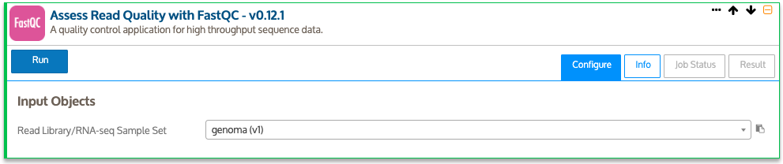
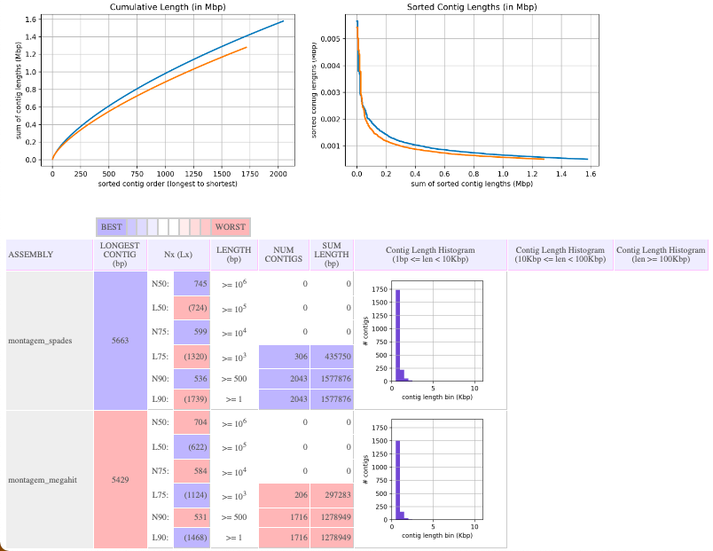
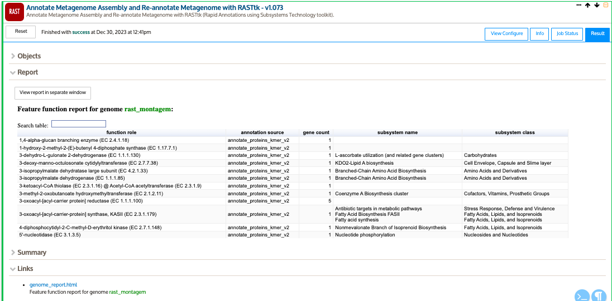

<!-- README.md is generated from README.Rmd. Please edit that file -->

```{r, include = FALSE}
knitr::opts_chunk$set(
  collapse = TRUE,
  comment = "#>",
  fig.path = "imgs/",
  out.width = "100%"
)


```

<!-- badges: start -->
[](https://shields.io/)
[](http://commonmark.org)
[](https://github.com/ellerbrock/open-source-badges/)
<!-- badges: end -->

# Curso Genômica e Metagnômica: Linhas de comando e ferramentas On-line 

### Contéudo programático

**1. Sequenciamento de DNA e RNA** 

|   1.1. Histórico

|   1.2. Sanger

|   1.3. Next Generation Sequence

|   1.4. Sequenciamento por síntese

|   1.5. Detecção de íons de hidrogênio

|   1.6. Sequenciamento por nanoporos

|   1.7. Estratégia de Sequenciamento foco: Genômica e Metagenômica

**2. Noções de linguagem de programação**

|   2.1. Sistema Operacional - GNU/LINUX

|   2.2.  Instalação de ferramentas con Anaconda/Miniconda

**3. Estratégias de Análises Genómicas – Command Line Interface (CLI)**

|   3.1. Controle de Qualidade

|   3.2. Montagem de novo

|   3.3. Avaliação da Montagem

|   3.4. Anotação Taxonômica

|   3.5. Anotação Funcional

|   3.6. Predição de ORFs

|   3.7. Atribuição Funcional das ORFs

|   3.8. Aplicações

**4. Estratégias de Análises Genómicas – Graphical User Interface (GUI)**

|   4.1. KBase

|       4.1.2. Controle de qualidade

|       4.1.3. Trimagem e Filtragem de sequências

|       4.1.4. Motagem de novo

|       4.1.5. Avaliação de montagem

|       4.1.6. Anotação taxonômica

|       4.1.7. Anotação funcional

|   4.2. Introdução a RAPT

|       4.2.1. Montagem de novo com Skesa

|       4.2.2. Anotação Taxonômica (ANI)

|       4.2.3. Anotação Funcional (PGAP)

**5. Estratégias de Análises Metagenómicas – Command Line Interface (CLI)**

|   5.1. Avaliação da qualidade

|   5.2. Cobertura dos Metagenoma

|   5.3. Análise de Distâncias MinHash (abordagem de co-assembly)

|   5.4. Montagem dos Metagenomas

|   5.5. Controle de Qualidade das montagens

|   5.6. Predição das ORFs (Open Reading Frame)

|   5.7. Anotação Funcional

|   5.8. Anotação Taxonômica

|   5.9. Mapeamento

|   5.10. Recuperação de MAGs (Metagenome Assembled Genomes)

|       5.10.1. Qualidade dos MAGs

|       5.10.2. Anotação Taxonômica de MAGs

|       5.10.3. Abundância relativa dos MAGs nas amostras

|   5.11. Análises Downstream

|       5.11.1. R Software

|       5.11.2. RawGraphs.io

**6. Estratégias de Análises Metagenómicas – Graphical User Interface (GUI)**

|   6.1. MGRAST

|   6.2. Kbase

**7. Bonus: Python**

|   7.1. Conceitos básicos

## Pré-requisitos

* Para as análisis usando linha de comando (CLI) é necessário contar com accesso a um terminal baseado em Unix. Por exemplo alguma distribuição de Linux, MacOS, ou no Windows via WSL (*Windows Subsystem for Linux*)

* Conexão a internet


### [SLIDES](https://khidalgo85.github.io/CURSO_SENAI/#1)

---

# Genômica (CLI)

# Prática I

## 0. Organização dos dados

### 0.1. Descarregando os arquivos

* Descarregue do **Slack** no canal *aula_genomica* os arquivos do genoma que será usado para esta prática (`pair1.fastq` e `pair2.fastq`)

* Usando o explorador de arquivos de Windows, copie os arquivos desde o diretório de *Descargas* de Windows até o diretório `/root/curso_senai/` do subdisco **Ubuntu**

* Abra o aplicativo de **Ubuntu**

### 0.2. Sequências

As sequências foram obtidas por sequenciamento do DNA genômico de uma bactéria pela plataforma Illumina usando o protocolo *paired-end* (2 x 250) 

> **Dica:** Usualmente os arquivos são entregues com nomes codificados do equipamento usado para o sequenciamento que não são informativos para o usuário. Sempre renomee os arquivos com palavras de fácil identificação. Evite espaços e caracteres especiais. Para separar palavras prefira *underline* `_`.

* Onde estou?
```
pwd
```

* Senão estiver no diretório `/root/curso_senai/`, use cd para ir até ele
``` 
cd curso_senai
```

* Troque os nomes dos arquivos `pair1.fastq` e `pair2.fastq` para `genoma_R1.fq` e `genoma_R2.fq`
```
mv pair1.fastq genoma_R1.fq
```
Repita o processo com o outro par

### 0.3. Criação de diretórios

**A organização de seus diretórios durante o processamento bioinformático, fará toda diferença!**

* Crie um diretório base para todo o *pipeline* de genômica, usando o comando `mkdir` (*make dir*)

```
mkdir genomica
```
* Entre ao novo diretório usando o comando `cd` (*change directory*)

```
cd genomica/
```
* Crie um novo diretório para armazenar as sequências brutas.

> **Dica:** Dado que a maiora das etapas do workflow são sequenciais, é recomendável nomear os diretórios começando com um número e assim manter a organização.

```
mkdir 00.DadosBrutos
```

* Crie os demais diretórios em uma linha de comando só
```
mkdir 01.FastqcRelatorios 02.DadosLimpos 03.Montagem 04.QualidadeMontagem 05.AnotacaoTaxonomica 06.PredicaoGenes 07.AnotacaoFuncional
```

* Use o comando `ll` (*list*) para listar o conteúdo do diretório atual

```
ll
```

* Coloque as sequências no diretório `~/curso_senai/genomica/00.DadosBrutos`

Antes de executar os seguintes dois comandos, pense se teria uma maneira mais eficiente de fazer essa tarefa
```
mv genoma_R1.fq 00.DadosBrutos/
```
Seguinte pair
```
mv genoma_R2.fq 00.DadosBrutos/
```

> **Desafio:** 
>
> Use os comandos básicos para explorar o arquivo. 
>
> *Dicas:*
>
> * Visualizar 
>
> * Contar número de sequências 
>
> * Tamanho dos arquivos

## 1. Controle de Qualidade

```{r, echo=FALSE, fig.align = 'center', out.width = "60%"}
knitr::include_graphics("docs/03.Images/workflow3.png")
```

### 1.1. Checagem da qualidade

Para a avaliação de qualidade das sequências será usado o programa [FastQC](http://www.bioinformatics.babraham.ac.uk/projects/fastqc/), que é uma ferramenta que lê os códigos *ASCII*, transforma em valores de *Phred* e apresenta graficamente estas informações.

#### 1.1.1. Instalação de FastQC com `conda`

Se o `conda` estiver ativo na máquina, deve aparecer no começo da linha de comando `(base)` p.e. `(base) aluno@senai $`. Senão digite o seguinte código:

```
source /root/anaconda3/bin/activate
```
A instalação de ferramentas usando o `conda` requer a criação de ambientes/containers, onde podem ser organizadas as ferramentas para cada etapa do *Workflow* p.e. `qualidade`, `montagem`, `anotacao`.

Crie um ambiente chamado **qualidade**, onde serão instaladas as ferramentas relacionadas com controle de qualidade.

O comando para criar ambientes é:
```
conda create -n qualidade
```
Durante o processo, o sistema preguntará se deseja proceder com a creação do ambiente, com as opções *y/n* (sim ou não). Dígite `y` para o ambiente ser criado.

Para a instalação de ferramentas dentro dos ambientes, é necessário ativar eles:
```
conda activate qualidade
```

O ambiente estará ativo quando o nome se encontre ao começo da linha de comando,
assim: `(qualidade) user@server:~/$`

Para a instalação dígite
```
conda install -c bioconda fastqc
```
Dígite `y` quando o sistema pedir confirmação.

Pronto a ferramenta está instalada.

`bioconda` é um canal dentro de Anaconda onde os desenvolvedores de ferramentas de bioinformática colocam elas para uso público em uma nuvem. Colocando esse canal no comando de instalação, estaremos acessando a ele para instalar a ferramenta que desejamos.

Alguns comandos úteis de `conda`:
* Para listar programas instalados dentro do ambiente atual: `conda list`
* Para listar os ambientes criados na máquina: `conda env list`

#### 1.1.2. Execução

A maioria das ferramentas tem um manual de ajuda, o qual pode ser acessado usando o argumento `-- help` ou `-h`.

Acesse ao manual de ajuda de `fastqc` digitando. (Lembre que ambiente de conda onde foi instalado tem que estar ativo)
```
fastqc --help
```
**Help** do `fastqc`
```
FastQC - A high throughput sequence QC analysis tool
SYNOPSIS
	fastqc seqfile1 seqfile2 .. seqfileN
    fastqc [-o output dir] [--(no)extract] [-f fastq|bam|sam]
           [-c contaminant file] seqfile1 .. seqfileN
DESCRIPTION
    FastQC reads a set of sequence files and produces from each one a quality
    control report consisting of a number of different modules, each one of
    which will help to identify a different potential type of problem in your
    data.
    If no files to process are specified on the command line then the program
    will start as an interactive graphical application.  If files are provided
    on the command line then the program will run with no user interaction
    required.  In this mode it is suitable for inclusion into a standardised
    analysis pipeline.
    
    The options for the program as as follows:
    
    -h --help       Print this help file and exit
    
    -v --version    Print the version of the program and exit
    
    -o --outdir     Create all output files in the specified output directory.
                    Please note that this directory must exist as the program
                    will not create it.  If this option is not set then the 
                    output file for each sequence file is created in the same
                    directory as the sequence file which was processed.
                    
    --casava        Files come from raw casava output. Files in the same sample
                    group (differing only by the group number) will be analysed
                    as a set rather than individually. Sequences with the filter
                    flag set in the header will be excluded from the analysis.
                    Files must have the same names given to them by casava
                    (including being gzipped and ending with .gz) otherwise they
                    won't be grouped together correctly.
                    
    --nano          Files come from nanopore sequences and are in fast5 format. In
                    this mode you can pass in directories to process and the program
                    will take in all fast5 files within those directories and produce
                    a single output file from the sequences found in all files.                    
                    
    --nofilter      If running with --casava then don't remove read flagged by
                    casava as poor quality when performing the QC analysis.
                   
    --extract       If set then the zipped output file will be uncompressed in
                    the same directory after it has been created. If --delete is 
                    also specified then the zip file will be removed after the 
                    contents are unzipped. 
                    
    -j --java       Provides the full path to the java binary you want to use to
                    launch fastqc. If not supplied then java is assumed to be in
                    your path.
                   
    --noextract     Do not uncompress the output file after creating it.  You
                    should set this option if you do not wish to uncompress
                    the output when running in non-interactive mode.
                    
    --nogroup       Disable grouping of bases for reads >50bp. All reports will
                    show data for every base in the read.  WARNING: Using this
                    option will cause fastqc to crash and burn if you use it on
                    really long reads, and your plots may end up a ridiculous size.
                    You have been warned!
                    
    --min_length    Sets an artificial lower limit on the length of the sequence
                    to be shown in the report.  As long as you set this to a value
                    greater or equal to your longest read length then this will be
                    the sequence length used to create your read groups.  This can
                    be useful for making directly comaparable statistics from 
                    datasets with somewhat variable read lengths.

    --dup_length    Sets a length to which the sequences will be truncated when 
                    defining them to be duplicates, affecting the duplication and
                    overrepresented sequences plot.  This can be useful if you have
                    long reads with higher levels of miscalls, or contamination with
                    adapter dimers containing UMI sequences.

                    
    -f --format     Bypasses the normal sequence file format detection and
                    forces the program to use the specified format.  Valid
                    formats are bam,sam,bam_mapped,sam_mapped and fastq
                    

    --memory        Sets the base amount of memory, in Megabytes, used to process 
                    each file.  Defaults to 512MB.  You may need to increase this if
                    you have a file with very long sequences in it.
                
    --svg           Save the graphs in the report in SVG format.

    -t --threads    Specifies the number of files which can be processed
                    simultaneously.  Each thread will be allocated 250MB of
                    memory so you shouldn't run more threads than your
                    available memory will cope with, and not more than
                    6 threads on a 32 bit machine
                  
    -c              Specifies a non-default file which contains the list of
    --contaminants  contaminants to screen overrepresented sequences against.
                    The file must contain sets of named contaminants in the
                    form name[tab]sequence.  Lines prefixed with a hash will
                    be ignored.

    -a              Specifies a non-default file which contains the list of
    --adapters      adapter sequences which will be explicity searched against
                    the library. The file must contain sets of named adapters
                    in the form name[tab]sequence.  Lines prefixed with a hash
                    will be ignored.
                    
    -l              Specifies a non-default file which contains a set of criteria
    --limits        which will be used to determine the warn/error limits for the
                    various modules.  This file can also be used to selectively 
                    remove some modules from the output all together.  The format
                    needs to mirror the default limits.txt file found in the
                    Configuration folder.
                    
   -k --kmers       Specifies the length of Kmer to look for in the Kmer content
                    module. Specified Kmer length must be between 2 and 10. Default
                    length is 7 if not specified.
                    
   -q --quiet       Suppress all progress messages on stdout and only report errors.
   
   -d --dir         Selects a directory to be used for temporary files written when
                    generating report images. Defaults to system temp directory if
                    not specified.
                    
BUGS

    Any bugs in fastqc should be reported either to simon.andrews@babraham.ac.uk
    or in www.bioinformatics.babraham.ac.uk/bugzilla/
```

**Sintaxe**

```
fastqc -t <num núcleos> <arquivo_de_entrada.fq> -o <diretório_de_saida>
```

Sendo:

* `arquivo_entrada.fq`: o arquivo de sequências a ser analisado. Pode ser um arquivo ou vários.
* `diretório_de_saida`: o diretório onde serão armazenados os arquivos de saída

> **Atenção:** Para o uso correto e seguro da máquina verifique o número de núcleos disponíveis para o usuário no momento da análise. **NUNCA** trabalhe com o total dos núcleos da máquina.

* Execute `fastqc`. Use como diretório base `~/curso_senai/genomica`

```
$ fastqc 00.DadosBrutos/* -o 01.FastqcRelatorios/
```

* Os elementos de saída serão um arquivo `.html` e um `.zip` para cada par (R1 e R2)

* Vamos a explorar os arquivos `genome_R1.fastqc.html` e `genome_R2_fastqc.html`, os quais são os relatórios com todas as informações de qualidade.

* Estes arquivos podem ser abertos no explorador de internet (p.e *Google Chrome*, *Internet Explorer*)

* O *read R* normalmente tem uma qualidade inferior, explicado pelo fato de que o tamanho dos clusters diminui durante a amplificação em ponte durante a rotação das sequências, que ocorre antes da leitura 2 ser sequenciada.

Para maiores detalhes sobre a interpretação e análise dos relatórios do FastQC consulte [aqui](https://www.bioinformatics.babraham.ac.uk/projects/fastqc/Help/3%20Analysis%20Modules/).

### 1.2. Trimagem e filtragem de sequências

[Trimmomatic](http://www.usadellab.org/cms/?page=trimmomatic) é um programa pra filtrar (remover) *reads* e/ou bases de baixa qualidade.

Trimmomatic tem vários parâmetros que podem ser considerados para filtrar leituras com baixa qualidade. No presente tutorial usaremos alguns deles. Se quiser saber que otros parâmetros e como funciona cada um deles, consulte o [manual](http://www.usadellab.org/cms/uploads/supplementary/Trimmomatic/TrimmomaticManual_V0.32.pdf).

> **Alguns dos parâmetros são:**
>
>* *SLIDINGWINDOW*: Executa uma abordagem de corte de janela deslizante e corta a leitura quando a qualidade média dentro da janela cai abaixo de um limite.
>
>* *LEADING*: Corta as bases no início de uma leitura, se estiver abaixo de um limite de qualidade
>
>* *TRAILING*: Corta bases no final de uma leitura, se estiver abaixo de um limite de qualidade
>
>* *CROP*: Corta a leitura em um comprimento especificado removendo as bases da extremidade
>
>* *HEADCROP*: Corta o número especificado de bases desde o início da leitura
>
>* *MINLEN*: Elimina a leitura se estiver abaixo de um comprimento especificado

#### 1.2.1. Instalação de Trimmomatic com `conda`

Como se trata de uma ferramenta que participa dentro do processo de control de qualidade, será instalada dentro do ambiente virtual *qualidade*.

* Senão estiver ativo o ambiente qualidade, ativé-o

```
conda activate qualidade
```
* Para a instalação use o código embaixo:

```
conda install -c bioconda trimmomatic
```

#### 1.2.2. Execução

**Sintaxe**

```
trimmomatic PE -threads <num_nucleos> <arquivo_entrada_R1> <arquivo_entrada_R2> <arquivo_saida_pair_R1> <arquivo_saida_unpair_R2> <arquivo_saida_pair_R1> <arquivo_saida_unpair_R1> [argumentos]
```

* Segundo os resultados obtidos da qualidade execute o seguinte comando do Trimmomatic:
```
trimmomatic PE -threads 10 00.DadosBrutos/genoma_R1.fq 00.DadosBrutos/genoma_R2.fq 02.DadosLimpos/genoma_R1.pair.fq 02.DadosLimpos/genoma_R1.unpair.fq 02.DadosLimpos/genoma_R2.pair.fq 02.DadosLimpos/genoma_R2.unpair.fq LEADING:3 TRAILING:3 CROP:249 HEADCROP:15 SLIDINGWINDOW:4:15 MINLEN:100
```

> **Desafio:** 
>
> Use os comandos básicos para explorar os arquivos das sequências limpas 
>
> *Dicas:*
>
> * Visualizar
>
> * Contar número de sequências (compare com o número de sequências brutas)

Verifique que a etapa de trimagem e filtragem foi bem sucedida executando FastQC para as sequências pareadas (`02.DadosLimpos/genoma_R1.pair.fq` e `02.DadosLimpos/genoma_R2.pair.fq`).

```
fastqc 02.DadosLimpos/*.pair.fq -o 01.FastqcRelatorios/
```
---

# Prática II

## 2. Montagem *de novo*

### 2.1. Montagem com `Spades`

Uma montagem é o processo de alinhamento de sequências curtas com o objetivo de recuperar uma sequência maior. No caso da montagem *de novo* são usados algorítmos baseados em *k-mers*, que são subsequências com tamanho definido pelo usuário (i.e. 21-mers).

O programa [Spades](https://github.com/ablab/spades) usao o algorítmo do grafo de De Bruijn para a montagem de *short reads*

#### 2.1.1. Instalação de Spades com `conda`

* Crie um novo ambiente chamado `montagem`. Se não aparece `(base)` ou o nome de outro ambiente no inicio da linha de comando, deve ativar o conda, com (`source /root/anaconda3/bin/activate `)
```
conda create -n montagem
```
* Confirme com `y`

* Quando terminar o processo de criação do ambiente, ative ele
```
conda activate montagem
```
* Instale Spades com:
```
conda install -c bioconda spades
```

* Confirme com `y`

#### 2.1.2. Execução

**Sintaxe**
```
spades.py -1 <pair1> -2 <pair2> -k <lista de kmers> -o <diretorio_de_saida> -t <num_nucleos>
```

O flag `--careful` tenta reduzir o número de mismatches e indels curtos. É recomendado para montagem de genomas de procariotas.

No [manual](http://cab.spbu.ru/files/release3.15.2/manual.html) encontra mais detalhes.

Antes de fazer a montagem, exploremos o `help` de spades
```
spades.py --help
```

A montagem será realizada executando o comando:

>**Dica:** O program nohup permite executar tarefas em segundo plano, com o objetivo de manter a execução do comando ainda com a perda da conexão.

```
nohup spades.py --careful -1 02.DadosLimpos/genoma_R1.pair.fq -2 02.DadosLimpos/genoma_R2.pair.fq -k 21,33,55,77,99,111,127 -o 03.Montagem/ -t 3 &
```

Vamos a explorar os arquivos de saída. O que é um arquivo fasta?

> **Desafio**
>
> Agora que sabe como está organizado um arquivo `.fasta`, usando comandos básicos avalie o número de contigs e de scafolds da montagem.

### 2.2. Avaliação da montagem

A montagem precisa ser avaliada através de métricas que representam qualidade do genoma. Neste paso será calculado o N50, o número de contigs, o tamanho do genoma, a completude e o nível de contaminação. 

Primeiro será usado o progama [Quast](http://quast.sourceforge.net/), que gera um relatório com a maioria das métricas (i.e. N50, número de contigs, tamanho dos contigs, etc). Depois será usado o a ferramenta [CheckM](https://github.com/Ecogenomics/CheckM/wiki) para avaliar a completude e a contaminação da montagem. Este programa usa base de dados própria de genes ortologos de cópia única.

#### 2.2.1. Instalação de Quast com `conda`

Devido a incompatibilidades do `quast` com a maioria das ferramentas, é necessário instalar ele num ambiente virtual diferente e só para ele

```
conda create -n quast
```

* Ative o ambiente

```
conda activate quast
```

* Instale quast

```
conda install -c bioconda quast
```

#### 2.2.2. Instalação de CheckM com `conda`

O `checkm` também precisa de um ambiente separado 

* Crie o ambiente `checkm`

```
conda create -n checkm
```

* Ative o ambiente

```
conda activate checkm
```

* Instale checkm

```
conda install -c bioconda checkm-genome
```

#### 2.2.3. Execução

**Sintaxe**
```
quast <input_assembly> -o <output_directory> -t <num_nucleos> [opções]
```

Para gerar o relatório com as métricas de `quast` use o seguinte comando (**lembre: primeiro deve ativar o ambiente onde está instalado `quast`**):

```
quast 03.Montagem/scaffolds.fasta -o 04.QualidadeMontagem/ --threads 3
```

Abra o arquivo `04.QualidadeMontagem/report.html` no explorador de internet, onde poderá explorar todas as métricas de qualidade. 

> **Dica:** Esta ferramenta permite comparar diversas montagens das mesmas sequências obtidas de diferentes montadores e/ou executados com diferentes parâmetros. Esta estrategia permite escolher a melhor montagem. Para maiores detalhes, visete o [manual](http://quast.sourceforge.net/docs/manual.html)

Contigs com tamanho menor de 600 bp não tem um valor representativo na montagem, é recomendável filtrar essas sequências. 

O programa bbmap tem um script que permite realizar a filtragem por tamanho. Crie um ambiente de conda chamado `bioinfo`, ative ele, e instale com o seguinte comando a ferramenta `bbmap`

```
conda install -c bioconda bbmap
```

Para filtrar contigs menores de 600 use o seguinte código:

``` 
reformat.sh in=03.Montagem/scaffolds.fasta out=03.Montagem/genoma_scaffolds_filtrado.fasta minlength=600
```

Agora para avaliar a completude e a contaminação, execute `checkm`. Lembre de ativar o ambiente `checkm`

**Sintaxe**

```
checkm lineage_wf <input_directory/> <output_directory/> -t <num_nucleos> -x <format> --tab > output.txt
```

Execute a ánalise para a montagem completa e filtrada com o seguinte comando:
```
checkm lineage_wf 03.Montagem/ 04.QualidadeMontagem/ -t 3 -x fasta --tab > 04.QualidadeMontagem/output.txt
```

Explore o arquivo de saída `04.QualidadeMontagem/output.txt` usando o comando `less`, ou use *Excel*.

Para mais detalhes sobre a interpretação do relatório visite este [link.](https://www.biostars.org/p/447744/)

---

# Prática III

## 3. Anotação taxonômica

### 3.1 Classificação taxonômica com `GTDB-tk`

A classificação taxonômica é o processo para assignar um nome ao(s) genoma(s) de interesse. Basicamente se dá pela comparação com bases de dados. O [GTDB-tk](https://ecogenomics.github.io/GTDBTk/index.html) é uma ferramenta que identifica genes marcadores (120 em bactérias e 53 em arqueias) e os compara com uma base de dados curada e constantemente atualizada.

#### 3.1.1. Instalação de GTDB-tk com `conda`

Crie um novo ambiente chamado `gtdbtk`. Lembre, senão aparece (base) ou o nome de outro ambiente no inicio da linha de comando, deve ativar o conda com: `source /root/anaconda3/bin/activate`

```
conda create -n gtdbtk
```

Confirme com `y`. Quando o ambiente estiver criado, ative ele

```
conda activate gtdbtk
```

Instale GTDB-tk com:

```
conda install -c bioconda gtdb
```

Confirme com `y `

Para descarregar a base de dados use o seguinte comando:
```
download-db.sh
```

#### 3.1.2. Execução

**Sintaxe**
```
gtdbtk classify_wf --genome_dir <diretorio_com_genomas/> --out_dir <diretorio_de_saida/> -x <fa fasta> --cpus <num_nucleos>
```

Para assignar a taxonomia ao genoma de trabalho, execute o seguinte comando
```
gtdbtk classify_wf --genome_dir 03.Montagem/ --out_dir 05.AnotacaoTaxonomica/ -x fasta --cpus 8
```
Durante o processamento serão criados vários arquivos de saída, porém o arquivo `05.AnotacaoTaxonomica/gtdbtk.bac120.summary.tsv` contém todas as informações importantes.

Explore o arquivo usando *Excel*.

---

# Prática IV

## 4. Anotação Funcional

### 4.1. Predição de ORFs com `prodigal`

#### 4.1.1. Instalação de Prodigal com `conda`

Para a instalação de Prodigal, crie um ambiente de conda chamado `anotacao` onde serão instaladas todas as ferramentas relacionadas com a anotação taxonômica. 

Crie o ambiente com o seguinte comando:
```
conda create -n anotacao
```

Ative o ambiente
```
conda activate anotacao
```

Instale `prodigal`
```
conda install -c bioconda prodigal
```

#### 4.1.2. Execução

O objetivo desta etapa é procurar as ORFs dentro dos contig/scaffols. Ou seja, predizer onde iniciam e terminam os genes. Basicamente o programa procura por codons de inicio e de parada. Para este objetivo será usada a ferramenta [Prodigal](https://github.com/hyattpd/prodigal/wiki).

Verifique que o conda e o ambiente `anotacao` esteja ativo. Senão use os comandos de ativação

**Sintaxe**
```
prodigal -i <montagem.fasta> -o <saida_arquivo_gbk> -a <saida_arquivo_seqs_proteinas> -d <saida_arquivo_seqs_nucleotideos> -s <saida_arquivos_coordenadas>
```

Para rodar o program utilize o seguinte comando:
```
prodigal -i 03.Montagem/genoma_scaffolds_filtrado.fasta -f gff -o 06.PredicaoGenes/genoma_filtered.gff -a 06.PredicaoGenes/genoma_filtered.faa -d 06.PredicaoGenes/genoma_filtered.fa
```

O arquivo `06.PredicaoGenes/genoma_filtered.gff` está escrito em formato `gff` (*gene Feature Format*). Adicionalmente, o programa gerá arquivos com as sequências nucleotídicas (`06.PredicaoGenes/genoma_filtered.fa`) e proteícas (`06.PredicaoGenes/genoma_filtered.faa`) de cada gene predito.

**Formato `.gff` (Gene Feature Format)**

Este formato guarda as informações dos genes preditos pelo Prodigal. Explore-o (`less genoma_filtered.gff`).

Cada sequência comença com um *header* com as informações da sequência analizada, seguido de uma tabela separada por tabulações com informações dos genes encontrados em dita sequência.

O *header* contém os seguentes campos:

* **seqnum**: O número da sequência, começando pelo número 1.
* **seqlen**: tamanho em bases da sequência
* **seqhdr**: título completo da sequência extraído do arquivo `.fasta`.
* **version**: versão do Prodigal usado
* **run_type**: modo de corrida, p.e. m*metagenomic*
* **model**: informação sob o arquivo de treinamento usado para a predição.
* **gc_cont**: % de GC na sequência
* **transl_table**: Tabela do código genético usada para analizar a sequência. Para bactérias e archaeas é usada a [tabela 11](https://www.ncbi.nlm.nih.gov/Taxonomy/Utils/wprintgc.cgi#SG11).
* **uses_sd**: 1 se o Prodigal usa o *[RBS](https://parts.igem.org/Ribosome_Binding_Sites) finder*, ou 0 se usa outros *motifs*. 

Depois do *header* se encontra uma tabela com as informações dos genes encontrados:

* **seqname**: nome da sequência, neste caso nome do scaffold/contig.
* **source**: nome do programa que gerou a predição
* **feature**: tipo de *feature*, p.e. CDS (*Coding DNA Sequence*)
* **start**: primeira posição da *feature*
* **end**: útlima posição da *feature*
* **score**: Valor numerico que geralmente indica a confiança do programa na predição da ORF.
* **strand**: fita do DNA que foi encontrado a *feature*. A fita *forward* é definida como '+', e a *reverse* como '-'.
* **frame**: 0 indica que a primeira base da *feature* é a primeira base do códon de inicio, 1, que a segunda base da *feature* é a primeira base do códon de inicio.
* **atribute**: información adicional sobre la *feature*, parada por ponto e vìrgula ";".  

Uma vez terminado o processo, pode explorar os diferentes arquivos de saída para conhecer a fondo a estrutura de cada um deles e as informações que cada um tem.

### 4.2. Atribuição Funcional das ORFs

Nesta etapa as ORFs preditas serão funcionalmente anotadas por homologia, usando bases de dados e um alinhador. Poderão ser usadas as sequências nucleotídicas ou proteícas.

Para o alinhamento será usado o programa [Diamond](https://github.com/bbuchfink/diamond/wiki/3.-Command-line-options), e uma base de dados acurada como [KEGG](https://www.genome.jp/kegg/).

#### 4.2.1. Instalação de Diamond com `conda`

O [**Diamond**](https://github.com/bbuchfink/diamond) será usado para a anotação funcional. Instale através do conda, no ambiente `anotacao`

```
conda activate anotacao
```
Instale o Diamond
```
conda install -c bioconda diamond
```

#### 4.2.2. Obtenção das Bases de Dados

Para a obtenção das bases de dados, pode ir nos sites e descarregar diretamente. No entanto, tenha em conta que a base de dados **KEGG** é paga. Se você descarregar direto da fonte, deverá formatar as DBs para o seu uso com Diamond (anotação funcional). Isto é feito com o comando

`makedb --in reference.fasta -d reference`

Para facilitar, no seguinte link, você encontrará as bases de dados **KEGG**, **EggNOG**, previamente formatadas para o uso em Diamond.

Use o programa `gdown` para descarregar as dbs que se encontram em um GoogleDrive. Se não tiver o `gdown` instalado, siga o seguintes passos: 

* [**Dbs**](https://drive.google.com/drive/folders/1GLP6vA4Gs0cce-nnBXCmZSgmONWybOSF?usp=sharing)

```
## Se não tiver instalado pip
sudo apt update
sudo apt install python3-pip
pip3 --verision

## Instale gdown
pip install gdown
```

Crie uma pasta, chamada `dbs/`, e use o programa `gdown` para descarregar as dbs. 

```
mkdir dbs/
```

Descarregue as DBs

**KEGG**
```
gdown --id 1ZxjJdwh1izP32X5CH-B8SN0DK2WAAAvr
```

**EggNOG**
```
gdown --id 1x2Kp4PTX8GFFhkJm6EVDQLfi-xRSQ735
```

Serão descarregados os seguintes arquivos:

* `eggnog.dmnd`: Base de dados EggNOG formatada para Diammond
* `keggdb.dmnd`: Base de dados KEGG formatada para Diammond

**Nota** É recomendável procurar os links originais para descarga das bases de dados para assim obter a versão mais atualizada.

Se você quiser criar sua própria base de dados, pode procurar as sequências de interesse por exemplo no NCBI, descarregar elas e criar a base de dados formantando para uso com Diamond. 

Como exemplo, vamos usar sequências de genes de degradação aeróbica de hidrocarbonetos já organizadas em um repositório de GitHub chamdado [HADEG](https://github.com/jarojasva/HADEG/tree/main).

Usando o comando `git clone` podemos descarregar o conteúdo total do repositório nas nossas máquinas:
```
git clone https://github.com/jarojasva/HADEG.git
```

Digite `ls`, observará a pasta descarragada `HADEG`, explore ela. Dentro, encontram-se as pastas `Seq_amino_acids` e `Seq_nucleotides`, que correspondem as sequências de aminoacidos e nucleotídeos de genes de degradação aeróbica de hidrocarbonetos. Dentro de cada pasta estão organizadas em diferentes diretórios dependendo das moléculas nas quais esses genes atuam (p.e. alcanos, Aromaticos), e também genes de produção de Biosurfactantes e polímeros.

Você pode gerar uma base de dados para cada tipo de genes ou uma base só para todos os genes desse repositório.

Para criar uma base de dados total, primeiro devem ser concatenadas todas as sequências, usando o comando `cat`.

Entre na pasta `HADEG/Seq_nucleotides`
```
cd HADEG/Seq_nucleotides
```
Concatene as sequências
```
cat Alkanes/* Alkenes/* Aromatics/* Biosurfactants/* Polymers/* > HADEG.fasta
```
Use o comando de `diamond` para formatar a DB
`diamond makedb --in HADEG.fasta -d ../../dbs/hadeg.dmnd`


#### 4.2.3. Execução

Uma vez instaladas todas as ferramentas e descarregadas as bases de dados, pode proceder à anotação. Neste caso será feita usando Diammond e as bases de dados **KEGG**, **EggNOG** e **HADEG**.

**SINTAXE**

```
diamond blastx --threads -k -f --id --query-cover -d dbs/db.dmnd --query genes.fa -o saida_anotacao.txt --tmpdir /dev/shm
```

* `blastx`: Alinha sequências de DNA contra uma base de dados de proteínas
Clique [aqui](https://github.com/bbuchfink/diamond/wiki/3.-Command-line-options) para mais detalhes
* `--threads`: número de núcleos
* `-k/--max-target-seqs`: Número máximo de sequências *target* por *query* para reportar alinheamentos.
* `-f/--outfmt`: Formato de saída. São aceptos os seguintes valores:
  * `0` Formato BLAST *pairwise*
  * `5` fomato BLAST XML
  * `6` Formato do BLAST tabular (default), pode customizar as colunas com uma lista separada por espaços, das seguintes opções:
    * `qseqid` id da sequência *query*
    * `qlen` tamanho da sequência *query* 
    * `sseqid` id da sequência da base de dados
    * `sallseqid` todas os id das sequências das bases de dados
    * `slen` tamanho da sequência da base de dados
    * `qstart` inicio do alinhamento no *query*
    * `qend` fim do alinhamento no *query*
    * `sstart` inicio do alinhamento na sequência da base de dados
    * `send` fim do alinhamento na sequência da base de dados
    * `evalue` 
    * `bitscore` 
    * `score` 
    * `length` tamanho do alinhamento
    * `pident` porcentagem de matches identicos
    
Execute Diamond com *KEGG* para o genes achados no genoma 
```
diamond blastx --threads 8 -k 1 -f 6 qseqid qlen sseqid sallseqid slen qstart qend sstart send evalue bitscore score length pident qcovhsp --id 60 --query-cover 60 -d dbs/keggdb.dmnd --query 06.PredicaoGenes/genoma_filtered.fa -o 07.AnotacaoFuncional/genoma_kegg.txt --tmpdir /dev/shm
```

Execute o comando com *EggNOG*
```
diamond blastx --threads 8 -k 1 -f 6 qseqid qlen sseqid sallseqid slen qstart qend sstart send evalue bitscore score length pident qcovhsp --id 60 --query-cover 60 -d dbs/eggnog.dmnd --query 06.PredicaoGenes/genoma_filtered.fa -o 07.AnotacaoFuncional/genoma_eggnog.txt --tmpdir /dev/shm
```

Execute o comando com *HADEG*
```
diamond blastx --threads 8 -k 1 -f 6 qseqid qlen sseqid sallseqid slen qstart qend sstart send evalue bitscore score length pident qcovhsp --id 60 --query-cover 60 -d dbs/hadeg.dmnd --query 06.PredicaoGenes/genoma_filtered.fa -o 07.AnotacaoFuncional/genoma_hadeg.txt --tmpdir /dev/shm
```

O arquivo de output é uma tabela que contém os códigos dos genes e as anotações (número KEGG), além de outras informações relacionadas ao alinhamento de cada sequência (i.e. cobertura, % de identidade). 

A coluna três tem as informações do número KEGG (p.e. K00001) e o código da sequência no NCBI (p.e. WP_014068995.1, separadas por um *pipe* `|`.

Para separar essa coluna, use o seguinte comando:

* Para KEGG
```
perl -pe 's/\|?(?:\s+gi|ref)?\|\s*/\t/g' 07.AnotacaoFuncional/genoma_kegg.txt > 07.AnotacaoFuncional/genoma_kegg_formatado.tsv
```

* Para EggNOG
```
perl -pe 's/\|?(?:\s+gi|ref)?\|\s*/\t/g' 07.AnotacaoFuncional/genoma_eggnog.txt > 07.AnotacaoFuncional/genoma_eggnog_formatado.tsv
```

Descarregue e explore em excel as tabela finais de anotações.

---

# Genômica com plataformas online

Existem diversas plataformas online nas quais podem ser realizadas diversas análises bioinformáticas. As mais conhecidas são [KBase](https://www.kbase.us/) e [Galaxy](https://usegalaxy.org/). Neste tutorial será usado o KBase, além da plataforma de montagem e anotação do [NCBI](https://www.ncbi.nlm.nih.gov/genome/annotation_prok/).

## 0. Organização de Dados

### 0.1. Criando uma conta no KBase

Ingresse no link para criar uma conta: [singup!](https://narrative.kbase.us/#signup)

[Neste link](https://docs.kbase.us/getting-started/narrative) você pode visitar o extenso manual/tutorial da plataforma.


Para facilitar acesse através de uma conta Google


No KBase, você pode criar fluxos de trabalho compartilháveis e reproduzíveis chamados **Narrativas** que incluem dados, etapas de análise, resultados, visualizações e comentários. 

### 0.2. Upload dos dados

O primeiro passo é criar uma nova narrativa clicando em *+ New Narrative*. Uma vez criada a nova narrativa, troque o nome dela para Genômica, clicando no título acima a esquerda *Untitled*


Na seção **DATA**, clique em *Add Data* e será aberta uma aba para carregar os dados. Clique em *Import* para importar os aquivos desde uma pasta no seu computador. Selecione os arquivos `genoma_R1.fq` e `genoma_R2.fq`. Pode selecionar os dois ao mesmo tempo.

Após subidos os arquivos na plataforma, eles devem ser importadas para dentro da narrativa, para isto é necessário selecionar o tipo de dados. Para o caso das sequências deste tutorial, trata-se do formato *FASTQ Reads Noninterleaved*, clique em *Import selected*. 


Automaticamente será aberta a primeira ferramenta a ser usada  *Import from Staging Area*. Preencha os campos conforme a foto e clique em *Run*.


A ferramenta primeiro fará a leitura dos arquivos e depois irá juntar eles num objeto só (*genoma*) e ficaram disponíveis dentro da narrativa na aba a esquerda *DATA*. As ferramentas a serem usadas podem ser procuradas na aba *APPS* a esquerda, na opção de busca.


## 1. Controle de Qualidade

### 1.1. Checagem da qualidade

Nesta etapa será acessada à qualidade das sequências usando a ferramenta [FastQC](https://www.bioinformatics.babraham.ac.uk/projects/fastqc/). Procure no catálogo e clique no nome (*Assess Read Quality with FastQC - v0.12.1*). Imediatamente será inserida na narrativa logo após a ferramenta de importação.

Selecione o objeto *genoma* no input (*Read Library/RNA-seq Sample Set*) e clique em *Run*



As análises no KBase podem demorar um pouco mais do normal de um servidor, devido que se trata de un servidor público usado por muitas pessoas ao mesmo tempo.

Uma vez a análise seja concluida, você terá acesso aos resultados na aba *Results*. Na seção *Report* serão disponibilizados os relatórios FastQC. Se você quiser descarregá-los na seção *Files* se encontram os arquivos para cada pair. 


### 1.2. Trimagem e filtragem de sequências

A remoção de sequências e bases de baixa qualidade deve ser feita baseada nos relatórios da checagem da qualidade. O programa [Trimmomatic](http://www.usadellab.org/cms/?page=trimmomatic), através de diversos argumentos realiza a filtragem e trimagem das sequências. Procure pela ferramenta na barra de busca e adicione ela (*Trim Reads with Trimmomatic - v0.36*) na narrativa.

No input, selecione o objeto *genoma*. Clique em *show advancedd* para modificar os argumentos de corte e filtragem. Segundo os resultados obtidos no relatório de qualidade, insira os parâmetros como apresentado na imagem:


A análise terá terminado quando mostrar a palavra *Sucess*. Explore os resultados clicando na aba *Results*


Perceba que na seção *DATA*, agora devem aparecer novos objetos criados após a trimagem. Esses novos elementos são as sequências limpas pareadas (*dadoslimpos_paired*), e as sequências não pareadas forward (*dadoslimpos_unpaired_fwd*) and reverse (*dadoslimpos_unpaired_rev*).

Após a limpeza das sequências é recomendável repetir a análise com Fastqc para ver a qualidade das sequências filtradas pareadas (*dadoslimpos_paired*). 

## 2. Montagem *de novo*

### 2.1. Spades

Uma montagem é o processo de alinhamento de sequências curtas com o objetivo de recuperar uma sequência maior. No caso da montagem *de novo* são usados algorítmos baseados em *k-mers*, que são subsequências com tamanho definido pelo usuário (i.e. 21-mers).

Procure o montador [Spades](https://github.com/ablab/spades) na barra de busca na seção *APPS* e coloque ele dentro da narrativa (*Assemble Reads with SPAdes - v3.15.3*) para ter acesso as funções dele.

Em *Read library* clique no *+* e adicione o objeto *dadoslimpos_paired*.

Clique em *show advanced* para modificar os parâmetros da montagem:


Ao rodar Spades dentro do KBase, uma vez terminada a montagem, automaticamente será rodado o program [Quast](http://quast.sourceforge.net/) para analisar a qualidade. Você pode ter acesso ao relatório de saída do Quast na aba *Results*. 


Descarregue o relatório na seção *Links*, clicando no link *QUAST report* onde poderá explorar todas as métricas de qualidade. 

A montagem (*montagem_spades*) deve aparecer na aba *DATA*.

### 2.3. Avaliação da montagem

Contigs com tamanho menor de 600 bp não tem um valor representativo na montagem, é recomendável filtrar essas sequências. Dentro do KBase existe uma ferramenta chamada *Filter Assembled Contigs by Length* que pode ser usada para este objetivo.


Será criado o novo objeto, chamado *montagem_filtrada*


Se você filtrou a montagem, daqui para frente você tem duas montagens. Nos passos seguintes avalie as duas montagens para ter certeza que a filtragem não impactou na qualidade da completude e da anotação de genes. 

Para avaliar a completude e a contaminação da montagem é usada a ferramenta [CheckM](https://github.com/Ecogenomics/CheckM/wiki). A qual usa uma base de dados própria de genes ortologos de cópia única. 

> **Dica:** Se tiver mais de uma montagem, você pode criar um *AssemblySet* para colocar todos dentro de um objeto só, e assim facilitar as análises, podendo fazer vários elementos ao mesmo tempo. Basta procurar na barra de buscas de *APPS* *Build AssemblySet*. Crie um objeto com as duas montagens, chamado *montagens*.

Procure o CheckM no catálogo de ferramentas e coloque ele dentro da narrativa (*Assess Genome Quality with Checkm -v1.0.18*). Em *Input Objects* adicione o *AssemblySet* (*montagens*). Nas opções avançadas, selecione *full tree* no *Reference Tree* parameter, e *save* no *Save All Plots*. Uma vez finalizada a análise, na aba *Results*, encontrará um gráfico apresentando o resultado. Clicando no link *CheckM Table*, poderá obter as informações de Completude e Contamination, além da linagem marcadara usada para a análise. 


Na seção *Files*, se encontram os arquivos de saída gerados para serem descarregados.

## 3. Anotação Taxonômica

A classificação baseada em dados de genoma tem maior poder ressolutivo em comparação ao usar apenas um gene marcado, desde que esta abordagem analisa múltiplos genes que refletem de forma mais robusta a relações de parêntesco do organismo de interesse. O [GTDB-Tk](https://ecogenomics.github.io/GTDBTk/index.html) é uma ferramenta que identifica 120 genes marcadores e os compara com uma base de dados curada e constamente atualizada. 

Coloque a ferramenta GTDB-Tk dentro da narrativa (*Classify Microbes with GTDB-tk - v2.3.2*). Em *input* coloque o *AssemblySet* (*montagens*) e coloque as opções segundo a imagem:


Na aba *Results* encontrará a árvore filogenética e uma tabela com a classificação taxonômica.


## 4. Anotação Funcional

Dentro do KBase tem várias opções para fazer a assignação funcional, tais como RASTtk e Prokka. O dois farão primeiro a predição das ORFs e depois a anotação. 

### 4.1. RASTtk

Procure no catálogo e escolha *Annotate Genome/Assembly with RASTtk - v1.073* e insira na narrativa.


O resultado pode ser acessado na aba *Results*. Alí encontrará 
varias seções. 


Em *Objects* estará o novo objeto criado *analisis_funcional*, clicando nele abrirá na narrativa uma tabela interativa onde pode explorar e procurar genes, além de uma aba para explorar os contigs. 


Na seção *Report* tem também uma tabela interativa menos detalhada com os genes anotados. *Summary* apresenta um resumo da análise, com números de genes encontrados, no codificantes, etc. 

### 4.2. Prokka

A anotação funcional também pode ser feita usando o programa [Prokka]
(https://github.com/tseemann/prokka). Procure na aba *APPS* e insira a ferramenta na narrativa (*Annotate Assembly and Re-annotate Genomes with Prokka - v1.14.5*)


Os resultados podem ser visualizados numa tabela interativa na seção *Output from Annotate Assembly and Re-annotate Genomes with Prokka - v1.14.5*.


### 4.3. [eggNOG Mapper](http://eggnog-mapper.embl.de/)

Esta ferramenta permite realizar a anotação funcional de sequências genômicas ou de um conjunto de genes preditos em formato fasta. Nas opções avançadas, a plataforma permite alterar vários parâmetros como o tipo de base de dados, o alinhador, a cobertura e o porcentagem de identidade, etc. Ao submeter a montagem, deve-se preencher o campo *Email address* para receber uma mensagem com um link que inicia o processo. 

Faça *download* do objeto *montagem_filtrada* desde o KBase, na aba *DATA*, clique nos três pontinhos do lado do nome do objeto. Vai abrir informações sobre o objeto, como conetudo de GC, a anotação taxonômica com GTDB, númeor de contigs, etc. E tem varios botões, entre eles o de descarga, escolha exportar como **FASTA**. 


Será descarregado no seu computador um arquivo `.zip`. Faça a descompressão, e use o arquivo `montagem_filtrada.fa`, na plataforma de [eggNOG mapper](http://eggnog-mapper.embl.de/)


Quando o processo acabar, você pode explorar as anotações na parte inferior do site. A busca pode ser feita baseado em nome ou código do gene. Alternativamente, pode descarregar a tabela de anotações em diferentes formatos (csv, excel, gff, etc)


## 5. RAPT

Os desenvolvedores do NCBI criaram a plataforma automatizada [**RAPT**](https://ncbiinsights.ncbi.nlm.nih.gov/2021/05/12/assemble-annotate-prokaryotic-genomes-webrapt/) de montagem e anotação funcional. O montador é a ferramenta [Skesa](https://genomebiology.biomedcentral.com/articles/10.1186/s13059-018-1540-z). A anotação funcional segue o pipeline [PGAP](https://www.ncbi.nlm.nih.gov/genome/annotation_prok/), o qual usa como base de dados RefSeq proteins.


Para realizar a montagem se deve submeter os arquivos R1 e R2 filtrados por qualidade, obtidos do KBase. Na aba *DATA* procure o objeto *dadoslimpos_paired* e faço o *download* em formato **FASTQ**. Un arquivo `.zip` será descarrega, dentro dele procure o arquivo `.fastq`, que será o necessário para o **RAPT**


Acesse à plataform [aqui](https://www.ncbi.nlm.nih.gov/rapt?utm_source=blog&utm_medium=referral&utm_campaign=rapt&utm_term=web&utm_content=20210512link1). Lembre-se que deve se cadastrar com uma conta do NCBI.


O processo demorará aproximadamente 2 horas e os resultados ficaram disponíveis na nuvem durante 6 semanas.


Clique no icone de descarregar.Este arquivo inclui:

* **skesa_out.fa**: montagem em formato fasta
* **assembly_stat_report.tsv**: relatório da qualidade da montagem (número de contigs, N50, etc)
* **ani-tax-report.txt**: relatório de identificação baseado em ANI.
* **annot.***: Anotação funcional dos genes preditos em diferentes formatos.

## Outras plataformas

* [PATRIC](https://www.bv-brc.org/) / [Tutorial](https://www.bv-brc.org/docs/tutorial/index.html)
* [Galaxy](https://usegalaxy.org/) / [Tutorial](https://usegalaxy.org/welcome/new)
* [BlastKOALA](https://www.kegg.jp/blastkoala/) / [Tutorial](https://www.kegg.jp/blastkoala/help_blastkoala.html)

> **Nota**:
>
> Imprevistos ou periodos de manutenção podem interromper a disponibilidade das ferramentas online. De tal forma que estar familiarizado com a linha de comando deve ser uma prioridade para o usuário. 

---

# Metagenômica

# Prática I: Linha de comando

## 0. Organizando os dados

### 0.1. Sequências

Para esta prática serão usados seis metagenomas exemplo para rodar todo o *pipeline*. Descarregue os datasets usando o comando `curl`. Porém lembre que primeiro deve criar os diretórios, para manter ordenada sua análise.

```
mkdir metagenomica 
cd metagenomica/
```
Agora dentro de metagenomica crie outro diretório chamado `00.DadosBrutos`, onde será descarregado o dataset de exemplo .

```
mkdir 00.DadosBrutos
```

Para descarregar o dataset...
```
curl -L https://figshare.com/ndownloader/articles/24899511/versions/2  -o  00.DadosBrutos/dataset.zip
```
Foi descarregado um arquivo chamado `dataset.zip`, dentro da pasta `00.DadosBrutos/`. Para fazer a descompressão do arquivo `.zip`, digite:
```
unzip 00.DadosBrutos/dataset.zip -d  00.DadosBrutos/
```

Com `ls` você pode ver o conteúdo descarregado. 

```
ls 00.DadosBrutos
```

Observe que têm 6 amostras (`sample1` ... `sample6`) paired-end (`_1` e `_2`). Repare também que o arquivo `.zip` ainda está aí, pode remové-lo.

```
rm 00.DadosBrutos/dataset.zip
```

**Atenção:** Execute todos os comandos desde o diretório base, que neste caso é: `metagenomica/`

> **Nota importante:** A maioria dos comandos que encontrará a continuação, terão um parâmetro para definir o número de núcleos/threads/cpus (`-t/--threads/`) que serão usados para o processamento de cada comando. Coloque o número de núcleos baseado na sua máquina o servidor que esteja usando para rodar as análises. Procure não usar todos os núcleos disponíveis.**

## 1. Controle da Qualidade

### 1.1. Chegagem da Qualidade

Para a avaliação da qualidade será usado o programa [FastQC](http://www.bioinformatics.babraham.ac.uk/projects/fastqc/) que é uma ferramenta que permite observar graficamente a qualidade das sequencias de Illumina. 

#### 1.1.1. Instalação de FastQC com `conda`

Se o `conda` estiver ativo na máquina, deve aparecer no começo da linha de comando `(base)` p.e. `(base) aluno@senai $`. Senão digite o seguinte código:

```
source /root/anaconda3/bin/activate
```
A instalação de ferramentas usando o `conda` requer a criação de ambientes/containers, onde podem ser organizadas as ferramentas para cada etapa do *Workflow* p.e. `qualidade`, `montagem`, `anotacao`.

Crie um ambiente chamado **qualidade**, onde serão instaladas as ferramentas relacionadas com controle de qualidade.

O comando para criar ambientes é:
```
conda create -n qualidade
```
Durante o processo, o sistema preguntará se deseja proceder com a creação do ambiente, com as opções *y/n* (sim ou não). Dígite `y` para o ambiente ser criado.

Para a instalação de ferramentas dentro dos ambientes, é necessário ativar eles:
```
conda activate qualidade
```

O ambiente estará ativo quando o nome se encontre ao começo da linha de comando,
assim: `(qualidade) user@server:~/$`

Para a instalação dígite
```
conda install -c bioconda fastqc
```
Dígite `y` quando o sistema pedir confirmação.

Pronto a ferramenta está instalada.

`bioconda` é um canal dentro de Anaconda onde os desenvolvedores de ferramentas de bioinformática colocam elas para uso público em uma nuvem. Colocando esse canal no comando de instalação, estaremos acessando a ele para instalar a ferramenta que desejamos.

Alguns comandos úteis de `conda`:
* Para listar programas instalados dentro do ambiente atual: `conda list`
* Para listar os ambientes criados na máquina: `conda env list`

#### 1.1.2. Execução

**Sintaxe**

```
fastqc -t <num núcleos> <arquivo_de_entrada.fq> -o <diretório_de_saida>
```

Sendo:

* `arquivo_entrada.fq`: o arquivo de sequências a ser analisado. Pode ser um arquivo ou vários.
* `diretório_de_saida`: o diretório onde serão armazenados os arquivos de saída

> **Atenção:** Para o uso correto e seguro da máquina verifique o número de núcleos disponíveis para o usuário no momento da análise. **NUNCA** trabalhe com o total dos núcleos da máquina.

Crie um diretório para os arquivos de saída da análise de qualidade

```
mkdir 01.FastqcRelatorios
```

Execute `fastqc`. Use como diretório base `~/curso_senai/metagenomica`. Lembre que deve estar ativado o ambiente conda `qualidade` onde foi anteriormente instalada a ferramenta.

```
fastqc 00.DadosBrutos/* -o 01.FastqcRelatorios/
```

* Os elementos de saída serão um arquivo `.html` e um `.zip` para cada par (`_1` e `_2`)

* Explore os arquivos `html`, os quais são os relatórios com todas as informações de qualidade.

* Estes arquivos podem ser abertos no explorador de internet (p.e *Google Chrome*, *Internet Explorer*)

* O *read R ou 2* normalmente tem uma qualidade inferior, explicado pelo fato de que o tamanho dos clusters diminui durante a amplificação em ponte durante a rotação das sequências, que ocorre antes da leitura 2 ser sequenciada.

Para maiores detalhes sobre a interpretação e análise dos relatórios do FastQC consulte [aqui](https://www.bioinformatics.babraham.ac.uk/projects/fastqc/Help/3%20Analysis%20Modules/).

Observe as estatísticas básicas que se encontram na primeira tabela. Alí, você pode saber quantas sequências tem, o tamanho e o %GC. O gráfico mais importante para saber a quealidade das leituras, é o primeiro, *Per base sequence quality*. Este gráfico é um boxplot com a distribuição dos valores de qualidade *Phred Score* (eixo y) em cada um dos nucleotídeos das leituras (eixo x). Se consideram sequências de excelente qualidade quando o *Phred Score > 30*.

As amostras deste tutorial, apresentam qualidade um relativamente boa, principalmente no pair1. Mesmo assim será feita uma fase de trimagem para limpar mais as sequencias. 

## 1.2. Trimagem e filtragem de sequências

[Trimmomatic](http://www.usadellab.org/cms/?page=trimmomatic) é um programa pra filtrar (remover) *reads* e/ou bases de baixa qualidade.

Trimmomatic tem vários parâmetros que podem ser considerados para filtrar leituras com baixa qualidade. No presente tutorial usaremos alguns deles. Se quiser saber que otros parâmetros e como funciona cada um deles, consulte o [manual](http://www.usadellab.org/cms/uploads/supplementary/Trimmomatic/TrimmomaticManual_V0.32.pdf).

> **Alguns dos parâmetros são:**
>
>* *SLIDINGWINDOW*: Executa uma abordagem de corte de janela deslizante e corta a leitura quando a qualidade média dentro da janela cai abaixo de um limite.
>
>* *LEADING*: Corta as bases no início de uma leitura, se estiver abaixo de um limite de qualidade
>
>* *TRAILING*: Corta bases no final de uma leitura, se estiver abaixo de um limite de qualidade
>
>* *CROP*: Corta a leitura em um comprimento especificado removendo as bases da extremidade
>
>* *HEADCROP*: Corta o número especificado de bases desde o início da leitura
>
>* *MINLEN*: Elimina a leitura se estiver abaixo de um comprimento especificado

#### 1.2.1. Instalação de Trimmomatic com `conda`

Como se trata de uma ferramenta que participa dentro do processo de control de qualidade, será instalada dentro do ambiente virtual *qualidade*.

Senão estiver ativo o ambiente qualidade, ativé-o

```
conda activate qualidade
```

Para a instalação use o código embaixo:

```
conda install -c bioconda trimmomatic
```

#### 1.2.2. Execução

**Sintaxe**

```
trimmomatic PE -threads <num_nucleos> <arquivo_entrada_R1> <arquivo_entrada_R2> <arquivo_saida_pair_R1> <arquivo_saida_unpair_R2> <arquivo_saida_pair_R1> <arquivo_saida_unpair_R1> [argumentos]
```

Crie um diretório para as sequências limpas após o processo de trimagem

```
mkdir 02.DadosLimpos
```

Segundo os resultados obtidos da qualidade execute o seguinte comando do Trimmomatic:
```
trimmomatic PE -threads 9 00.DadosBrutos/sample1_1.fq 00.DadosBrutos/sample1_2.fq 02.DadosLimpos/sample1_1.pair.fq 02.DadosLimpos/sample1_1.unpair.fq 02.DadosLimpos/sample1_2.pair.fq 02.DadosLimpos/sample1_2.unpair.fq LEADING:3 TRAILING:3 HEADCROP:10 SLIDINGWINDOW:4:15 MINLEN:80
```

O comando anterior tem muitas partes. Primeiro, o nome do comando é `trimmomatic`, a continuação a opção `PE` indica para o programa que as sequências que irão ser analisadas são de tipo *paired end*. Depois se encontram os inputs, forward (pair1) e reverse (pair2). Depois estão os outputs, na seguinte ordem, sequências forward limpas pareadas, sequências forward limpas não pareadas, sequências reverse limpas pareadas e por último as sequências reverse limpas não pareadas. A continuação se encontram os parâmetros de filtragem. Para este caso usamos os parâmetros `LEADING`, `TRAILING`, `HEADCROP`, `SLIDINGWINDOW` e `MINLEN`. `LEADING` corta bases do começo da leitura que estejam por debaixo do *threshold* de qualidade, igualmente faz o `TRAILING` mas no final das leituras. `HEADCROP` corta o número de bases indicado no inicio. `SLIDINGWINDOW`, gera uma janela deslizante, que em este caso vai de 4 em 4 bases, cálcula a média do *Phred Score* e se estiver por baixo de 15 essas bases serão cortadas.`MINLEN` elimina todas as reads com tamanho menor ao informado. Trimmomatic tem muitos mais parâmetros para customizar, veja no [manual](http://www.usadellab.org/cms/uploads/supplementary/Trimmomatic/TrimmomaticManual_V0.32.pdf).

Com o comando anterior você tem que rodar a linha de comando para cada amostra. Se quiser rodar todas as amostras de maneira automâtica é possível usar um *loop* `for` para executar esta tarefa.


```
for i in 00.DadosBrutos/*_1.fq 
do
BASE=$(basename $i _1.fq)
trimmomatic PE -threads 9 $i 00.DadosBrutos/${BASE}_2.fq 02.DadosLimpos/${BASE}_1.pair.fq 02.DadosLimpos/${BASE}_1.unpair.fq 02.DadosLimpos/${BASE}_2.pair.fq 02.DadosLimpos/${BASE}_2.unpair.fq LEADING:3 TRAILING:3 HEADCROP:10 SLIDINGWINDOW:4:15 MINLEN:80
done
```

> **Desafio:** 
>
> Use os comandos básicos para explorar os arquivos das sequências limpas 
>
> *Dicas:*
>
> * Visualizar
>
> * Contar número de sequências (compare com o número de sequências brutas)

Verifique que a etapa de trimagem e filtragem foi bem sucedida executando FastQC para as sequências pareadas (`02.DadosLimpos/*_1.pair.fq` e `02.DadosLimpos/*_2.pair.fq`).

```
fastqc -t 9 02.DadosLimpos/*.pair.fq -o 01.FastqcRelatorios/
```

## 1.3 Cobertura dos Metagenoma

Além de limpar e trimar as sequências com baixa qualidade, é necessário calcular a cobertura dos metagenomas. Este programa usa a redundância de reads nos metagenomas para estimar a cobertura média e prediz a quantidade de sequências que são requeridas para atingir o *"nearly complete coverage"*, definida como $≥95$%  ou $≥99$% de cobertura média. A ferramenta [**NonPareil v3.3.3**](https://nonpareil.readthedocs.io/en/latest/) será usada nesta etapa.

### 1.3.1. Instalação de NonPareil com `conda`

[NonPareil v3.3.3](https://nonpareil.readthedocs.io/en/latest/) é uma ferramenta que será usada para o cálculo da cobertura dos metagenomas. Devido a incompatibilidades com a versão do Python usado para escrever esta ferramenta, ela será instalada em um ambiente diferente ao de controle de qualidade, chamado **nonpareil**.

Crie o ambiente com
```
conda create -n nonpareil
```
Ative o ambiente criado com
```
conda activate nonpareil
```

Instale NonPareil com
```
conda install -c bioconda nonpareil
```

### 1.3.2. Execução

Como *input* para esta análise só é necessário um pair de cada amostra, e deve estar sem compressão.

Crie o diretório para o *output*

```
mkdir 03.NonPareil
```

Entre no directorio com 
```
cd 03.NonPareil
```

Copie os pair 1 da pasta 02.DadosLimpos
```
cp ../02.CleanData/*_1.pair* ./
```

* Se tiver que descomprimir arquivos, use o seguinte comando:
```
gunzip -d *
```

Agora está tudo pronto para executar a análise, mas antes disso tome-se o tempo para entender o comando que vai usar. Para conhecer que é cada um dos argumentos, explore o menú de ajuda da ferramenta. 

Lembre que deve estar ativado o ambiente conda `nonpareil`.

```
nonpareil --help
```

O comando do NonPareil para cada amostra é:
``` 
nohup nonpareil -s Sample1.fq -T kmer -f fastq -b Sample1 -t 6 &
```

**Sintaxe**

* `-s`: caminho para o *input* 
* `-T`: algorítmo a ser usado. `kmer` é recomendado para arquivos `.fastq` ou `.fq` e `alignment` é recomendado para arquivos `.fasta` ou `.fa`.
* `-f`: indique aqui o formato do input (p.e. `fastq` ou `fasta`)
* `-b`: prefixo para os *outputs*
* `-t`: número de threads

No caso, se tiver várias amostras pode usar o seguinte loop para facilitar o processo.

```
for i in ./*.fq
do
BASE=$(basename $i .fq)
nohup nonpareil -s $i -T kmer -f fastq -b $i -t 9 &
done
```

Ao terminar esse processo, o programa terá criado varios [*outputs*](https://nonpareil.readthedocs.io/en/latest/redundancy.html#output) por cada amostra. Descarregue os arquivos `.npo`. Os quais são tabelas delimitadas por tabulações com seis colunas. A primeira coluna indica o esforço de sequenciamento (em número de reads), as demais colunas têm informação sobre a distribuição da redundância a determinado esforço de sequenciamento. 

Devido a que se trata de um dataset exemplo que foi obtido apartir de um subSample aleatorio de um conjunto de dados, pode se apresentar um erro no comando devido ao baixo número de sequências. Porém descarregue (no *slack*) os arquivos `.npo` reais gerados apartir do conjunto de dados original.

Usando os arquivos `.npo` e o R, pode gráficar as curvas de saturação. A continuação se encontra o script.
Além dos arquivos `.npo` é necessário criar um arquivo chamado `Samples.txt`, o qual deve ter três colunas (separadas por tabulações), a primeira terá o nome de cada arquivo `.npo`, a segunda o nome da amostra, e a terceira a cor em formato JSON que vai ser usada para a curva. A continuação se encontram uma série de comandos no bash para gerar o arquivo, no entanto este arquivo pode ser construido em um bloco de notas, ou incluso no excel.

Cria um arquivo com os nomes dos arquivos
```
ls *.npo > files.txt
```

Cria um arquivo com os nomes das amostras
```
ls *.npo | sed 's/_1.pair.fq.npo//g' > prefix.txt
```

Agora precisa criar uma lista de cores para diferenciar suas amostras no gráfico. Use o site [IWantHue](http://medialab.github.io/iwanthue/) para criar uma paleta com o número de cores igual ao númerop de amostras. Copie os códigos **HEX json** das cores e coloque dentro de um arquivo (elimine as vírgulas):

Crie o arquivo `colors.txt`
```
nano colors.txt
```

Copie e cole os códigos

"#c151b6"
"#5eb04d"
"#7d65ce"
"#b5b246"
"#688ccd"
"#4bb092"

Crie o arquivo final com os títulos de las columnas e una los três arquivos gerados anteriormente:

```
echo -e 'File\tName\tCol' > Samples.txt
```

Unindo os arquivos dentro de Samples.txt
```
paste -d'\t' files.txt prefix.txt colors.txt >> Samples.txt
```

Use `less` para explorar o arquivo, ele deve se ver assim:

```
File    Name    Col
Sample1.npo   Sample1   "#c151b6"
Sample2.npo   Sample2   "#5eb04d"
Sample3.npo   Sample3   "#7d65ce"
Sample4.pno   Sample4   "#b5b246"
Sample5.npo   Sample5   "#688ccd"
Sample6.npo   Sample6   "#4bb092"
```

Descarregue os arquivos `.npo` e o arquivo `Samples.txt`. Usando o seguinte script do R, grafique as curvas de saturação. 

**Nota:** todos os arquivos descarregados devem estar dentro de uma pasta só, p.e. `03.NonPareil`.

Use o seguinte script de R para construir as curvas

```{r, eval=FALSE}
install.packages("Nonpareil") #para instalar o pacote
library(Nonpareil) # ativa o pacote

# Use a pasta metagenomica como diretório de trablaho. Nna aba files, 
# procure o diretório, clique na setinha do lado do icone de engrenagem, e 
# clique em "Set as Working Directory"

Samples <- read.table('03.NonPareil/Samples.txt', sep='\t', header=TRUE, as.is=TRUE); 
#lê o arquivo Samples.txt com a informação das amostras

attach(Samples);
nps <- Nonpareil.set(File, col=Col, labels=Name, 
                     plot.opts=list(plot.observed=FALSE, 
                                    ylim = c(0, 1.05),
                                    legend.opts = FALSE)) #grafica as curvas

Nonpareil.legend(nps, x.intersp=0.5, y.intersp=0.7, pt.cex=0.5, cex=0.5) #coloca e personaliza a legenda

detach(Samples);
summary(nps) #mostra o resumo em forma de tabela
```

Vai obter um gráfico com as curvas de saturação de cada amostra, como este:


As linhas tracejadas <font color='red'> vermelha </font> e <font color='gray'> cinza </font> representam os *threshold* de 95% e 99% da cobertura média, respeitivamente. O circulo em cada curva representa a cobertura atual das amostras, o ideal é que esteja por cima do primeiro *threshold*. As curvas também apresentam a estimação de quanto esforço de sequenciamento é necessário (zetas no eixo x). 

## 1.4. Análise de Distâncias MinHash

Após obter as sequências limpas, de boa qualidade, e determinar a cobertura dos metagenomas, é possível fazer a montagem. No entanto, pode ser incluído um passo extra antes da montagem e é verificar a similaridade dos datasets para determinar se pode ser usada a abordagem de *co-assembly*, onde são misturadas as *reads* de vários metagenomas para gerar os contigs. O programa [**Mash v2.3**](https://mash.readthedocs.io/en/latest/) usa uma técnica chamada redução de dimensionalidad *MinHash* que avalia as distâncias um a um entre os datasets. 

### 1.4.1. Instalação de MinHash com `conda`

[Mash v2.3](https://mash.readthedocs.io/en/latest/) é uma ferramenta que usa a técnica de redução da dimensionalidade *MinHash* para calcular as distâncias um a um entre os datasets, assim, é possível determinar se os metagenomas são similares ou não para serem montados usando *co-assembly*. 
Por ser considerada uma ferramenta que participa no processo de montagem, será instalada dentro de um ambiente virtual chamado **montagem**.

Crie o ambiente virtual
```
conda create -n Assembly
```

Instale Mash
```
conda install -c bioconda mash
```

### 1.4.2. Execução

Crie uma pasta para o output
```
mkdir 04.MinHash
```

O primeiro paso é concatenar os reads 1 e 2, e armazenar eles na nova pasta criada `04.MinHash/`.

**Nota:** Se você trimou suas sequências, deve usar os arquivos gerados pelo **Trimmomatic** na pasta `02.DadosLimpos`, se pelo contrário suas sequências estavam de boa qualidade e não foi necessário trimar, use os arquivos originais, que estão dentro da pasta `00.DadosBrutos/`.

```
for i in 02.DadosLimpos/*_1.pair.fq
do
BASE=$(basename $i _1.pair.fq)
cat $i 02.DadosLimpos/${BASE}_2.pair.fq > 04.MinHash/${BASE}.fq
done
```

Depois será criado um *sketch* para combinar todas as amostras. Usando `mash info` pode verificar o conteúdo e, em seguida, estimar as distâncias par a par:

```
mash sketch -o 04.MinHash/reference 04.MinHash/Sample1.fq 04.MinHash/Sample2.fq 04.MinHash/Sample3.fq 04.MinHash/Sample4.fq 04.MinHash/Sample5.fq 04.MinHash/Sample6.fq
```

Verificando...
```
mash info 04.MinHash/reference.msh
```

**Sintaxe**

`mash sketch -o reference [inputs]`

`mash info reference.msh`

* `sketch`: Comando para criar um *sketch*, combinando todas as amostras, recomendado quando têm mais de três amostras.
* `-o`: caminho para o *output*, criará um *sketch* `.msh`.
* `inputs`: liste os inputs (sequencias concatenadas dos pair1 e pair2)
* `info`: pode verificar o conteúdo do `sketch`
* `reference.msh`: *sketch* criado

Por último, calcule as distâncias entre cada par de metagenomas usando `mash dist` e salve o resultado no arquivo `distancesOutput.tsv`.

```
mash dist 04.MinHash/reference.msh 04.MinHash/reference.msh -p 6 -t > 04.MinHash/distancesOutputFinal.tsv
```

**Sintaxe**
`mash dist [reference] [query] [options]`

* `dist`: comando para calcular as distâncias entre cada par de mategenomas, baseado na distância *MinHash*.
* `reference`: aqui pode colocar o *sketch* criado, ou arquivos `.fq`, `fasta`.
* `query`: ídem
* `-p`: número de threads
* `-t`: indica o tipo de formato matriz

Descarregue o *output* (`04.MinHash/distancesOutputFinal.tsv`) e use o seguinte script do R para plotar um heatmap com as distâncias.

Use o seguinte script de R para plotar o *heatmap* com as distâncias.

```{r, eval=FALSE}
setwd("~/04.MinHash/")

# install.packages('dplyr')
library(dplyr)
# install.packages('stringr')
library(stringr)
# install.packages('tidyverse')
library(tidyverse)

data <- read.table("distancesOutputFinal.tsv", comment.char = '', 
                    header = TRUE ) %>% 
  rename(X = X.query) 
  

data$X <- str_remove_all(data$X, "04.MinHash/")
data$X <- str_remove_all(data$X, ".fq")

names <- c("X", data[,1])

colnames(data) <- names

data <- column_to_rownames(data, var="X")

library(pheatmap)


pheatmap(data)
```

Vai obter um heatmap com clusterização:


Como pode ser observado, se formaram vários clusters, por exemplo Sample4 e Sample6, Sample1 e Sample5, e Sample2 e Sample3 formaram um clusters separados. Assim, poderiam ser feitos três co-assemblies. No entanto, outros fatores devem/podem ser levados em conta (p.e. local de coleta, data, etc). Para facilitar o processo desta prática, será feito um co-assembly só, com todas as amostras.

## 2. Montagem de Metagenomas
A montagem de metagenomas é a etapa mais importante do processo, devido a que o sucesso das seguintes etapas dependen de uma boa montagem. No caso dos metagenomas, se trata de um proceso que não é para nada trivial, requer um grande esforço computacional. Por este motivo, serão testados vários parâmetros, para comparar cada montagem e decidir qual é o melhor para ás análises *downstream*. Neste processo será usado o montador [Spades](https://github.com/ablab/spades).

### 2.1. Montagem com Spades

#### 2.1.1. Instalação de Spades com `conda`
[Spades](https://github.com/ablab/spades) é um dos montadores de genomas e metagenomas, mais conhecido e com melhores resultados, pode ser usado tanto para leituras curtas como longas. Leia atentamente o [manual](http://cab.spbu.ru/files/release3.15.2/manual.html), já que este programa tem muitas opções diferentes. Spades usa o algorítmo do *Grafo de Bruijn* para a montagem das secuências.

Siga as seguintes instruções para a instalação do **Spades** dentro do ambiente virtual *montagem*.

Ative o ambiente `montagem`

```
conda activate montagem
```
Instale `spades`
```
conda install -c bioconda spades
```

#### 2.1.2. Execução

Agora é momento de fazer as montagens. Use o resultado da análisis de distâncias *MinHash* para decidir como serão feitos as montagens. Amostras muito próximas pode fazer *co-assembly*, para amostras distantes é recomendado montar individualmente. Opcionalmente podem ser usadas as sequências limpas não pareadas (saída do trimmomatic). O montador usado neste método será [Spades](https://github.com/ablab/spades). 

A continuação se encontram os comandos se sua montagem for individual:

* Criar um diretório para todas as montagens

```
mkdir 05.Montagem
```

* Se você quiser usar as *reads* no pareadas (saída do **Trimmomatic**), deve primeiro concatenarlas em um arquivo só

```
cat 02.DadosLimpos/sample1_1.unpair.fq 02.DadosLimpos/sample1_2.unpair.fq > 02.DadosLimpos/Sample1_12.unpair.fq
```

* Montagem com MetaSpades

```
metaspades.py -o 05.Montagem/ -1 02.DadosLimpos/sample1_1.pair.fq -2 02.DadosLimpos/sample1_2.pair.fq -s 02.DadosLimpos/sample1_12.unpair.fq -t 8 -m 30 -k 21,29,39,59,79,99,119
```

**Sintaxe**

* `metaspades.py`: script para montar metagenomas
* `-o`: caminho para diretório de saída
* `-1`: caminho para diretório do pair1
* `-2`: caminho para diretório do pair2
* `-s`: caminho para diretório das *reads* no pareadas
* `-t`: número de threads
* `-m`: Memória em gigas (máximo)
* `-k`: lista de *k-mers*

Se sua montagem for no modo *co-assembly* deve fazer uma etapa anterior, onde vai concatenar todos os pair1 das amostras que serão montadas e todos os pair2 das mesmas. 

* Concatene os pair 1

```
cat 02.DadosLimpos/sample1_1.pair.fq 02.DadosLimpos/sample2_1.pair.fq 02.DadosLimpos/sample3_1.pair.fq 02.DadosLimpos/sample4_1.pair.fq 02.DadosLimpos/sample4_1.pair.fq 02.DadosLimpos/sample5_1.pair.fq 02.DadosLimpos/sample6_1.pair.fq > 02.DadosLimpos/sample_all_1.pair.fq
```

* Concatene os pair 2

```
cat 02.DadosLimpos/sample1_2.pair.fq 02.DadosLimpos/sample2_2.pair.fq 02.DadosLimpos/sample3_2.pair.fq 02.DadosLimpos/sample4_2.pair.fq 02.DadosLimpos/sample4_2.pair.fq 02.DadosLimpos/sample5_2.pair.fq 02.DadosLimpos/sample6_2.pair.fq > 02.DadosLimpos/sample_all_2.pair.fq
```

* Se você quiser usar as *reads* não pareadas (saída do **Trimmomatic**), deve primeiro concatenarlas em um arquivo só

```
cat 02.DadosLimpos/sample1_1.unpair.fq 02.DadosLimpos/sample1_2.unpair.fq 02.DadosLimpos/sample2_1.unpair.fq 02.DadosLimpos/sample2_2.unpair.fq 02.DadosLimpos/sample3_1.unpair.fq 02.DadosLimpos/sample3_2.unpair.fq 02.DadosLimpos/sample4_1.unpair.fq 02.DadosLimpos/sample4_2.unpair.fq 02.DadosLimpos/sample5_1.unpair.fq 02.DadosLimpos/sample5_2.unpair.fq 02.DadosLimpos/sample6_1.unpair.fq 02.DadosLimpos/sample6_2.unpair.fq > 02.DadosLimpos/sample_all.unpair.fq
```

* Montagem com MetaSpades

```
nohup metaspades.py -o 05.Montagem/ -1 02.DadosLimpos/sample_all_1.pair.fq -2 02.DadosLimpos/sample_all_2.pair.fq -s 02.DadosLimpos/sample_all.unpair.fq -t 9 -m 30 -k 21,29,39,59,79,99,119 &
```

**Outputs**

Para conhecer os demais parâmetros do comando que não foram modificados (usados por *default*), consulte o [manual](http://cab.spbu.ru/files/release3.15.2/manual.html).

* `scaffolds.fasta`: contém os scaffolds obtidos

* `contigs.fasta`: contém os contigis obtidos

* `assembly_graph_with_scaffolds.gfa`: contém o grafo da montagem en formato GFA 1.0.

* `assembly_graph.fastg`: contém o grafo da montagem em formato FASTG

### 2.2. Avaliação da montagem

Para avaliar a qualidade das montagens será usada a ferramenta [**Quast v5.0.2**](http://quast.sourceforge.net/docs/manual.html) (*QUality ASsesment Tool*), especificamente o *script* `metaquast.py`, com o qual é possível determinar as principais estatísticas da montagem (i.e. N50, número de contigs, tamanho total da montagem, tamanho dos contigs, etc). **Metaquast** gera uma série de arquivos e reportes onde é possível observar essas estatísticas básicas da montagem. É uma ferramenta muito útil para comparar montagens e escolher a melhor pro mesmo conjunto de dados. 

#### 2.2.1. Instalação de Quast com `conda`

Devido a incompatibilidades do `quast` com a maioria das ferramentas, é necessário instalar ele num ambiente virtual diferente e só para ele

```
conda create -n quast
```

Ative o ambiente

```
conda activate quast
```

Instale quast

```
conda install -c bioconda quast
```

#### 2.2.2 Execução

Se você tiver várias montagens e quer comparar todas é necessário trocar os nomes dos assemblies, já que eles tem todos o mesmo nome, `contigs.fasta` ou `scaffolds.fasta`. Use o comando `mv` para trocar os nomes. 
Para as amostras desta prática não é necessário trocar os nomes porque só é uma montagem:

Crie um diretório pro output
```
mkdir 06.QualidadeMontagem
```

Execute Quast para a montagem em contigs e em scaffolds
```
metaquast.py 05.Montagem/scaffolds.fasta 05.Montagem/contigs.fasta -o 06.QualidadeMontagem/ --threads 8
```

**Sintaxis**
`metaquast.py caminho/a/montagem.fasta -o caminho/ao/output/`

Pode colocar vários inputs (montagens) separados por espaço.

**Interpretação dos resultados**

A ideia de usar **Metaquast**, a parte de avaliar as estatísticas básicas das montagens, é comparar varias montagens para escolher a melhor. Por exemplo: entre menor seja o número de contigs é melhor, porque significa que a montagem está menos fragmentada. E isso será refletido no tamanho dos contigs que serão maiores. O valor de N50, é melhor entre maior seja. Além, também é ideal um menor número de gaps e Ns. No entanto, estas estatísticas funcionam melhor para genomas que para metagenomas, por se tratar de um conjunto de microrganismos.

**Outputs**

Explore o diretório do output usando o comando `ls`.

* `06.QualidadeMontagem/report.html`: Este relatório pode ser aberto em um *web browser* e contem as informações mais relevantes. Como número de contigs, tamanho del maior contig, tamanho total da montagem, N50, etc.


* `06.QualidadeMontagem/report.tex`, `06.QualidadeMontagem/report.txt`, `06.QualidadeMontagem/report.tsv`, `06.QualidadeMontagem/report.pdf`: é o mesmo relatório porém em diferentes formatos. 

* `06.QualidadeMontagem/transposed_report.tsv`, `06.QualidadeMontagem/transposed_report.tex`, `06.QualidadeMontagem/transposed_report.tex`: Também é o relatório porém em formato tabular. 

* `06.QualidadeMontagem/icarus_viewers/contig_size_viewer.html`: Visualizador das contigs

* `06.QualidadeMontagem/basis_stats/`: Dentro desta pasta se encontram vários gráficos em formato `.pdf`. 

## 4. Anotação Funcional e taxonômica

### 4.1. Predição de ORFs com `prodigal`

#### 4.1.1. Instalação de Prodigal com `conda`

Para a instalação de Prodigal, crie um ambiente de conda chamado `anotacao` onde serão instaladas todas as ferramentas relacionadas com a anotação taxonômica. 

Crie o ambiente com o seguinte comando:
```
conda create -n anotacao
```

Ative o ambiente
```
conda activate anotacao
```

Instale `prodigal`
```
conda install -c bioconda prodigal
```

#### 4.1.2. Execução

O objetivo desta etapa é procurar as ORFs dentro dos contig/scaffols. Ou seja, predizer onde iniciam e terminam os genes. Basicamente o programa procura por codons de inicio e de parada. Para este objetivo será usada a ferramenta [Prodigal (*Prokaryotic Dynamic Programming Genefinding Algorithm*)](https://github.com/hyattpd/prodigal/wiki).

Verifique que o conda e o ambiente `anotacao` esteja ativo. Senão use os comandos de ativação.

Antes de executar Prodigal, crie um diretório para os arquivos de saída.
```
mkdir 07.PredicaoGenes
```

**Sintaxe**
```
prodigal -i <montagem.fasta> -o <saida_arquivo_gbk> -a <saida_arquivo_seqs_proteinas> -d <saida_arquivo_seqs_nucleotideos> -s <saida_arquivos_coordenadas>
```

* `-i`: caminho para a montagem em formato `.fasta`, `.fa` ou `.fna`
* `-f`: formato de saída pro arquivo de coordenadas, default `.gbk` (*Genbank-like format*), `.gff` (*Gene Feature Format*), `.sqn` (*Sequin feature table format*) ou `.sco` (*Simple coordinate input*)
* `-o`: arquivo output com as coordenadas das ORFs
* `-a`: sequências das ORFs em proteína
* `-d`: sequências das ORFs em nucleotídeos

Para rodar o program utilize o seguinte comando:
```
prodigal -i 05.Montagem/scaffolds.fasta -f gff -o 07.PredicaoGenes/GenesCoordenates.gff -a 07.PredicaoGenes/GenesAA.faa -d 07.PredicaoGenes/GenesNucl.fa
```

O arquivo `07.PredicaoGenes/GenesCoordenates.gff` está escrito em formato `gff` (*gene Feature Format*). Adicionalmente, o programa gerá arquivos com as sequências nucleotídicas (`07.PredicaoGenes/GenesNucl.fa`) e proteícas (`07.PredicaoGenes/GenesAA.faa`) de cada gene predito.

**Formato `.gff` (Gene Feature Format)**

Este formato guarda as informações dos genes preditos pelo Prodigal. Explore-o (`less 07.PredicaoGenes/GenesCoordenates.gff`).

Cada sequência comença com um *header* com as informações da sequência analizada, seguido de uma tabela separada por tabulações com informações dos genes encontrados em dita sequência.

O *header* contém os seguentes campos:

* **seqnum**: O número da sequência, começando pelo número 1.
* **seqlen**: tamanho em bases da sequência
* **seqhdr**: título completo da sequência extraído do arquivo `.fasta`.
* **version**: versão do Prodigal usado
* **run_type**: modo de corrida, p.e. *metagenomic*
* **model**: informação sob o arquivo de treinamento usado para a predição.
* **gc_cont**: % de GC na sequência
* **transl_table**: Tabela do código genético usada para analizar a sequência. Para bactérias e archaeas é usada a [tabela 11](https://www.ncbi.nlm.nih.gov/Taxonomy/Utils/wprintgc.cgi#SG11).
* **uses_sd**: 1 se o Prodigal usa o *[RBS](https://parts.igem.org/Ribosome_Binding_Sites) finder*, ou 0 se usa outros *motifs*. 

Depois do *header* se encontra uma tabela com as informações dos genes encontrados:

* **seqname**: nome da sequência, neste caso nome do scaffold/contig.
* **source**: nome do programa que gerou a predição
* **feature**: tipo de *feature*, p.e. CDS (*Coding DNA Sequence*)
* **start**: primeira posição da *feature*
* **end**: útlima posição da *feature*
* **score**: Valor numerico que geralmente indica a confiança do programa na predição da ORF.
* **strand**: fita do DNA que foi encontrado a *feature*. A fita *forward* é definida como '+', e a *reverse* como '-'.
* **frame**: 0 indica que a primeira base da *feature* é a primeira base do códon de inicio, 1, que a segunda base da *feature* é a primeira base do códon de inicio.
* **atribute**: información adicional sobre la *feature*, parada por ponto e vìrgula ";".  

Uma vez terminado o processo, pode explorar os diferentes arquivos de saída para conhecer a fondo a estrutura de cada um deles e as informações que cada um tem.

Se tiver várias amostras, pode usar o seguinte loop para automatizar o processo com todas as amostras:

```
for i in 06.Montagem/*.fasta
do
BASE=$(basename $i .fasta)
prodigal -i $i -f gff -o 07.PredicaoGenes/${BASE}.gff -a 07.PredicaoGenes/${BASE}.faa -d 07.PredicaoGenes/${BASE}.fa
done
```

### 4.2. Atribuição Funcional das ORFs

A anotação dos genes é feita alinhando as ORFs preditas contra bases de dados. No caso da anotação funcional, será usado o alinhador [**Diamond**](https://github.com/bbuchfink/diamond) e as bases de dados serão [**EggNOG**](http://eggnog5.embl.de/#/app/home) e [**KEGG**](https://www.kegg.jp/kegg/). 

#### 4.2.1. Instalação de Diamond com `conda`

O [**Diamond**](https://github.com/bbuchfink/diamond) será usado para a anotação funcional. Instale através do conda, no ambiente `anotacao`

```
conda activate anotacao
```
Instale o Diamond
```
conda install -c bioconda diamond
```

#### 4.2.2. Obtenção das Bases de Dados

Para a obtenção das bases de dados, pode ir nos sites e descarregar diretamente. No entanto, tenha em conta que a base de dados **KEGG** é paga. Se você descarregar direto da fonte, deverá formatar as DBs para o seu uso com Diamond (anotação funcional). Isto é feito com o comando

`makedb --in reference.fasta -d reference`

Para facilitar, no seguinte link, você encontrará as bases de dados **KEGG**, **EggNOG**, previamente formatadas para o uso em Diamond.

* [**Dbs**](https://drive.google.com/drive/folders/1GLP6vA4Gs0cce-nnBXCmZSgmONWybOSF?usp=sharing)

Crie uma pasta dentro de `~/curso_senai/`, chamada `dbs/` para armazenar as dbs. 

```
mkdir ../dbs/
```

Serão descarregados os seguintes arquivos:

* `eggnog.dmnd`: Base de dados EggNOG formatada para Diammond
* `keggdb.dmnd`: Base de dados KEGG formatada para Diammond

**Nota** É recomendável procurar os links originais para descarga das bases de dados para assim obter a versão mais atualizada.

Se você quiser criar sua própria base de dados, pode procurar as sequências de interesse por exemplo no NCBI, descarregar elas e criar a base de dados formantando para uso com Diamond. 

Como exemplo, vamos usar sequências de genes de degradação aeróbica de hidrocarbonetos já organizadas em um repositório de GitHub chamdado [HADEG](https://github.com/jarojasva/HADEG/tree/main).

Usando o comando `git clone` podemos descarregar o conteúdo total do repositório nas nossas máquinas:
```
git clone https://github.com/jarojasva/HADEG.git
```

Digite `ls`, observará a pasta descarragada `HADEG`, explore ela. Dentro, encontram-se as pastas `Seq_amino_acids` e `Seq_nucleotides`, que correspondem as sequências de aminoacidos e nucleotídeos de genes de degradação aeróbica de hidrocarbonetos. Dentro de cada pasta estão organizadas em diferentes diretórios dependendo das moléculas nas quais esses genes atuam (p.e. alcanos, Aromaticos), e também genes de produção de Biosurfactantes e polímeros.

Você pode gerar uma base de dados para cada tipo de genes ou uma base só para todos os genes desse repositório.

Para criar uma base de dados total, primeiro devem ser concatenadas todas as sequências, usando o comando `cat`.

Entre na pasta `HADEG/Seq_nucleotides`
```
cd HADEG/Seq_nucleotides
```
Concatene as sequências
```
cat Alkanes/* Alkenes/* Aromatics/* Biosurfactants/* Polymers/* > HADEG.fasta
```
Use o comando de `diamond` para formatar a DB
```
diamond makedb --in HADEG.fasta -d ../../dbs/hadeg.dmnd
```

#### 4.2.3. Execução

Uma vez instaladas todas as ferramentas e descarregadas as bases de dados, pode proceder à anotação. Neste caso será feita usando Diamond e as bases de dados **KEGG**, **EggNOG** e **HADEG**.

**SINTAXE**

```
diamond blastx --threads -k -f --id --query-cover -d dbs/db.dmnd --query genes.fa -o saida_anotacao.txt -c1 --tmpdir /dev/shm
```

* `blastx`: Alinha sequências de DNA contra uma base de dados de proteínas
Clique [aqui](https://github.com/bbuchfink/diamond/wiki/3.-Command-line-options) para mais detalhes
* `--threads`: número de núcleos
* `-k/--max-target-seqs`: Número máximo de sequências *target* por *query* para reportar alinheamentos.
* `-f/--outfmt`: Formato de saída. São aceptos os seguintes valores:
  * `0` Formato BLAST *pairwise*
  * `5` fomato BLAST XML
  * `6` Formato do BLAST tabular (default), pode customizar as colunas com uma lista separada por espaços, das seguintes opções:
    * `qseqid` id da sequência *query*
    * `qlen` tamanho da sequência *query* 
    * `sseqid` id da sequência da base de dados
    * `sallseqid` todas os id das sequências das bases de dados
    * `slen` tamanho da sequência da base de dados
    * `qstart` inicio do alinhamento no *query*
    * `qend` fim do alinhamento no *query*
    * `sstart` inicio do alinhamento na sequência da base de dados
    * `send` fim do alinhamento na sequência da base de dados
    * `evalue` 
    * `bitscore` 
    * `score` 
    * `length` tamanho do alinhamento
    * `pident` porcentagem de matches identicos
    
Execute Diamond com *KEGG* para o genes preditos no metagenoma, porém primeiro crie um diretório para os arquivos de saída:

```
mkdir 08.AnotacaoFuncional
```

Execute Diamond:
```
diamond blastx --threads 8 -k 1 -f 6 qseqid qlen sseqid sallseqid slen qstart qend sstart send evalue bitscore score length pident qcovhsp --id 60 --query-cover 60 -d ../dbs/keggdb.dmnd --query 07.PredicaoGenes/GenesNucl.fa -o 08.AnotacaoFuncional/keggdb.txt -c1 --tmpdir /dev/shm
```

Execute o comando com *EggNOG*
```
diamond blastx --threads 8 -k 1 -f 6 qseqid qlen sseqid sallseqid slen qstart qend sstart send evalue bitscore score length pident qcovhsp --id 60 --query-cover 60 -d ../dbs/eggnog.dmnd --query 07.PredicaoGenes/GenesNucl.fa -o 08.AnotacaoFuncional/eggnog.txt -c1 --tmpdir /dev/shm
```

Execute o comando com *HADEG*
```
diamond blastx --threads 8 -k 1 -f 6 qseqid qlen sseqid sallseqid slen qstart qend sstart send evalue bitscore score length pident qcovhsp --id 60 --query-cover 60 -d ../dbs/hadeg.dmnd --query 07.PredicaoGenes/GenesNucl.fa -o 08.AnotacaoFuncional/hadeg.txt -c1 --tmpdir /dev/shm
```

Se você tiver muitas amostras ou como é o caso atual, várias DBs, pode criar um loop para automatizar a anotação e facilitar o processo:

* Se forem várias amostras e uma DB só:

```
for genes in 07.PredicaoGenes/*.fa
do
BASE=$(basename $genes .fasta)
diamond blastx --threads 8 -k 1 -f 6 qseqid qlen sseqid sallseqid slen qstart qend sstart send evalue bitscore score length pident qcovhsp --id 60 --query-cover 60 -d ../dbs/keggdb.dmnd --query $genes -o 08.AnotacaoFuncional/${BASE}.txt -c1 --tmpdir /dev/shm
```

* Se forem várias DBs e uma amostra só:
```
for db in ../dbs/*.dmnd
do
DB=$(basename $db .dmnd)
diamond blastx --threads 8 -k 1 -f 6 qseqid qlen sseqid sallseqid slen qstart qend sstart send evalue bitscore score length pident qcovhsp --id 60 --query-cover 60 -d $db --query 07.PredicaoGenes/GenesNucl.fa -o 08.AnotacaoFuncional/${DB}.txt -c1 --tmpdir /dev/shm
```

* Se forem várias amostras e várias bases de dados:
```
for genes in 07.PredicaoGenes/*.fa
do
GENES=$(basename $genes .fa)
  for db in dbs/*.dmnd
  do
  DB=$(basename $db .dmnd)
diamond blastx --more-sensitive --threads 6 -k 1 -f 6 qseqid qlen sseqid sallseqid slen qstart qend sstart send evalue bitscore score length pident qcovhsp --id 60 --query-cover 60 -d $db --query $genes -o 08.AnotacaoFuncional/${GENES}_${DB}.txt --tmpdir /dev/shm
done
done
```

Os arquivo de output são tabelas que contém os códigos dos genes e as anotações (*KEGG Number, COG number*), além de outras informações relacionadas ao alinhamento de cada sequência (i.e. cobertura, % de identidade). 

A coluna três tem as informações do código KEGG ou COG/EGG (p.e. K00001, COG1350) e o código da sequência no NCBI (p.e. WP_014068995.1, separadas por um *pipe* `|`.

Para separar essa coluna, use o seguinte comando:

* Para KEGG
```
perl -pe 's/\|?(?:\s+gi|ref)?\|\s*/\t/g' 08.AnotacaoFuncional/keggdb.txt > 08.AnotacaoFuncional/keggdb_formatado.tsv
```

* Para EggNOG
```
perl -pe 's/\|?(?:\s+gi|ref)?\|\s*/\t/g' 08.AnotacaoFuncional/eggnog.txt > 08.AnotacaoFuncional/eggnog_formatado.tsv
```

Descarregue e explore em excel as tabela finais de anotações.

### 4.3. Atribuição taxonômica das ORFs

Para a atribuição taxonômica dos genes será usado [**Kraken2**](https://github.com/DerrickWood/kraken2/wiki).

#### 4.3.1. Instalação de Kraken2 com `conda`

Crie um ambiente para instalar Kraken2
```
conda create -n kraken2
```

Ative o ambiente criado
```
conda activate kraken2
```

Instale 
```
conda install -c bioconda kraken2
```

Descarregue a base de dados  [**aqui**](https://drive.google.com/drive/folders/1GLP6vA4Gs0cce-nnBXCmZSgmONWybOSF?usp=sharing). Armazene o arquivo na pasta `dbs/`

```
tar zxvf minikraken2_v1_8GB_201904.tgz
```

Troque o nome da pasta de saída
```
mv minikraken2_v1_8GB/ mainDB
```

Elimine o arquivo original
```
rm minikraken2_v1_8GB_201904.tgz
```

Agora deve configurar a base de dados, isto é indicar pro programa o caminho (*PATH*) onde se encontram a base de dados. Dígite o seguinte comando: (*coloque o caminho que corresponda a onde você descarregou suas bases de dados*)

```
export KRAKEN2_DB_PATH="/root/curso_senai/dbs/"
```

#### 4.3.2. Execução

Crie um diretório para os arquivos de saída de Kraken2    

```
mkdir 09.AnotacaoTaxonomica
```

Execute Kraken2
```
kraken2 --use-names --db mainDB 07.PredicaoGenes/GenesNucl.fa > 09.AnotacaoTaxonomica/GenesNucl_taxonomia.tsv
```
**SINTAXE**

`kraken2 --db db genes.fa`

* `--db`: nome da pasta onde se encontra a base de dados e que foi configurada no PATH.
* `genes.fa`: Arquivo de saída da predição de ORFs, en formato `.fa` (nucleotídeos)

O arquivo de saída é uma tabela `.tsv` por cada montagem. As colunas estão organizadas da seguinte forma:

1. "C"/"U": Para indicar se a sequência foi classificada ou não classificada (*Unclassified*).
2. Nome do contig
3. Identificação Taxonômica
4. Tamanho da sequência em bp.
5. Mapeamento LCA de cada *k*-mer.

Depois de obtida a tabela de anotação taxonômica, é necessário ordenar pela primeira coluna (IDs das sequências):

Elimine a primeira e última coluna
```
cut -f2,3 09.AnotacaoTaxonomica/GenesNucl_taxonomia.tsv > 09.AnotacaoTaxonomica/GenesNucl_taxonomia_formatada.tsv
```

Ordenando

```
sort -k1,1 09.AnotacaoTaxonomica/GenesNucl_taxonomia_formatada.tsv > 09.AnotacaoTaxonomica/GenesNucl_taxonomia_formatada_sorted.tsv
```

## 5. Mapeamento

Agora precisamos mapear as ORFs anotadas nos contigs gerados no assembly. A ferramenta principal durante este proceso se chama [Bowtie2](https://github.com/BenLangmead/bowtie2), a qual é uma ferramenta que permite o mapeamento de sequências. Também será usado o programa [Samtools](https://github.com/samtools/samtools) para a transformação e manipulação dos arquivos do mapeamento. 

### 5.1. Instalação de Bowtie2 e SamTools com `conda`

Para a instalação das ferramentas do mapeamento, crie um ambiente virtual chamado **mapeamento**.

```
conda create -n mapeamento
```

Ative o ambiente
```
conda activate mapeamento
```

Instale Bowtie2
```
conda install -c bioconda bowtie2
```

Instale SamTools

```
conda install -c bioconda samtools=1.9
```

### 5.2. Execução

#### 5.2.1. Extração das sequências anotadas
O primeiro passo é selecionar a coluna um das tabelas de anotações, que correspondem aos nomes das sequências anotadas, para depois extraí-las. Isto pode ser feito usando o comando `cut`. 

```
cut -f1 08.AnotacaoFuncional/keggdb.txt > 08.AnotacaoFuncional/keggdb_contigsIDs.txt
```
Com o loop, você consegue fazer ao mesmo tempo o processo para todas as tabelas de anotações que tiver (p.e. mais de um assembly e/ou mais de uma base de dados).

**Loop**
```
for tabela in 08.AnotacaoFuncional/*.txt
do
TAB=$(basename $tabela .txt)
cut -f1 $tabela > 08.AnotacaoFuncional/${TAB}_contigsIDs.txt
done
```

**SINTAXE**
`cut [options] arquivo`

* `-f`: Fields (colunas) selecionadas

No comando anterior, basicamente são criados novos arquivos (`*_contigsIDs.txt`) com a primeira coluna das tabelas de anotação, que contém os IDs (Códigos dos genes nos contigs).

A continuação, use os últimos arquivos gerados (`*_contigsIDs.txt`) para extrair as sequências desses genes anotados. Ou seja, use a lista dos IDs, para que sejam procuradas as sequências anotadas dentro dos arquivos dos genes preditos (i.e `GenesNucl.fa`). Este processo é feito com um script escrito na linguagem [*perl*](https://www.perl.org/). Rode este comando para cada anotação ou base de dados usada (i.e. kegg e eggnog).

Primeiro crie um diretório para a saída do processo de mapeamento

```
mkdir 10.Mapeamento
```

**KEGG**

```
perl -ne 'if(/^>(\S+)/){$c=$i{$1}}$c?print:chomp;$i{$_}=1 if @ARGV' 08.AnotacaoFuncional/keggdb_contigsIDs.txt 07.PredicaoGenes/GenesNucl.fa > 10.Mapeamento/keggdb_seqs.fa
```

**SINTAXE**
`perl script input1 input2`

* `input1`: IDs das sequências
* `input2`: Sequências Genes preditos (output Prodigal)

**EGGnog**
```
perl -ne 'if(/^>(\S+)/){$c=$i{$1}}$c?print:chomp;$i{$_}=1 if @ARGV' 08.AnotacaoFuncional/eggnog_contigsIDs.txt 07.PredicaoGenes/GenesNucl.fa > 10.Mapeamento/eggnog_seqs.fa
```

Use o comando `ls` para listar o conteúdo da pasta `10.Mapeamento/`. Perceba que tem dois arquivos por cada amostra ou montagem, um com as sequências anotadas com KEGG, e outra com as sequências anotadas com EggNOG. 

#### 5.2.2. Mapeamento

**1. Criação do índice**

Após a formatação das tabelas de anotações e a extração das sequências, será iniciado o processo de mapeamento. O primeiro paso é criar um índex das sequências anotadas e extraídas (`keggdb_seqs.fa` e `eggnog_seqs.fa`), usando **Bowtie2**.

Entre na pasta do mapeamento:

```
cd 10.Mapeamento/
```

Rode este comando para cada arquivo de sequências extraídas por base de dados que tiver:

```
bowtie2-build keggdb_seqs.fa keggdb_seqs_index
```

**SINTAXE**
`bowtie2-build referência índice_name`

* `referência`: arquivo `.fasta` com as sequências
* `índice_name`: nome do índice

**Loop**

O loop é muito útil se tiver mais de uma montagem. Assim, criará um índice para cada montagem.

```
for sequencias in ./*_seqs.fa
do
SEQS=$(basename $sequencias _seqs.fa)
bowtie2-build $sequencias ${SEQS}_index
done
```

**2. Obtenção arquivos `.sam`**

Assim que criado(s) o(s) índice(s), pode se proceder ao comando do mapeamento, que irá criar arquivos `.sam` (*Sequence Alignment Map*) para cada amostra ou montagem e cada base de dados.

```
bowtie2 -p 6 -x keggdb_index -1  ../02.DadosLimpos/sample1_1.pair.fq -2 ../02.DadosLimpos/sample1_2.pair.fq -S sample1_keggdb.sam
```

**SINTAXE** 
`bowtie2 -p threads -x index -1 pair1 -2 pair2 -S arquivo.sam`

* `-p`: Número de threads/ núcleos
* `-x`: índice (bowtie2-build)
* `-S`: Arquivo de saída em formato `.sam`.

Se quise ter mais informações sobre os arquivos [`.sam`](https://en.wikipedia.org/wiki/SAM_(file_format))

**Loop**

Com o seguinte loop, é possível fazer o mapeamento de várias amostras usando o mesmo único índice que proveem de uma únicam montagem (caso desta prática).

**KEGG**
```
for par in ../02.DadosLimpos/*_1.pair.fq
do
AMOSTRA=$(basename $par _1.pair.fq)
bowtie2 -p 6 -x keggdb_index -1 $par -2 ../02.DadosLimpos/${AMOSTRA}_2.pair.fq -S ${AMOSTRA}_keggdb.sam
done
```

**EGGNOG**
```
for par in ../02.DadosLimpos/*_1.pair.fq
do
AMOSTRA=$(basename $par _1.pair.fq)
bowtie2 -p 6 -x eggnog_index -1 $par -2 ../02.DadosLimpos/${AMOSTRA}_2.pair.fq -S ${AMOSTRA}_eggnog.sam
done
```

Então ao finalizar o processo, terá dois arquivos `.sam` por cada amostra (KEGG, EggNOG).

**3. `.sam` para `.bam`**

Para facilidade na manipulação, os arquivos `.sam` devem ser transformados a `.bam` usando a ferramenta **SamTools**.

```
samtools view -b -S -o sample1_keggdb.bam sample1_keggdb.sam
```

**SINTAXE**
`samtools view -b -S -o output input`

* `-b`: transformar a `.bam´
* `-S`: desde `.sam`
* `-o`: `output.bam`
* `input`: `input.sam`

**Loop**
Com o loop, consegue transformar todos os arquivos `.sam` para `.bam`.

```
for arquivo in ./*.sam
do
AMOSTRA=$(basename $arquivo .sam)
samtools view -b -S -o ${AMOSTRA}.bam $arquivo
done
```

Agora você tem os mapeamentos tanto em formato `.sam` como `.bam`.

**4. Ordenando e Indexando**

O seguinte paso é ordenar os arquivos `.bam`

Ordenando
```
samtools sort sample1_keggdb.bam -o sample1_keggdb_sorted.bam
```

Indexando
```
samtools index sample1_keggdb_sorted.bam
```

**SINTAXE**
`samtools sort input -o output_sorted.bam`

`samtools index output_sorted.bam`

**Loops**

Ordenando
```
for arquivo in ./*.bam
do
AMOSTRA=$(basename $arquivo .bam)
samtools sort $arquivo -o ${AMOSTRA}_sorted.bam
done
```

Indexando
```
for arquivo in ./*_sorted.bam
do
samtools index $arquivo
done
```

**5. Criando as estatísticas da anotação funcional**

**Nota:** Daqui para frente, você se enfrentará a vários comandos de formatação (remoção de colunas, ordenação, união de tabelas, etc). Use sempre algum comando para dar uma olhada nos output de cada passo (i.e. `less`, `head`) e entender o que está acontecendo em cada comando.

Neste paso serão geradas as estatísticas da anotação funcional.

**Estatísticas**
```
samtools idxstats sample1_keggdb_sorted.bam > ../08.AnotacaoFuncional/sample1_keggdb_stats.txt
```

Troque para o diretório de anotação funcional
```
cd ../08.AnotacaoFuncional/
```

Ordenando
```
sort -k1,1 sample1_keggdb_stats.txt > sample1_keggdb_stats_sorted.txt
```

**SINTAXE**
`samtools idxstats sorted.bam > table.txt`

`sort -k table.txt > table_sorted.txt`: Classifique (ordene) o arquivo `table.txt` com base na coluna 1 e salve no arquivo `table_sorted.txt`

**Loop**

**Estatísticas**

```
for arquivo in ./*_sorted.bam
do
AMOSTRA=$(basename $arquivo _sorted.bam)
samtools idxstats $arquivo > ../08.AnotacaoFuncional/${AMOSTRA}_stats.txt
done
```
Troque para o diretório de saída da anotação funcional

```
cd ../08.AnotacaoFuncional/
```

Ordenando
```
for arquivo in ./*_stats.txt
do
AMOSTRA=$(basename $arquivo _stats.txt)
sort -k1,1 $arquivo > ${AMOSTRA}_sorted.txt
done
```

Remova a primeira linha
```
for arquivo in ./*_sorted.txt
do
AMOSTRA=$(basename $arquivo _sorted.txt)
awk 'NR>1 {print}' $arquivo > ${AMOSTRA}_sorted_formated.txt
done
```

Use o comando `head` para dar uma olhada em algum dos arquivos (i.e `head sample1_keggdb_sorted_formated.txt`).

Em cada um desses arquivos terá 4 colunas:

1. nome da sequência
2. tamanho da sequência
3. quantidade de reads mapeados
4. quantidade de reads não mapeados

## 6. Construção Tabela Final

Finalmente é necessário construir uma tabela final com todas as anotações (taxonômica e funcional) com todas as bases de dados e de todas as amostras 

Execute os comandos desde o diretório `~/curso_senai/metagenomica/`, e crie dois diretórios: um para a tabela final `11.TabelasFinais` e outro para as tabelas intermediarias `tmp` 

```
mkdir 11.TabelasFinais tmp
```

**1. Selecionar as colunas de interesse**

Das tabelas de anotação de kegg (`08.AnotacaoFuncional/keggdb_formatado.tsv` e `08.AnotacaoFuncional/eggnog_formatado.tsv`) selecionar as colunas 1 (Identificador das sequências) e 4 (Código KEGG ou EggNOG):

**KEGG**
```
cut -f1,4 08.AnotacaoFuncional/keggdb_formatado.tsv > tmp/keggdb_colunas14.tsv
```

**EggNOG**
```
cut -f1,4 08.AnotacaoFuncional/eggnog_formatado.tsv > tmp/eggnog_colunas14.tsv
```
A continuação, usando o comando `sort`, será organizada a tabela pela coluna 1 (identificadores das sequências):

**KEGG**

```
sort -k1,1 tmp/keggdb_colunas14.tsv > tmp/keggdb_colunas14_sorted.tsv
```

**EggNOG**

```
sort -k1,1 tmp/eggnog_colunas14.tsv > tmp/eggnog_colunas14_sorted.tsv
```

**Caso: Co-assembly com duas ou mais amostras (caso desta prática)**

Agora serão unidas as tabelas com as informações de KEGG, EggNOG e taxonomia, as quais é uma por co-assembly:

```
join -j1 tmp/keggdb_colunas14_sorted.tsv 09.AnotacaoTaxonomica/GenesNucl_taxonomia_formatada_sorted.tsv > tmp/tabela_func_tax.tsv
```

A continuação junte as informações númericas (tamanho da sequência/coluna 2 e counts de cada gene/coluna 3, obtido no mapeamento). Esta informação corresponde a uma tabela por amostra.


```
join -j 1 -o 1.1,1.2,1.3,2.2,2.3 tmp/tabela_func_tax.tsv 08.AnotacaoFuncional/sample1_keggdb_sorted_formated.txt > tmp/sample1_func_tax_count.tsv
```

Logo enseguida, adicione a coluna de counts da seguinte amostra (use uma ordem lógica para juntar amostra trás amostra). Agora não é mais necessário adicionar a coluna do tamanho da sequência porque já foi colocada com a amostra 1.

```
join -j 1 -o 1.1,1.2,1.3,1.4,1.5,2.3 tmp/sample1_func_tax_count.tsv 08.AnotacaoFuncional/sample2_keggdb_sorted_formated.txt > tmp/sample12_func_tax_count.tsv
```

Perceba que, de novo aumentou o número de colunas do arquivo 1 (coluna 4 - tamanho da sequência, coluna 5 counts da amostra 1), e que só foi chamada a coluna 3 do arquivo 2, que corresponde com os counts para a amostra 2.

Adicione a amostra 3:

```
join -j 1 -o 1.1,1.2,1.3,1.4,1.5,1.6,2.3 tmp/sample12_func_tax_count.tsv 08.AnotacaoFuncional/sample3_keggdb_sorted_formated.txt > tmp/sample123_func_tax_count.tsv
```

De novo, perceba o aumento no número de colunas do arquivo 1, na medida que vai colocando mais colunas. 

Adicione a amostra 4...

```
join -j 1 -o 1.1,1.2,1.3,1.4,1.5,1.6,1.7,2.3 tmp/sample123_func_tax_count.tsv 08.AnotacaoFuncional/sample4_keggdb_sorted_formated.txt > tmp/sample1234_func_tax_count.tsv
```

Amostra 5

```
join -j 1 -o 1.1,1.2,1.3,1.4,1.5,1.6,1.7,1.8,2.3 tmp/sample1234_func_tax_count.tsv 08.AnotacaoFuncional/sample5_keggdb_sorted_formated.txt > tmp/sample12345_func_tax_count.tsv
```
Amostra 6

```
join -j 1 -o 1.1,1.2,1.3,1.4,1.5,1.6,1.7,1.8,1.9,2.3 tmp/sample12345_func_tax_count.tsv 08.AnotacaoFuncional/sample6_keggdb_sorted_formated.txt > tmp/sample123456_func_tax_count.tsv
```

A continuação, crie os nomes das colunas com `echo`

```
echo -e 'ID\tKO\tTaxonomia\tLength\tSample1\tSample2\tSample3\tSample4\tSample5\tSample6' > myheaders.txt
```

Concatene com a tabela acumulada:

```
cat myheaders.txt tmp/sample123456_func_tax_count.tsv > 11.TabelasFinais/tabela_total_final.tsv
```

Ao final você terá sua tabela final com TODAS as informações.

```
less 11.TabelasFinais/tabela_total_final.tsv
```

O mesmo processo pode ser feito com a anotação com EggNOG ou outras bases de dads, gerando então uma tabela final para cada base de dados usada na anotação.

## 7. Recuperação de genomas apartir de metagenomas - Binning

Pipeline para reconstrução de genomas a partir de metagenomas, usando várias ferramentas de *binning* e *DAS tools* para integrar os resultados dos algoritmos de binning e obter um conjunto otimizado e não redundante de MAGs (*Metagenome Assembled Genomes*) de uma única montagem.

O *binning* é uma técnica bioinformática para reconstruir genomas a partir de metagenomas. As fases: **1) Sequenciamento de metagenomas**, no qual são obtidas reads; **2) Controle de qualidade das reads**, usando ferramentas como *FastQC* e *Trimmomatic* para filtrar as reads de baixa qualidade; **3) Montagem das reads**, para obter contigs ou scafolds; são etapas comuns ao processamento anterior. A continuação as novas etapas para a obtenção dos genomas, são: **4) Mapeamento das reads**, isto com o objetivo de saber a abundância e o origem de cada read (informação necessária para a seguinte etapa); **5)Binning**, usando diferentes ferramentas/algoritmos (i.e. *Metabat2, MaxBin*) que clusterizam os contigs/scalfolds baseado em diferentes características similares tais como: níveis de cobertura de cada contig/scalfold, genes marcadores de cópia única, perfil de frequências de tetranucleotídeos, formando os genomas reconstruidos também conhecidos como *MAGs* ou *Bins*; **6) Controle de qualidade**, compreende o uso de ferramentas bioinformáticas (i.e. *CheckM, DAStool*) para á analise da qualidade de cada um dos bins gerados, em ítems como completude e contaminação; **7) Anotação taxonômica** e **8) Anotação funcional**.

A continuação uma visão geral do processo de **Binning**


Crie um diretório para todo o pipeline de binning
```
mkdir 12.Binning
```

E execute os seguintes comandos desde esse novo diretório
```
cd 12.Binning
```

### 7.1. Mapeamento

É necessário fazer o mapeamento das reads originais dentro do co-assembly para obter informações de cobertura (número de vezes que um fragmento é sequênciado) para cada contig em cada amostra, usando [Bowtie2](https://github.com/BenLangmead/bowtie2) e [Samtools](https://github.com/samtools/samtools).

As instruções de instalação se encontram na [seção 5.1]()

#### 7.1.1. Execução

Após instaldo, crie uma pasta para armazenar a saída do mapeamento

```
mkdir 01.Mapeamento
```

O primeiro passo do mapeamento é criar um índice de nosso co-assembly. Lembre de ativar o ambiente onde está instalado Bowtie2 e SamTools.

```
conda activate mapeamento
```

Execute Bowtie2 para obter o index
```
bowtie2-build ../05.Montagem/scaffolds.fasta 01.Mapeamento/scaffolds_index
```
Agora vamos a mapear as reads das amostras individuais no co-assembly. O processo pode ser feito amostra por amostra, ou podemos usar um loop para fazer todas as amostras ao mesmo tempo. **Cuidado:** Fique atento a nome de suas amostras, e se for necessário modifique o comando, para que se ajuste as suas amostras. 

```
for amostra in ../02.DadosLimpos/*_1.pair.fq
do
AMOSTRA=$(basename $amostra _1.pair.fq)
bowtie2 -q -1 $amostra -2 ../02.DadosLimpos/${AMOSTRA}_2.pair.fq -x 01.Mapeamento/scaffolds_index -p 8 -S 01.Mapeamento/${AMOSTRA}.sam
done
```

A linha de comando para cada amostra é:

```
bowtie2 -q -1 ../02.DadosLimpos/sample1_1.pair.fq -2 ../02.DadosLimpos/sample1_2.pair.fq -x 01.Mapeamento/scaffolds_index -p 8 -S 01.Mapeamento/sample1.sam
```

Agora é necessário converter os arquivos `.sam` para `.bam`. Também será feito o comando usando um loop.

Entre ao diretório do mapeamento

```
cd 01.Mapeamento/
```

Execute SamTools para transformar os arquivos `.bam` para `.sam`

```
for arquivo in *.sam
do
AMOSTRA=$(basename $arquivo .sam)
samtools view -@ 8 $arquivo -b > ${AMOSTRA}.bam
done
```

O comando individual é:

```
samtools view -b -o 01.Mapeamento/sample1.bam 01.Mapeamento/sample1.sam
```

Após transformar em arquivo `.bam`, devem ser ordenados.

```
for arquivo in *.bam
do
AMOSTRA=$(basename $arquivo .bam)
samtools sort -@ 8 $arquivo > ${AMOSTRA}.sorted.bam
done
```

Use o comando listar para ver o conteúdo do diretório do mapeamento
```
ls 
```

E por úlitmo os arquivos vão ser indexados

```
for arquivo in *.sorted.bam
do
AMOSTRA=$(basename $arquivo .sorted.bam)
samtools index -@ 8 $arquivo > ${AMOSTRA}.index.bam
done
```

Comando individual
```
samtools index -@ 8 sample1.sorted.bam sample1.index.bam
```

para voltar na pasta base do processo de binning

```
cd ..
```

### 7.2 Binning

Para a reconstrução dos genomas, serão usadas duas ferramentas para ter um número maior de MAGs recuperados.

#### 7.2.1. MetaBat2

##### 7.2.1.1 Instalação de MetaBat2 com `conda`

Para a instalação das ferramentas de binning, será criado um ambiente chamado **binning**.

```
conda create -n binning
```

Ative o ambiente Binning
```
conda activate binning
```

Instale Metabat2

```
conda install -c bioconda metabat2
```

##### 7.2.1.2 Execução

Crie uma pasta para armazenar a saída do processamento em *MetaBat2*

```
mkdir 02.MetaBat2
```

Usando os arquivos ordenados `.sorted.bam` vai gerar um arquivo `.txt` com a informação da cobertura, necessária para a recuperação dos genomas.
Como sempre lembrando que precisa ativar o ambiente onde se encontra instalado o *MetaBat2*

```
jgi_summarize_bam_contig_depths --outputDepth 02.MetaBat2/Depth.txt 01.Mapeamento/*sorted.bam
```
O *MetaBat2* tem vários parâmetros para customizar, o tamanho minimo de contig é o mais comum de ser modificado. 


Use como tamanho minimo de contig 1500

```
 metabat2 -i ../05.Montagem/scaffolds.fasta -a 02.MetaBat2/Depth.txt -m 1500 -t 8 -o 02.MetaBat2/metabat2
```
#### 7.2.2. MaxBin2

A segunda ferramenta é [MaxBin2](https://denbi-metagenomics-workshop.readthedocs.io/en/latest/binning/maxbin.html). 

###### 7.2.2.1 Instalação de MaxBin2 com `conda`

O **MaxBin2** será instalado no ambiente **binning**. Se precisar ative o ambiente.

```
conda ativate binning
```
Instale o MaxBin

````
conda install -c bioconda maxbin2=2.2.7
```

Adicionalmente será necessário instalar também a ferramenta [BBMAP](https://jgi.doe.gov/data-and-tools/bbtools/bb-tools-user-guide/bbmap-guide/) no mesmo ambiente.

```
conda install -c bioconda bbmap
```

##### 7.2.2. Execução

Primeiro crie a pasta para saída do *MaxBin2*

```
mkdir 03.MaxBin2
```

Para obter a informação da cobertura são usados os arquivos `.sam`. Para facilitar, primeiro entre na pasta anteriormente criada 

```
cd 03.MaxBin2/
```

Copie os arquivos gerados no mapeamento (`.sam`) que se encontram na pasta `01.Mapeamento/` para a pasta atual (`03.MaxBin2/`).

```
cp ../01.Mapeamento/*.sam ./
```

Gere os arquivos de cobertura usando o script `pile.up` da ferramenta **BBMAP**

```
for arquivo in *.sam
do
AMOSTRA=$(basename $arquivo .sam)
pileup.sh in=$arquivo out=${AMOSTRA}.txt
done
```

```
cd .. ## sair da pasta para ficar na pasta base 12.Binning/
```
Depois gere um arquivo com os nomes e caminhos dos arquivos de cobertura gerados acima
```
ls 03.MaxBin2/*.txt > 03.MaxBin2/abundance.list
```
A continuação o comando para gerar os bins com *MaxBin2*


Crie um diretório para colocar os bins
```
mkdir 03.MaxBin2/bins
```

Execute o MaxBin2
```
run_MaxBin.pl -contig ../05.Montagem/scaffolds.fasta -abund_list 03.MaxBin2/abundance.list -max_iteration 20 -min_contig_length 1500 -thread 8 -out 03.MaxBin2/bins/maxbin
```

*MaxBin2* gera os bins com extensão `.fasta`, mas para facilitar as análises downstream e padronizar a mesma extensão dos bins gerados por todas as ferramentas, é melhor converter eles para `.fa`.

Para isto vamos a usar um loop for, para realizar o procedimento com todos bins de uma vez só.

Entre ao diretório dos bins gerados com MaxBin2

```
cd 03.MaxBin2/bins
```

Execute o seguinte loop, que transformará os arquivos `.fa` para `.fasta`.

```
for arquivo in *.fasta
do mv "$arquivo" "$(basename "$arquivo" .fasta).fa"
done
```

Confira que foram trocadas as extensões

```
ls 
```

Volte pro diretório base (`12.Binning`)

```
cd ../../ # para voltar à pasta base
```

### 7.3. Desreplicação com DAS TOOL

O [DasTool](https://github.com/cmks/DAS_Tool) é uma ferramenta que integra os resultados de diferentes ferramentas de reconstrução de genomas apartir de metagenomas, para determinar o conjunto otimizado de MAGs, não redundantes de uma única montagem.

#### 7.3.1 Instalação de DasTool com `conda`

Crie um ambiente chamado **Dastool** para instalar a ferramenta

```
conda create -n dastool
```
Ative o ambiente
```
conda activate dastool
```
Adicione os channels
```
conda config --add channels defaults
conda config --add channels bioconda
conda config --add channels conda-forge
```
Instale Das Tool
```
conda install -c bioconda das_tool=1.1.3
```

#### 7.3.2. Uso

Crie uma pasta para o output de Das Tool

```
mkdir 04.DasTool
```
O primeiro paso é gerar uma tabela `.tsv`, com os contigs IDs e os bin IDs.

Nem todas as ferramentas de binning fornecem resultados em formato de tabela `.tsv`, com o contigs IDs e os bin IDs. Para formatar isto o DAS Tool tem um script adicional `scaffolds2bin` que converte um conjunto de bins no formato `.fasta` em um arquivo tabular para ser usado como input do DAS Tool. Salve as tabelas na pasta criada para DAS Tool.

Entre na pasta do MetaBat2

```
cd 02.MetaBat2/ 
```
Script para criar a tabela
```
Fasta_to_Scaffolds2Bin.sh -e fa > ../04.DasTool/metabat2.tsv
```
Entre na pasta de MaxBin2
```
cd ../03.MaxBin2/bins/
```
Crie a tabela
```
Fasta_to_Scaffolds2Bin.sh -e fa > ../../04.DasTool/maxbin.tsv
```

Após criadas as tabelas dos bins de cada ferramenta usada, é rodado o DAS Tool.

Entre no diretório do Das Tool

```
cd ../../04.DasTool/
```

Execute Das Tool
```
DAS_Tool -i maxbin.tsv,metabat2.tsv -l maxbin,metabat2 -c ../../05.Montagem/scaffolds2.fasta -t 8 -o ./ --score_threshold 0.0 --write_bins 1 --search_engine diamond
```

Após terminar a corrida do *DAS Tool*, de uma olhada no arquivo `_DASTool_summary.txt`, o qual é uma tabela com muitas informações dos bins que passaram o filtro do *DAS Tool* (p.e. "size", "contigs", "N50", "binScore", "SCG_completeness",	"SCG_redundancy")

Adicionalmente, o **DAS Tool** separa os bins que passaram o *threshold* na pasta `04.DasTool/_DASTool_bins/`. 


### 7.4. Qualidade dos MAGs

#### 7.4.1. Renomeando os MAGs
           
Crie uma pasta para colocar todos os bins dereplicados pelo DAS Tool
           
```
mkdir 05.MAGS
```
           
Use o comando `mv` para colocar os bins dereplicados na pasta `05.MAGS/`.

```
mv _DASTool_bins/* ../05.MAGS/
```

Use o comando `ls` para confirmar que tudo deu certo. 
```
ls
```

Volte para o diretório base de Binning (`~/curso_senai/metagenomica/12.Binning`)

```
cd ..
```
           
Agora que todos os bins estão numa única pasta, e para facilitar as análises seguintes, renomee os bins usando o script numerate.sh. Descarregue o script e coloque ele no diretório `~/curso_senai/metagenomica/12.Binning`. Este script irá renomear, usando um nome base para todos, seguido de números consecutivos.
           
```
./numerate.sh -d 05.MAGS -b 1 -p MAG -s .fa -o numerically -r
```

**SINTAXE**

```
./numerate.sh -d <pasta/com/arquivos/para/renomear> -b <número inicial> -p sufixo -s .extensão -o numerically
```
           
* `-d`: Pasta com os arquivos que quer renomear
* `-b`: número para iniciar a sequência
* `-p`: sufixo, palavra inicial
* `-s`: prefixo/extensão
* `-o`: ordem (númerica)
           
**Nota:** Caso ao tentar rodar acuse um erro de permissão, digite o seguinte comando `chmod 777 numerate.sh` e tente novamente.
           
Ao final do processo, dentro da pasta `05.MAGS/`, terá todos os bins, nomeados como MAG1, MAG2, MAG3... MAGn.

#### 7.4.2 CheckM

A qualidade dos MAGs é avaliada usando uma ferramenta chamada [CheckM](https://github.com/Ecogenomics/CheckM/wiki). Basicamente a avaliação consiste em comparar os MAGs com uma base de dados de genes de cópia única para assim saber que tão completo e contaminado está cada um dos genomas recuperados. 

##### 7.4.2.1. Instalação de CheckM com `conda`

Esta ferramenta pode ser instalada dentro de um ambiente chamado **checkm**

Crie o ambiente `checkm`

```
conda create -n checkm
```

Ative o ambiente

```
conda activate checkm
```

Instale checkm

```
conda install -c bioconda checkm-genome
```

##### 7.4.2.2. Execução

Serão analisados os genomas dereplicados e renomeados (`05.MAGS/`)

Agora crie uma pasta para armazenar a saída do *CheckM*:

```
mkdir 06.CheckM
```
Para rodar o *CheckM* é preciso criar um diretório para os arquivos temporais que serão criados enquanto a corrida.

```
mkdir tmp
```

Lembre **SEMPRE** que **TODA** ferramenta tem um menú de ajuda (`-h` ou `--help`).

Para rodar a análise de qualidade pelo *CheckM* use o seguinte comando:

```
checkm lineage_wf 05.MAGs/ 06.CheckM/ -t 8 -x fa --tmpdir tmp --tab > 06.CheckM/output.txt
```

A continuação um gráfico mostrando a disperssão dos MAGs segundo a qualidade (baseado no [MiMAG](https://www.nature.com/articles/nbt.3893)), sendo possível observar quantos MAGs são de baixa (*Low-Quality*: *Completeness < 50 & Contamination > 10*), média (*Medium-Quality*: *Completeness > 50 & Contamination < 10*) e alta (*High-Quality*: *Completeness > 90 & Contamination < 5*). Para a construção desse gráfico, use o seguinte script de R.


```{r, echo=TRUE, message=FALSE, eval=FALSE}
### Gráfico de dispersão dos bins baseado na completude e contaminação

# Lendo os dados 

tab <- read.delim("output.txt", skip = 33)

library(dplyr)

## Formatando a tabela
tab1 <- as_tibble(tab) %>% 
  na.omit() %>% 
  select(1,12,13) %>% 
  mutate(Quality = case_when(Contamination < 5 & Completeness > 90 ~ "High-Quality",
                             Contamination < 10 & Completeness >= 50 ~ "Medium-Quality",
                             Completeness < 50 ~ "Low-Quality",
                             Contamination > 10 ~ "Low-Quality"))

## Contando os MAGs por qualidade

tab1 %>% 
  group_by(Quality) %>% 
  summarise(
    n=n()
  )


library(ggplot2)

tab1 %>% 
ggplot(aes(x=Completeness, y=Contamination, shape=Quality)) + 
  geom_point(size =1.3) +
  ggtitle("MAGs Dispersion by CheckM") +
  theme(plot.title = element_text(face = "bold", colour = "Dark blue")) +
  theme(axis.title = element_text(face = "bold", colour = "Black")) +
  scale_shape_manual(values = c(17, 8, 1)) +
  ylim(50,0) + xlim(0,100) +
  annotate("text", x = 45, y = 50, label = "High-Quality draft 1 (Comp > 90 & Cont < 5)", size = 2.5, colour= "Dark green") +
  annotate("text", x = 45, y = 45, label = "Medium-Quality draft 7 (Comp > 50 & Cont < 10)", size = 2.5, colour= "Orange") +
  annotate("text", x = 45, y = 40, label = "Low-Quality draft 9 (Comp < 50 & Cont > 10)", size = 2.5, colour= "Red" ) + 
  geom_vline(xintercept=90, linetype="dashed", colour="Dark green") + geom_hline(yintercept=5, linetype="dashed", colour="Dark green") +
  geom_vline(xintercept=50, linetype="dashed", colour="orange") + geom_hline(yintercept=10, linetype="dashed", colour="Orange")
```

Observe que foi possível recuperar um genoma de alta qualidade, 3 de média qualidade e 4 de baixa qualidade. 

### 7.5 Anotação Taxonômica

A classificação taxonômica é o processo para assignar um nome ao(s) genoma(s) de interesse. Basicamente se dá pela comparação com bases de dados. O [GTDB-tk](https://ecogenomics.github.io/GTDBTk/index.html) é uma ferramenta que identifica genes marcadores (120 em bactérias e 53 em arqueias) e os compara com uma base de dados curada e constantemente atualizada.

#### 7.5.1. Instalação de GTDB-tk com `conda`

Crie um ambiente chamado `gtdbtk`

```
conda create -n gtdbtk
```

Confirme com `y`. Quando o ambiente estiver criado, ative ele

```
conda activate gtdbtk
```

Instale GTDB-tk com:

```
conda install -c bioconda gtdb
```

Confirme com `y `

Para descarregar a base de dados use o seguinte comando:
```
download-db.sh
```

#### 7.5.2. Execução

Usando R e o arquivo de saída do CheckM `output.txt` crie uma lista dos MAGs com média e alta qualidade. Use o Script do R:

```{r, echo=TRUE, message=FALSE, eval=FALSE}

# Lendo os dados 

tab <- read.delim("output.txt", skip = 33)

library(dplyr)

## Formatando a tabela
tab1 <- as_tibble(tab) %>% 
  na.omit() %>% 
  select(1,12,13) %>% 
  mutate(Quality = case_when(Contamination < 5 & Completeness > 90 ~ "High-Quality",
                             Contamination < 10 & Completeness >= 50 ~ "Medium-Quality",
                             Completeness < 50 ~ "Low-Quality",
                             Contamination > 10 ~ "Low-Quality"))

## Contando os MAGs por qualidade

tab1 %>% 
  group_by(Quality) %>% 
  summarise(
    n=n()
  )

### Criando tabela só com os MAGs de alta e média qualidade
mags.filtered <- tab1 %>% 
  group_by(Quality) %>% 
  filter(Quality == "High-Quality" | Quality == "Medium-Quality") %>% 
  ungroup() %>% 
  select(Bin.Id) %>% 
  as.data.frame()

fa <- c(rep(".fa", nrow(mags.filtered))) ## add .fa a cada nome do MAG


mags <- mags.filtered[,1] %>% 
  paste0(., fa) %>% 
  write(., file="filt.mags.txt") # salva o arquivo com a lista dos Mags que passaram o filtro


mags.filtered
```

Coloque o arquivo `filt.mags.txt` no diretório `curso_senai/metagenomica/12.Binning/`). Este arquivo será usado para separar os MAGs de alta e média qualidade dos de baixa que não serão usados nas seguintes análises. 

Entre na pasta dos MAGs
```
cd 05.MAGS/
```

Crie um diretório para colocar os MAGs com alta e média qualidade
```
mkdir HQ_MQ_MAGs
```
Crie um diretório para colocar os MAGs com baixa qualidade
``` 
mkdir LQ_MAGs
```
Uma vez criados os diretórios para separar os MAGs pela qualidade, será usado o arquivo com a lista de MAGs que passaram o filtro:


```
cat ../filt.mags.txt | xargs mv -t HQ_MQ_MAGs/
```
Confira
``` 
ls HQ_MQ_MAGs
```

Com o comando anterior, os MAGs que estiverem na lista do arquivo `filt.mags.txt` serão trocados de pasta para o diretório `HQ_MQ_MAGs/`. Se preferir, para organizar melhor, passe o restante dos MAGs dentro da pasta `05.MAGS/` (MAGs com baixa qualidade) para o diretório `LQ_MAGs/`.

```
mv *.fa LQ_MAGs/
```

Pronto, agora pode proceder à anotação taxonômica dos MAGs de alta e média qualidade usando o programa **GTDB-tk**.

```
cd ..
```

Crie o diretório para os arquivos de saída
```
mkdir 07.AnotacaoTaxonomica
```
**Sintaxe**
```
gtdbtk classify_wf --genome_dir <diretorio_com_genomas/> --out_dir <diretorio_de_saida/> -x <fa fasta> --cpus <num_nucleos>
```

* `classify_wf`: este script consiste em três fases (que também podem ser feitas por separado); `identify`, `align` e `classify`. `identify` gerá uma predição de genes usando **Prodigal** e usa **HMMER** para identificar 120 genes marcadores de bactéria e 53 de archaea usados para inferência flogenética. São feitos alinhamentos múltiplos no alinhamento dos marcadores nos modelos HMM. `align` concatena os marcadores de genes alinhados e filtra o alinhamento multiplo a aproximadamente 5,000 amino ácidos. `classify`, usa **pplacer** usando *maximun-likelihood* para colocar cada genoma numa árvore de referência de GTDB-Tk, o qual classifica cada genoma baseado no seu lugar na árvore de referência, a sua divergência evolucionaria relativa, e/ou o ANI (*average nucleotide identity*) contra genomas de referência.

* `--genome_dir`: Diretório com os genomas

* `out_dir`: Diretório para o output. Nele serão criadas automáticamente pastas para cada uma das fases do processo.

* `-x`: formato (p.e. `.fa`, `.fasta`, `.fna`)

* `--cpus`: número de núcleos ou threads.

Para assignar a taxonomia dos MAGs obtidos, execute o seguinte comando
```
gtdbtk classify_wf --genome_dir 05.MAGS/ --out_dir 07.AnotacaoTaxonomica/ -x fasta --cpus 8 --mash_db ./
```

**Output**

Após a corrida de **GTDB-Tk** serão gerados uma série de arquivos e pastas com resultados de cada fase do processo. Esta ferramenta separa os resultados dos MAGs que foram anotados como bactérias e como Arqueias. Isto devido a que usa dois bases de dados separadas para cada dominio. Assím, os arquivos com os resultados finais são `gtdbtk_bac120.summary.tsv` e `gtdbtk_ar53.summary.tsv`. Estes arquivos são tabelas com as seguintes colunas:


* user_genome: Nome do MAG
* Classification: Taxonomia inferida por GTDB-Tk. 
* fastani_reference: Indica o número de acesso do genoma de referência ao qual o MAG foi assignado baseado no ANI (*Average Nucleotide Identity*)
* fastani_reference_radius: Informação númerica do ANI
* fastani_taxonomy: Indica a taxonomia do GTDB para o genoma de referência
* fastani_ani: Indica o valor de ANI entre o MAG e o genoma de referência
* fastani_af: infica o valor de AF entre o MAG e o genoma de referência
* closest_placement_reference: Indica o número de acesso ao genoma de referência quando o MAG e colocado em um branch terminal
* closest_placemente_taxonomy: Indica a taxonomia do GTDB para o genoma de referência de cima
* closest_placement_ani: Indica o valor de ANI entre o MAG e o genoma de referência de cima.
* closest_placement_af: Indica o valor de AF entre o MAG e o genoma de referência de cima
* pplacer_taxonomy: Indica a taxonomia do pplacer para o MAG
* classification_method: Indica o método usado para a classificação do MAG.
* note: provee informação adicional da clasificação do MAG. Este campo é prenchido quando a determinação da espécie é feita e indica se a colocação de MAG dentro de uma árvore de referência e o parente mais próximo baseado no ANI/AF são iguais (congruent) ou diferentes (incongruent).
* other_relate_references: lista de 100 genomas de referência próximos baseadso no ANI.
* mas_percent: Indica a porcentagem do MSA 

**TABELA**

Usando o Script de R, construa uma tabela única com as informações das taxonomias e da qualidade dos MAGs:


```{r, message=FALSE, eval=FALSE}
## Construindo tabela com taxonomia e qualidade dos mags

## install.packages('dplyr')
library(dplyr)

## install.packages('tidyr')
library(tidyr)


## Lendo a tabela saída do CheckM com a qualidade dos MAGs
quality <- read.delim("output.txt", skip = 33) %>% 
  select(Bin.Id, Completeness, Contamination) %>% 
  na.omit() %>% 
  as_tibble() %>% 
  rename(Genome = Bin.Id)

## Lendo a tabela de anotação taxonômica de bactérias
bact.taxa <- read.delim("gtdbtk.bac120.summary.tsv",
                        sep = '\t') %>% 
  select(user_genome, classification, classification_method, note) %>% 
  rename(Bin.Id = user_genome) %>% 
  as_tibble() %>% 
  separate(col = classification, into = c("Kingdom", "Phylum", "Class", "Order",
                                          "Family", "Genus", "Species"), sep = ';')


## Lendo a tabela de anotação taxonômica de Arqueas
arc.taxa <- read.delim("gtdbtk.ar122.summary.tsv",
                       sep = '\t') %>% 
  select(user_genome, classification, classification_method, note) %>% 
  rename(Bin.Id = user_genome) %>% 
  as_tibble() %>% 
  separate(col = classification, into = c("Kingdom", "Phylum", "Class", "Order",
                                          "Family", "Genus", "Species"), sep = ';')


## Unindo as tabelas de taxonomia
taxa <- rbind(bact.taxa,  arc.taxa) %>%
  rename(Genome = Bin.Id) 

### Limpando a taxonomia
temp <- select(taxa, 2:8)

# Eliminando caracteres indesejados na taxonomia 
temp$Kingdom<-gsub("d__","",as.character(temp$Kingdom))
temp$Phylum<-gsub("p__","",as.character(temp$Phylum))
temp$Class<-gsub("c__","",as.character(temp$Class))
temp$Order<-gsub("o__","",as.character(temp$Order))
temp$Family<-gsub("f__","",as.character(temp$Family))
temp$Genus<-gsub("g__","",as.character(temp$Genus))
temp$Species<-gsub("s__","",as.character(temp$Species))


### Completando os campos sem taxonomia com o último nível assignado
temp[is.na(temp)] <- ""

for (i in 1:nrow(temp)){
  if (temp[i,2] == ""){
    Kingdom <- paste("Kingdom_", temp[i,1], sep = "")
    temp[i, 2:7] <- Kingdom
  } else if (temp[i,3] == ""){
    phylum <- paste("Phylum_", temp[i,2], sep = "")
    temp[i, 3:7] <- phylum
  } else if (temp[i,4] == ""){
    Class <- paste("Class_", temp[i,3], sep = "")
    temp[i, 4:7] <- Class
  } else if (temp[i,5] == ""){
    Order <- paste("Order_", temp[i,4], sep = "")
    temp[i, 5:7] <- Order
  } else if (temp[i,6] == ""){
    Family <- paste("Family_", temp[i,5], sep = "")
    temp[i, 6:7] <- Family
  } else if (temp[i,7] == ""){
    temp$Species[i] <- paste("Genus",temp$Genus[i], sep = "_")
  }
}

taxa$Kingdom <- temp$Kingdom
taxa$Phylum <- temp$Phylum
taxa$Class <- temp$Class
taxa$Order <- temp$Order
taxa$Family <- temp$Family
taxa$Genus <- temp$Genus
taxa$Species <- temp$Species


## Unindo a taxonomia com a qualidade
taxa <- merge(quality, taxa, by = "Genome") 


# Classificando os MAGs pela qualidade
taxa2 <- taxa %>% 
  mutate(Quality = if_else(Completeness > 90 & Contamination < 5, "HighQuality",
                           "MediumQuality"))

```

```{r, echo=FALSE, message=FALSE, eval=FALSE}

library(dplyr)
library(kableExtra)

df<- taxa2
color.me <- which(df$Quality == "HighQuality")

color.me1 <- which(df$Quality == "MediumQuality")

df %>% 
  kable(escape = F, full_width = FALSE) %>%
  kable_styling() %>%
  row_spec(color.me, bold = T, color = "white", background = "green") %>% 
  kable_styling() %>%
  row_spec(color.me1, bold = T, color = "white", background = "orange") %>% 
  row_spec(0, background = "rgb(172, 178, 152)", color = "black", font_size = 15)
```


### 7.6. Anotação Funcional

Além da anotação taxonômica pode ser feita uma anotação funcional para conhecer o potencial metabólico de cada um dos MAGs obtidos. Esta fase está divida em dois grandes processos: i) predição dos genes, ii) alinhamento dos genes preditos contra as diferentes bases de dados.

#### 7.6.1. Predição de genes

O objetivo desta etapa é procurar os marcos abertos de leitura ou ORFs (*Open Reading Frames*) dentro dos MAGs. Ou seja, predizer onde inicam e terminam os genes. Basicamente o programa procura por codons de inicio, principalmente **ATG**, porém também são codons de iniciação **GTG** e **TTG**. Depois, o programa procura os codons de parada, como **TAA, TAG** e **TGA**.

O programa a usar para a predição das ORFs em procarioros é [Prodigal (*Prokaryotic Dynamic Programming Gene Fiding Algorithm*)](https://github.com/hyattpd/Prodigal).

##### 7.6.1.1. Instalação de Prodigal com `conda`

Crie um ambiente para instalação das ferramentas relacionadas com à anotação de genes, chamado **anotacao**

Crie o ambiente
```
conda create -n anotacao
```
Ative o ambiente
```
conda activate anotacao
```

Instale Prodigal
```
conda install -c bioconda prodigal
```

##### 7.6.1.2. Execução

Crie uma pasta chamada `08.PredicaoGenes` para colocar a saída do **Prodigal**.
```
mkdir 08.PredicaoGenes
```

A continuação encontrara o comando **individual** (Um MAG por vez)

```
prodigal -i 05.MAGS/HQ_MQ_MAGs/MAG1.fa -f gff -o 08.PredicaoGenes/MAG1.gff -a 08.PredicaoGenes/MAG1.faa -d 08.PredicaoGenes/MAG1.fa -p single
```

Se quiser pode rodar a análises para vários MAGs ao mesmo tempo, usando o seguinte loop:

```
for mag in 05.MAGS/HQ_MQ_MAGs/*.fa
do
MAG=$(basename $mag .fa)
prodigal -i $mag -f gff -o 08.PredicaoGenes/${MAG}.gff -a 08.PredicaoGenes/${MAG}.faa -d 08.PredicaoGenes/${MAG}.fa -p single
done
```

**SINTAXE**

```
prodigal -i genome.fasta -f <gbk, gff, sqn, sco> -o coordfile -a proteins.faa -d nucleotides.fa
```
* `-i`: caminho para o genoma em formato `.fasta`, `.fa` ou `.fna`
* `-f`: formato de saída para o arquivo de coordenadas, default `.gbk`(*Genbank-like format*), `.gff` (`Gene Feature Format`), `.sqn` (*Sequin feature format*), ou `.sco` (*Simple Coordinate Output*)
* `-o`: arquivo output com as coordenadas das ORFs
* `-a`: sequências das ORFs em proteína
* `-d`: sequências das ORFs em nucleotídeos

**Formato `.gff` (Gene Feature Format)**

Este formato guarda as informações dos genes preditos pelo Prodigal. Explore-o (`less 07.PredicaoGenes/GenesCoordenates.gff`).

Cada sequência comença com um *header* com as informações da sequência analizada, seguido de uma tabela separada por tabulações com informações dos genes encontrados em dita sequência.

O *header* contém os seguentes campos:

* **seqnum**: O número da sequência, começando pelo número 1.
* **seqlen**: tamanho em bases da sequência
* **seqhdr**: título completo da sequência extraído do arquivo `.fasta`.
* **version**: versão do Prodigal usado
* **run_type**: modo de corrida, p.e. *metagenomic*
* **model**: informação sob o arquivo de treinamento usado para a predição.
* **gc_cont**: % de GC na sequência
* **transl_table**: Tabela do código genético usada para analizar a sequência. Para bactérias e archaeas é usada a [tabela 11](https://www.ncbi.nlm.nih.gov/Taxonomy/Utils/wprintgc.cgi#SG11).
* **uses_sd**: 1 se o Prodigal usa o *[RBS](https://parts.igem.org/Ribosome_Binding_Sites) finder*, ou 0 se usa outros *motifs*. 

Depois do *header* se encontra uma tabela com as informações dos genes encontrados:

* **seqname**: nome da sequência, neste caso nome do scaffold/contig.
* **source**: nome do programa que gerou a predição
* **feature**: tipo de *feature*, p.e. CDS (*Coding DNA Sequence*)
* **start**: primeira posição da *feature*
* **end**: útlima posição da *feature*
* **score**: Valor numerico que geralmente indica a confiança do programa na predição da ORF.
* **strand**: fita do DNA que foi encontrado a *feature*. A fita *forward* é definida como '+', e a *reverse* como '-'.
* **frame**: 0 indica que a primeira base da *feature* é a primeira base do códon de inicio, 1, que a segunda base da *feature* é a primeira base do códon de inicio.
* **atribute**: información adicional sobre la *feature*, parada por ponto e vìrgula ";".  

Uma vez terminado o processo, pode explorar os diferentes arquivos de saída para conhecer a fondo a estrutura de cada um deles e as informações que cada um tem.

#### 7.6.2. Anotação Funcional

A anotação dos genes é feita alinhando as ORFs preditas contra bases de dados. No caso da anotação funcional, será usado o alinhador [**Diamond**](https://github.com/bbuchfink/diamond) e a base de dados  [**KEGG**](https://www.kegg.jp/kegg/).

##### 7.6.2.1. Instalação de Diamond com `conda`

O [**Diamond**](https://github.com/bbuchfink/diamond) será usado para a anotação funcional. Instale através do conda, no ambiente `anotacao`

```
conda activate anotacao
```
Instale o Diamond
```
conda install -c bioconda diamond
```

##### 7.6.2.2. Obtenção das Bases de Dados

Para a obtenção das bases de dados, pode ir nos sites e descarregar diretamente. No entanto, tenha em conta que a base de dados **KEGG** é paga. Se você descarregar direto da fonte, deverá formatar as DBs para o seu uso com Diamond (anotação funcional). Isto é feito com o comando

`makedb --in reference.fasta -d reference`

Para facilitar, no seguinte link, você encontrará as bases de dados **KEGG**, **EggNOG**, previamente formatadas para o uso em Diamond.

* [**Dbs**](https://drive.google.com/drive/folders/1GLP6vA4Gs0cce-nnBXCmZSgmONWybOSF?usp=sharing)

Crie uma pasta dentro de `~/curso_senai/`, chamada `dbs/` para armazenar as dbs. 

```
mkdir ../../dbs/
```

Será descarregado o seguinte arquivo:

* `keggdb.dmnd`: Base de dados KEGG formatada para Diammond

**Nota** É recomendável procurar os links originais para descarga das bases de dados para assim obter a versão mais atualizada.

Se você quiser criar sua própria base de dados, pode procurar as sequências de interesse por exemplo no NCBI, descarregar elas e criar a base de dados formantando para uso com Diamond. 


##### 7.6.2.3. Execução

Uma vez instaladas todas as ferramentas e descarregadas a base de dados, pode proceder à anotação. Neste caso será feita usando Diamond e a base de dados **KEGG**.

**SINTAXE**

```
diamond blastx --threads -k -f --id --query-cover -d dbs/db.dmnd --query genes.fa -o saida_anotacao.txt -c1 --tmpdir /dev/shm
```

* `blastx`: Alinha sequências de DNA contra uma base de dados de proteínas
Clique [aqui](https://github.com/bbuchfink/diamond/wiki/3.-Command-line-options) para mais detalhes
* `--threads`: número de núcleos
* `-k/--max-target-seqs`: Número máximo de sequências *target* por *query* para reportar alinheamentos.
* `-f/--outfmt`: Formato de saída. São aceptos os seguintes valores:
  * `0` Formato BLAST *pairwise*
  * `5` fomato BLAST XML
  * `6` Formato do BLAST tabular (default), pode customizar as colunas com uma lista separada por espaços, das seguintes opções:
    * `qseqid` id da sequência *query*
    * `qlen` tamanho da sequência *query* 
    * `sseqid` id da sequência da base de dados
    * `sallseqid` todas os id das sequências das bases de dados
    * `slen` tamanho da sequência da base de dados
    * `qstart` inicio do alinhamento no *query*
    * `qend` fim do alinhamento no *query*
    * `sstart` inicio do alinhamento na sequência da base de dados
    * `send` fim do alinhamento na sequência da base de dados
    * `evalue` 
    * `bitscore` 
    * `score` 
    * `length` tamanho do alinhamento
    * `pident` porcentagem de matches identicos
    
Execute Diamond com *KEGG* para o genes preditos nos MAG, porém primeiro crie um diretório para os arquivos de saída:

```
mkdir 09.AnotacaoFuncional
```

Execute Diamond:
```
diamond blastx --threads 8 -k 1 -f 6 qseqid qlen sseqid sallseqid slen qstart qend sstart send evalue bitscore score length pident qcovhsp --id 60 --query-cover 60 -d ../../dbs/keggdb.dmnd --query 08.PredicaoGenes/MAG1.fa -o 09.AnotacaoFuncional/MAG1_keggdb.txt -c1 --tmpdir /dev/shm
```
Ou pode usar um loop para processar todos os MAGs ao mesmo tempo:

```
for mag in 08.PredicaoGenes/*.fa
do
MAG=$(basename $mag .fa)
diamond blastx --more-sensitive --threads 8 -k 1 -f 6 qseqid qlen sseqid sallseqid slen qstart qend sstart send evalue bitscore score length pident qcovhsp --id 60 --query-cover 60 -d ../../dbs/keggdb.dmnd --query $mag -o 09.AnotacaoFuncional/${MAG}_keggdb.txt --tmpdir /dev/shm -c1
done
```

Com o comando anterior, é feita a anotação em todas as ORFs preditas na pasta `08.PredicaoGenes/` com a base de dados para diammond dentro da pasta `dbs/`. Veja que no loop foi declarada uma variáevel, `mag` que corresponde a cada um dos arquivos das ORFs (nucleotídeos) preditas com Prodigal. O arquivo de saída e uma tabela por cada MAG, da anotação com com *kegg*. 

#### 7.6.3. Manipulação de Final de Dados

Após a anotação funcional com Diamond e KEGG, você terá uma tabela por MAG. Para facilitar a ánalise dessas funções é melhor juntar as tabelas de todos os MAGs numa só, tengo todas as anotações de todos os MAGs. Para a unifiação de todas as tabelas é necessário uma série de passos de formatação a modo de não perder a trazabilidade das anotações.

**Nota:** Em cada etapa verifique o que foi feito nas tabelas usando o comando `head` e/ou `tail`.

**1. Separando da terceira coluna**

A terceira coluna das tabelas geradas pelo Diamond, traz o código de acesso do NCBI e separado por |, o número KO. Por exemplo: WP00000.0 | K00001. O seguinte comando separa essas informações em duas colunas usando um script de *Perl*:


Entre no diretório da anotação funcional
```
cd 09.AnotacaoFuncional
```

Use o seguinte loop com um script de Perl para separar a coluna 3 da tabela de anotação:
```
for mag in *.txt
do MAG=$(basename $mag .txt)
perl -pe 's/\|?(?:\s+gi|ref)?\|\s*/\t/g' $mag > ${MAG}_formated.txt
done
```

Elimine as tabelas iniciais para não poluir a pasta:

```
rm *keggdb.txt
```

**2. Criando uma coluna com o nome do MAG**

Esta etapa consiste em criar uma coluna em cada tabela com o nome do MAG que corresponda. Para isto é usado no comando o nome do arquivo que corresponde ao nome do MAG.

```
for i in *; do nawk '{print FILENAME"\t"$0}' $i > $i.bk; mv $i.bk $i; done
```

**3. Concatenando todas as tabelas em uma**

Por último concatene todas as tabelas de anotação dos MAGs em uma só:

```
cat * > ../10.TabelaFinal/anotacaoFuncional_mags.txt
```

Descarregue [aqui](https://figshare.com/ndownloader/files/33953774) da tabela `kegg.tsv` que contém todas os níveis jerárquicos e faça upload dela junto com `anotacaoFuncional_mags.txt` no ambiente R. A continuação encontra um Script do R para trabalhar com as duas tabelas anteriores. 

```{r, message=FALSE, eval=FALSE}

library(dplyr)
library(stringr)
library(tidyr)


### Lendo a tabela única de anotação funcional
func <- read.delim("FunctionalAnnotation/funcannot.txt", header = F) %>% 
  select(V1,V2,V3,V5,V17) 

### Filtrando só as anotações de KEGG
func.annot.kegg <- func %>% 
  filter(str_detect(V5, "^K")) %>% # Filtra strings que começem com K (i.e. K00001)
  # Renomea as colunas
  rename(Genome = V1, ContigID = V2, length = V3, KO = V5, pident = V17) %>% 
  # converte para data.frame
  as.data.frame()


# Lê a tabela das informações completas do KEGG
kegg <- read.delim("FunctionalAnnotation/kegg.tsv", header = F) %>% 
  rename(KO = V1, Level1 = V2, Level2 = V3, Level3 = V4, GenName = V5)

## Junta as tabelas da anotação do Kegg e as informações dos níveis do KEGG
func.annot.kegg.final <- left_join(func.annot.kegg %>% 
                                     group_by(KO) %>% 
                                     mutate(id = row_number()),
                                   kegg %>% 
                                     group_by(KO) %>% 
                                     mutate(id = row_number()), 
                                   by = c("KO", "id"))

head(func.annot.kegg.final)
```


---

# Metagenômica com a plataforma online KBase

## 0. Organização de Dados

### 0.1. Criando uma conta no KBase

Ingresse no link para criar uma conta: [singup!](https://narrative.kbase.us/#signup)

[Neste link](https://docs.kbase.us/getting-started/narrative) você pode visitar o extenso manual/tutorial da plataforma.


Para facilitar acesse através de uma conta Google


No KBase, você pode criar fluxos de trabalho compartilháveis e reproduzíveis chamados **Narrativas** que incluem dados, etapas de análise, resultados, visualizações e comentários. 

### 0.2. Upload dos dados

O primeiro passo é criar uma nova narrativa clicando em *+ New Narrative*. Uma vez criada a nova narrativa, troque o nome dela para Metagenômica, clicando no título acima a esquerda *Untitled*


Na seção **DATA**, clique em *Add Data* e será aberta uma aba para carregar os dados. Clique em *Import* para importar os aquivos desde uma pasta no seu computador. Selecione os arquivos `sample1_1.fq` até `sample6_2.fq`, são 6 amostras, 12 arquivos no total. Pode selecionar todos ao mesmo tempo.

Após subidos os arquivos na plataforma, eles devem ser importadas para dentro da narrativa, para isto é necessário selecionar o tipo de dados. Para o caso das sequências desta prática, trata-se do formato *FASTQ Reads Noninterleaved*, clique em *Import selected*. 


Automaticamente será aberta a primeira ferramenta a ser usada  *Import from Staging Area*. Preencha os campos conforme a foto e clique em *Run*.


A ferramenta primeiro fará a leitura dos arquivos e depois irá juntar eles num objeto só por amostra (*sample1*, *sample2*, ... *sample6*) e ficaram disponíveis dentro da narrativa na aba a esquerda *DATA*. As ferramentas a serem usadas podem ser procuradas na aba *APPS* a esquerda, na opção de busca.


A continuação crie um objeto só com todas as amostras, para facilitar as etapas siguentes, processando todas as amostras ao mesmo tempo. Na aba *APPS* procure a ferramenta *Build ReadsSet - v1.7.6* e clique nela para aparecer na narrativa.


Clique no símbolo *+* para adicionar cada uma das amostras. Após adicionadas todas as amostras (livrarias), coloque um nome para o objeto (*all_samples*) e clique em *Run*.


## 1. Controle de Qualidade

### 1.1. Checagem da qualidade

Nesta etapa será acessada à qualidade das sequências usando a ferramenta [FastQC](https://www.bioinformatics.babraham.ac.uk/projects/fastqc/). Procure no catálogo e clique no nome (*Assess Read Quality with FastQC - v0.12.1*). Imediatamente será inserida na narrativa logo após a ferramenta de importação.

Infelizmente, *FastQC* não faz a leitura de um set de amostras, só aceita amostra por amostra. Execute a ferramenta com cada amostra, selecionando cada objeto *sample1* até *sample6* no input (*Read Library/RNA-seq Sample Set*) e clique em *Run*


Pode executar todos os processos ao mesmo tempo.


As análises no KBase podem demorar um pouco mais do normal de um servidor, devido que se trata de un servidor público usado por muitas pessoas ao mesmo tempo.

Uma vez a análise seja concluida, você terá acesso aos resultados na aba *Results*. Na seção *Report* serão disponibilizados os relatórios FastQC. Se você quiser descarregá-los na seção *Files* se encontram os arquivos para cada pair. 


### 1.2. Trimagem e filtragem de sequências

A remoção de sequências e bases de baixa qualidade deve ser feita baseada nos relatórios da checagem da qualidade. O programa [Trimmomatic](http://www.usadellab.org/cms/?page=trimmomatic), através de diversos argumentos realiza a filtragem e trimagem das sequências. Procure pela ferramenta na barra de busca e adicione ela (*Trim Reads with Trimmomatic - v0.36*) na narrativa.

Esta ferramenta sim pode fazer a leitura de um *Sample Set*. No input, selecione o objeto *all_samples*. Clique em *show advancedd* para modificar os argumentos de corte e filtragem. Segundo os resultados obtidos no relatório de qualidade, insira os parâmetros como apresentado na imagem:


A análise terá terminado quando mostrar a palavra *Sucess*. Explore os resultados clicando na aba *Results*


Perceba que na seção *DATA*, agora devem aparecer novos objetos criados após a trimagem. Esses novos elementos são as sequências limpas pareadas (*all_samples_clean_paired*), e as sequências não pareadas forward (*all_samples_clean_unpaired_fwd*) and reverse (*all_samples_clean_unpaired_rev*).

Após a limpeza das sequências é recomendável repetir a análise com Fastqc para ver a qualidade das sequências filtradas pareadas (*all_samples_clean_paired*). 


## 2. Montagem *de novo*

### 2.1. Spades

Uma montagem é o processo de alinhamento de sequências curtas com o objetivo de recuperar uma sequência maior. No caso da montagem *de novo* são usados algorítmos baseados em *k-mers*, que são subsequências com tamanho definido pelo usuário (i.e. 21-mers).

Procure o montador [Spades](https://github.com/ablab/spades) na barra de busca na seção *APPS* e coloque ele dentro da narrativa (*Assemble Reads with metaSPAdes - v3.15.3*) para ter acesso as funções dele.

Em *Read library* clique no *+* e adicione o objeto *all_samples_clean_paired*.

Clique em *show advancedd* para modificar os parâmetros da montagem:


Ao rodar Spades dentro do KBase, uma vez terminada a montagem, automaticamente será rodado o program [Quast](http://quast.sourceforge.net/) para analisar a qualidade. Você pode ter acesso ao relatório de saída do Quast na aba *Results*. 


Descarregue o relatório na seção *Links*, clicando no link *QUAST report* onde poderá explorar todas as métricas de qualidade. 

A montagem (*montagem_spades*) deve aparecer na aba *DATA*.

### 2.2. MegaHit

Com o objetivo de comparar diferentes montagens e escolher a melhor baseado nas métricas de qualidade das montagens, use o montador [MegaHit](https://github.com/voutcn/megahit), o qual também usa o mesmo algorítmo (Grafo de De Bruijn) para montagem de sequências curtas.

Na aba de *APPS* procure a ferramenta *Assembled Reads with MEGAHIT v1.2.9*. Preencha os paramêtros segundo a foto.


Ao igual que o MetaSpades, o Megahit após a montagem, é executado o MetaQuast.


### 2.3. Comparação de Montagens

Para comparar más facilmente los dos montajes, existem duas ferramentas dentro do KBase: *Compare Assembled Contig Distributions* e *Assess Quality of Assemblies with QUAST - v4.4*.

Coloque na narrativa a ferramenta *Compare Assembled Contig Distributions* e preencha os dados segundo a imagem:


Explore os gráficos e resultados obtidos da comparação das montagens:



Agora coloque na narrativa a ferramenta *Assess Quality of Assemblies with QUAST - v4.4* e preencha os dados segundo a imagem:


Explore os gráficos e resultados obtidos da comparação das montagens:


A melhor montagem será o que tenga menor número de contigs, maior número de contigs grandes, e N50 maior.

Normalmente com o programa MetaSpades é possível obter melhores resultados, por tanto use a montagem do Spades para as demais etapas do processamento.

> **Dica:** Se tiver mais de uma montagem, você pode criar um *AssemblySet* para colocar todos dentro de um objeto só, e assim facilitar as análises, podendo fazer vários elementos ao mesmo tempo. Basta procurar na barra de buscas de *APPS* *Build AssemblySet*. Crie um objeto com as duas montagens, chamado *montagens*.

## 3. Anotação de genes

### 3.1. Taxonômica

A anotação taxonômica em KBase pode ser executada usando o programa [Kaiju](https://kaiju.binf.ku.dk/), que usa a base de dados RefSeq do GenBank. Dentro de KBase só é possível fazer a asignação taxonômica dos reads e no da montagem.

Procuro no catálogo de ferramentas *Classify Taxonomy of Metagenomic Reads with Kaiju v1.9.0* e preencha as informações segundo a imagen.


Uma vez terminado o processo de anotação, na aba de resultados, encontrará um relatório completo com varios gráficos de barras dos diferentes nivéis taxonômicos.


Assim como também gráficos interativos de tipo Krona:


Adicionalmente, na seção *Files*, se encontram vários arquivos de saída que podem ser descarregados.

### 3.1. Funcional

KBase oferece várias opções para anotação funcional, entre elas se encomtram, [Prokka](https://github.com/tseemann/prokka), [MG-RAST](https://www.mg-rast.org) y [DRAM](https://github.com/WrightonLabCSU/DRAM). Nesta prática serão abordadas as anotações com as três ferramentas. Todas elas, antes de realizar a asignão funcional, fazem a predição dos genes.

#### 3.1.1 RASTtk

Procure no catálogo e escolha *Annotate Metagenome Assembly and Re-annotate Metagenome with RASTtk - v1.073* e insira na narrativa.


O resultado pode ser acessado na aba *Results*. Alí encontrará 
varias seções. 


Em *Objects* estará o novo objeto criado *analisis_funcional*, clicando nele abrirá na narrativa uma tabela interativa onde pode explorar e procurar genes, além de uma aba para explorar os contigs. 



Na seção *Report* tem também uma tabela interativa menos detalhada com os genes anotados. *Summary* apresenta um resumo da análise, com números de genes encontrados, no codificantes, etc. 

#### 3.1.2 Prokka

A anotação funcional também pode ser feita usando o programa [Prokka]
(https://github.com/tseemann/prokka). Procure na aba *APPS* e insira a ferramenta na narrativa (*Annotate Metagenome Assembly with Prokka - v1.14.5*)


Os resultados podem ser visualizados numa tabela interativa na seção.


#### 3.1.3 DRAM

Procure na aba *APPS* a ferramenta *Annotate and Distill Assemblies with DRAM*


Na aba *Results*, encontrará um gráfico com a anotación de KEGG, que representa que tão completas estão cada um dos módulos. Também encontrará um gráfico de ausência/presença de genes relacionados ao metabolismo de carboidratos, metabolismo do nitrogenio e do enxofre, etc.


## 4. Recuperação de Genomas apartir de metagenomas

A recuperação de genomas apartir de metagenomas, consiste na clusterização do contigs/scaffolds obtidos na montagem, baseados nas diferentes caracteristicas, tais como: i) conteúdo de GC, ii) frequência de tetrámeros, iii) cobertura, iv) perfil filogenêtico, assumindo que por ter essas características similares, pertencem ao mesmo genoma.

Existem varias ferramentas que permitem fazer esse processo. O recomendado é usar todas para recuperar o maior número de genomas possíveis.


### 4.1. Montagem

Use a montagem *montagem_binning* para a recuperação de genomas.

### 4.2. Binning

Todos os programas de binning calculan a informação de cobertura das sequências na montagem, pois é uma das características dos contigs que é usada para a clusterização.

No KBase, atualmente estão disponíveis três ferramentas de binning, [Metabat2](https://bitbucket.org/berkeleylab/metabat/src/master/), [CONCOCT](https://github.com/BinPro/CONCOCT) y [MaxBin2](https://denbi-metagenomics-workshop.readthedocs.io/en/latest/binning/maxbin.html).

#### 4.2.1 MetaBat2

Procure *Metabat2 Contig Binning - v1.7* no catálogo e adicione ele na narrativa. Use a montagem e as sequências já trimadas e filtradas para o processo.


Os resultados serão apresentados uma vez terminado o processo. Encontrará o número de contigs que foram clusterizados e o número de bins gerados. Também se abre otra janela na narrativa com mais informações sobre os resultados.


#### 4.2.2. MaxBin2

Faça de novo o proceso con o programa *Bin Contig using MaxBin2 - v2.2.4*.


Ao igual que com o programa anterior, os resultados apresentam o número de contigs clusterizados e o número de bins e adicionalmente em outra janela são apresentadas mais informações.


#### 4.2.3. CONCOCT

Por último use a ferramenta *Bin Contig using CONCOCT v1.1*


### 4.3 De-replição

Esse processo compara os bins gerados por todas os programas e elimina os repetidos, escolhendo os melhores.


Os resultados:


### 4.4. Controle de qualidade

Uma vez têm o conjunto de bins recuperados apartir da montagem, é necessario verificar a qualidade de cada um, medida en completeza e contaminação. A completeza se refere ao porcentagem de genes de cópia única e a contaminação se dá quando estes genes aparecem mais de uma vez. 

O progama usado para este objetivo se chama [CheckM](https://github.com/Ecogenomics/CheckM). Procure na aba *APPS* a ferramenta *Assess Genome Quality with CheckM - v1.0.18* e agregue ela à narrativa.


Os resultados se mostraram em gráficos e em forma de tabela os dados de completeza e contaminação de cada bin.


Usando outra aplicação do *CheckM* pode filtrar os genomas pelos parâmetros de qualidade. Procure na aba de *APPS* por *Filter Bins by Quality with CheckM - v1.0.18*.


Ao terminar o processamento, será criado um set de genomas de média (>50% completeza e <10% de contaminação) e alta (>90% completeza e <5% de contaminação) qualidade. 


Use esse conjunto de MAGs/bins para as etapas seguintes.

### 4.5. Anotación taxonómica

A classificação baseada em dados de genoma tem maior poder ressolutivo em comparação ao usar apenas um gene marcado, desde que esta abordagem analisa múltiplos genes que refletem de forma mais robusta a relações de parêntesco do organismo de interesse. O [GTDB-Tk](https://ecogenomics.github.io/GTDBTk/index.html) é uma ferramenta que identifica 120 genes marcadores de Bactérias e 53 genes marcadores de Archaea e os compara com uma base de dados curada e constamente atualizada. 

Coloque a ferramenta GTDB-Tk dentro da narrativa (*Classify Microbes with GTDB-tk - v2.3.2*). Em *input* coloque o *CheckM_MQHQ_bins.BinnedContigs* (MAGs filtrados por qualidade de CheckM) e coloque as opções segundo a imagem:


Na aba *Results* encontrará a árvore filogenética e uma tabela com a classificação taxonômica.


### 4.6. Anotación funcional

Dentro do KBase tem várias opções para fazer a assignação funcional, entre elas RASTtk. O qual primeiro faz a predição das ORFs e depois a anotação. 

Antes de proceder à anotação funcional deve extrair os MAGs do objeto *CheckM_MQHQ_bins.BinnedContigs*. Procure no catálogo a ferramenta *Extract Bins as Assemblies from BinnedContigs - v1.0.2*.


Ao terminar o processo terá os MAGs separados e um Set chamado *MAGsSet*.


#### 4.6.1. RASTtk

Procure no catálogo e escolha *Annotate Multiple Microbial Assemblies with RASTtk - v1.073* e insira na narrativa.


O resultado pode ser acessado na aba *Results*. Alí encontrará 
varias seções. 


Em *Objects* estará a anotação de cada MAG por separado e um Set com a anotaçao total (*rastk_MAGs*). Clicando em cada MAG, se abrirá na narrativa uma tabela interativa onde pode explorar e procurar genes, além de uma aba para explorar os contigs. 


Na seção *Report* tem também uma tabela interativa menos detalhada com os genes anotados. *Summary* apresenta um resumo da análise, com números de genes encontrados, no codificantes, etc. 


# FIM 

