<div style = "position:fixed; visibility: hidden">
$$\require{color}\definecolor{yellow}{rgb}{1, 0.8, 0.16078431372549}$$
$$\require{color}\definecolor{orange}{rgb}{0.96078431372549, 0.525490196078431,
0.203921568627451}$$ $$\require{color}\definecolor{green}{rgb}{0,
0.474509803921569, 0.396078431372549}$$
$$\require{color}\definecolor{blue}{rgb}{0, 0, 205}$$
$$\require{color}\definecolor{red}{rgb}{255, 0, 0}$$ </div>
<script type="text/x-mathjax-config">
MathJax.Hub.Config({
  TeX: {
    Macros: {
      yellow: ["{\\color{yellow}{#1}}", 1],
      orange: ["{\\color{orange}{#1}}", 1],
      green: ["{\\color{green}{#1}}", 1],
      blue: ["{\\color{blue}{#1}}", 1],
      red: ["{\\color{red}{#1}}", 1]
    },
    loader: {load: ['[tex]/color']},
    tex: {packages: {'[+]': ['color']}}
  }
});
</script>
<style> .yellow {color: #FFCC29;} .orange {color: #F58634;} .green {color:
#007965;} .blue {color: #0000CD;} .red {color: #FF0000;} </style>
```{r xaringan-logo1, echo=FALSE}
library(xaringan)
library(xaringanExtra)
library(emo)
library(knitr)
```
```{r setup commen, include=FALSE}
knitr::opts_chunk$set(comment="")
```
```{css, echo = FALSE}
.huge .remark-code { /*Change made here*/
  font-size: 150% !important;
}
.tiny .remark-code { /*Change made here*/
  font-size: 60% !important;
}
```
```{r update1, eval = FALSE, echo=FALSE}
xaringan::inf_mr()
```
```{r share-again, echo=FALSE}
xaringanExtra::use_share_again()
```
```{r update, eval = FALSE, echo=FALSE}
xaringan::inf_mr()
```
```{r xaringanExtra-clipboard, echo=FALSE}
htmltools::tagList(
  xaringanExtra::use_clipboard(
    button_text = "<i class=\"fa fa-clipboard\"></i>",
    success_text = "<i class=\"fa fa-check\" style=\"color: #90BE6D\"></i>",
    error_text = "<i class=\"fa fa-times-circle\" style=\"color: #F94144\"></i>"
  ),
  rmarkdown::html_dependency_font_awesome()
)
```
```{r xaringan-extra-styles, echo=FALSE}
xaringanExtra::use_extra_styles(
  hover_code_line = TRUE,         #<<
  mute_unhighlighted_code = TRUE  #<<
)
```
```{r xaringanExtra, echo = FALSE}
xaringanExtra::use_progress_bar(color = "#0051BA", location = "top")
```
```{r xaringan-tile-view, echo=FALSE}
xaringanExtra::use_tile_view()
```
```{r xaringan-editable, echo=FALSE}
xaringanExtra::use_editable(expires = 1)
```
```{r xaringan-scribble, echo=FALSE}
xaringanExtra::use_scribble()
```
```{r xaringan-panelset, echo=FALSE}
xaringanExtra::use_panelset()
```
```{r flair_color, echo=FALSE}
library(flair)
yellow <- "#FFCC29"
orange <- "#F58634"
green <- "#007965"
blue <- "#0000CD"
```
---
## Um pouco sobre mim
* Nome: Kelly Hidalgo Martinez
* `r emo::ji("colombia")` Sou da Colômbia `r emo::ji("colombia")`
* Sou microbiologista
* Doutora em genética e biologia molecular da Unicamp
* Grupo de Ecologia Microbiana e Multi-ômicas da Divisão de Recursos Microbianos do CPQBA- UNICAMP
* Área de pesquisa: Microbiomas de áreas contaminadas com petróleo e derivados
```{r qrcode, echo=FALSE, fig.align = 'right', out.width = "30%"}
knitr::include_graphics("03.Images/ORCID.png")
```
---
## Conteúdo Programático
**1. Sequenciamento de ácidos nucleicos**

|   1.1. Histórico

|   1.2. Sanger

|   1.3. Next Generation Sequence

|   1.4. Sequenciamento por síntese

|   1.5. Detecção de íons de hidrogênio

|   1.6. Sequenciamento por nanoporos

|   1.7. Estratégia de Sequenciamento foco: Genômica e Metagenômica
---
## Conteúdo Programático

**2. Noções de linguagem de programação**

|   2.1. Sistema Operacional - GNU/LINUX

|       2.1.1. Linha de comando (Comandos básicos)

|       2.1.2. Instalação de ferramentas con Anaconda/Miniconda
---
## Conteúdo Programático

**3. Estratégias de Análises Genómicas – Command Line Interface (CLI)**

|   3.1. Controle de Qualidade

|   3.2. Montagem de novo

|   3.3. Avaliação da Montagem

|   3.4. Anotação Taxonômica

|   3.5. Anotação Funcional

|   3.6. Predição de ORFs

|   3.7. Atribuição Funcional das ORFs

|   3.8. Aplicações
---
## Conteúdo Programático

**4. Estratégias de Análises Genómicas – Graphical User Interface (GUI)**

|   4.1. KBase

|       4.1.2. Controle de qualidade

|       4.1.3. Trimagem e Filtragem de sequências

|       4.1.4. Motagem de novo

|       4.1.5. Avaliação de montagem

|       4.1.6. Anotação taxonômica

|       4.1.7. Anotação funcional

|   4.2. Introdução a RAPT

|       4.2.1. Montagem de novo com Skesa

|       4.2.2. Anotação Taxonômica (ANI)

|       4.2.3. Anotação Funcional (PGAP)
---
## Conteúdo Programático

**5. Estratégias de Análises Metagenómicas – Command Line Interface (CLI)**

|   5.1. Avaliação da qualidade

|   5.2. Cobertura dos Metagenoma

|   5.3. Análise de Distâncias MinHash (abordagem de co-assembly)

|   5.4. Montagem dos Metagenomas

|   5.5. Controle de Qualidade das montagens

|   5.6. Predição das ORFs (Open Reading Frame)

|   5.7. Anotação Funcional

|   5.8. Anotação Taxonômica

|   5.9. Mapeamento
---
## Conteúdo Programático

|   5.10. Recuperação de MAGs (Metagenome Assembled Genomes)

|   5.11. Análises Downstream

|       5.11.1. R Software

|       5.11.2. RawGraphs.io

---

**6. Estratégias de Análises Metagenómicas – Graphical User Interface (GUI)**

|   6.1. MGRAST

|   6.2. Kbase

**7. Bonus: Python**

|   7.1. Conceitos básicos

---
class: center, middle, inverse
.huge[ # Antes de começar lembremos juntos conceitos básicos ]
---
## Lembrando a estrutura do DNA (Ácido desoxirribonucleico)
* É a molécula que carrega toda a informação genética dos organismos.
* Tem uma estrutura química simples
.center[  ]

---
## Estrutura do DNA
```{r, echo=FALSE, fig.align = 'center', out.width = "70%"}
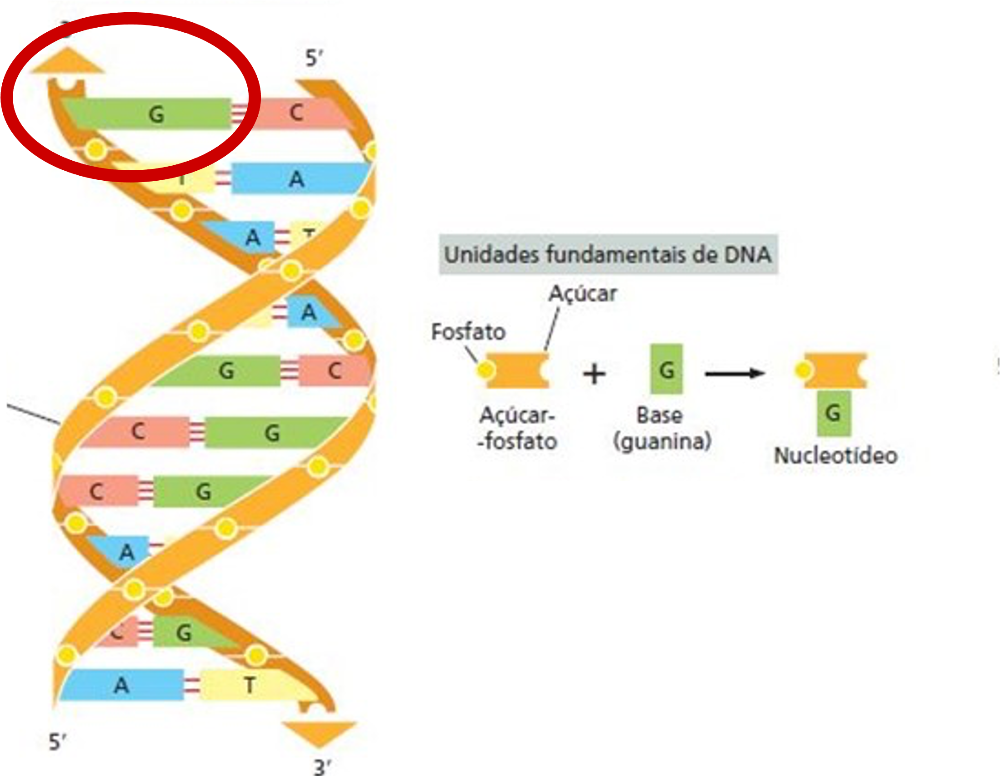
```
* A molécula de DNA está composta por nucleotídeos

---
## Estrutura do DNA
* Os nucleotídeos também são conhecidos como dNTPs - desoxinucleotídeo.
* O grupo fosfato dá o carater negativo à molécula de DNA.
* O açúcar é uma pentosa (cinco carbonos), chamado desoxirribose, pela falta do oxigênio no carbono 2.
```{r, echo=FALSE, fig.align = 'center', out.width = "50%"}
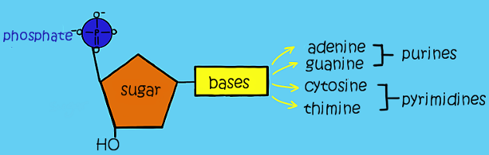
```
```{r, echo=FALSE, fig.align = 'center', out.width = "50%"}
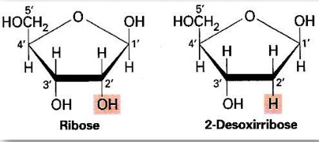
```
---
## Estrutura do DNA
* As bases dão nome aos nucleotídeos.
* Existem dois tipos de bases nitrogenadas, purinas e pirimidinas.
```{r, echo=FALSE, fig.align = 'center', out.width = "100%"}
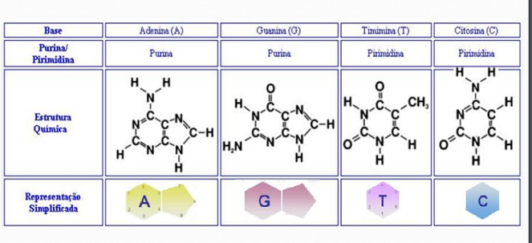
```
---
## Estrutura do DNA
* As bases nitrogenadas são complementares e se ligam por pontes de hidrogênio (união da dupla fita).
* Sempre se dá a união entre A e T por duas pontes, e entre G e C por três pontes.
* A ligação GC é mais forte.
```{r, echo=FALSE, fig.align = 'center', out.width = "100%"}
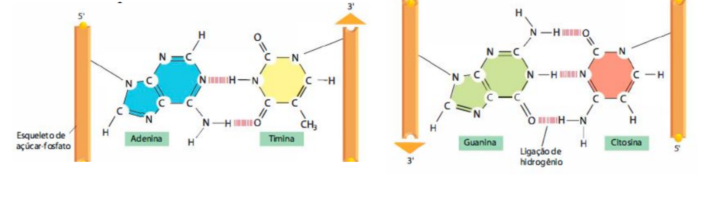
```
---
## Estrutura do DNA
* A polimerização da fita de DNA, se dá por uma ligação 3'-5' fosfodiéster.
```{r, echo=FALSE, fig.align = 'center', out.width = "70%"}
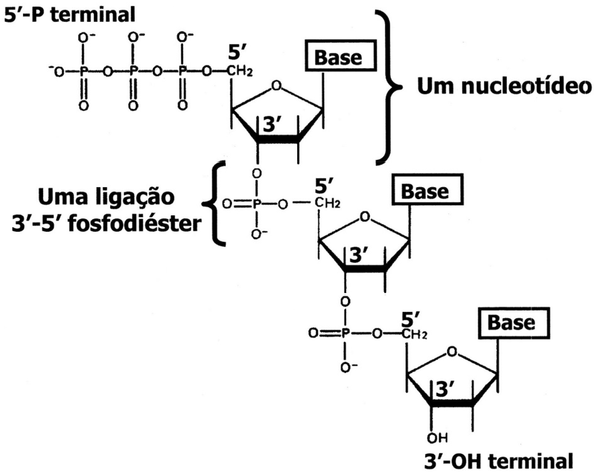
```
---
## Estrutura do DNA
* Dupla fita, antiparalela.
```{r, echo=FALSE, fig.align = 'center', out.width = "55%"}
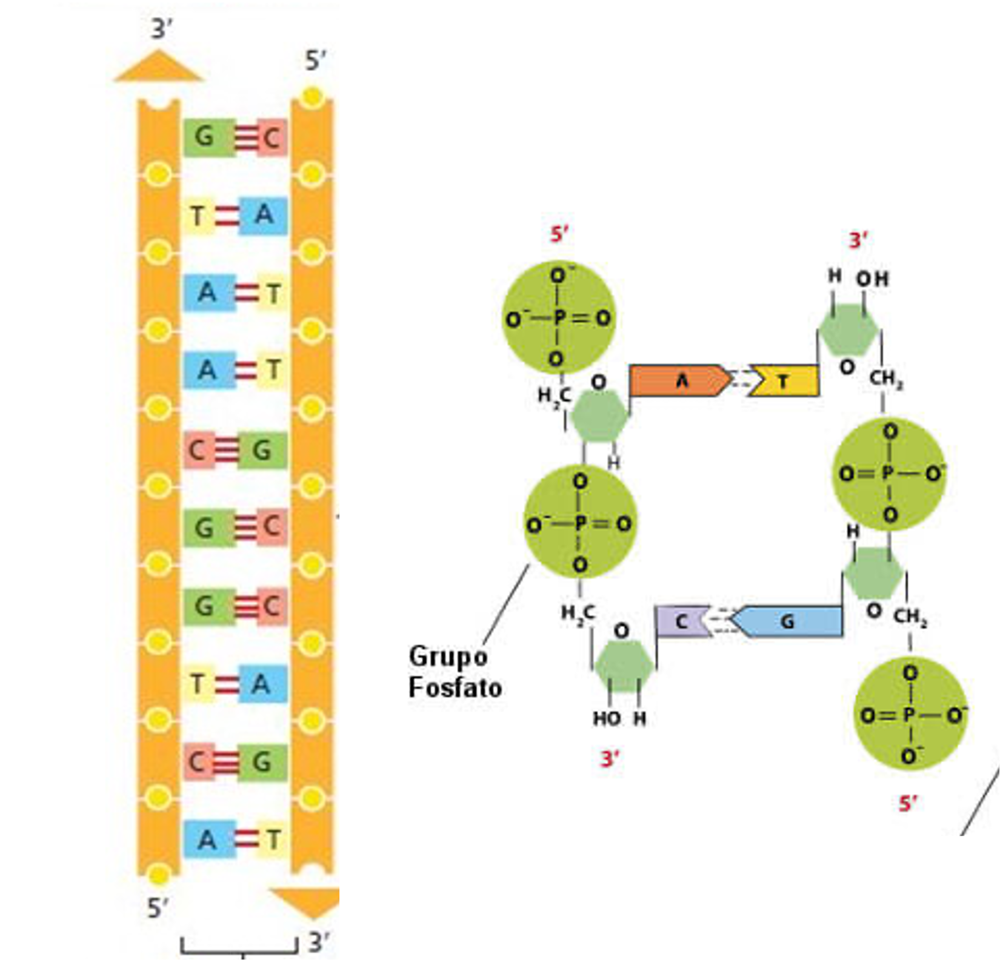
```
---
## Dogma Central da Biologia Molecular
.center[  ]
* O DNA se duplica, sempre em sentido 5' --> 3'
* O DNA é transcrito em RNA mensageiro e estes traduzidos em proteínas

---
class: center, middle, inverse
.huge[ # Agora sim entrando no nosso curso... ]
---

class: inverse, center, middle
.huge[ # 1. Sequenciamento de DNA e RNA ]
---

## O que é sequenciamento?
É a utilização de métodos bioquímicos para determinar a ordem dos nucleotideos
em uma molécula de DNA ou RNA. Assim, será possível conhecer a sequência em que
as quatro bases nucleotídicas ocorrem.
.center[  ]
---
class: center, middle, inverse
.huge[ # Um pouco de história ]
---
## A viagem pela história do sequenciamento do DNA
```{r, echo=FALSE, fig.align = 'center', out.width = "100%"}
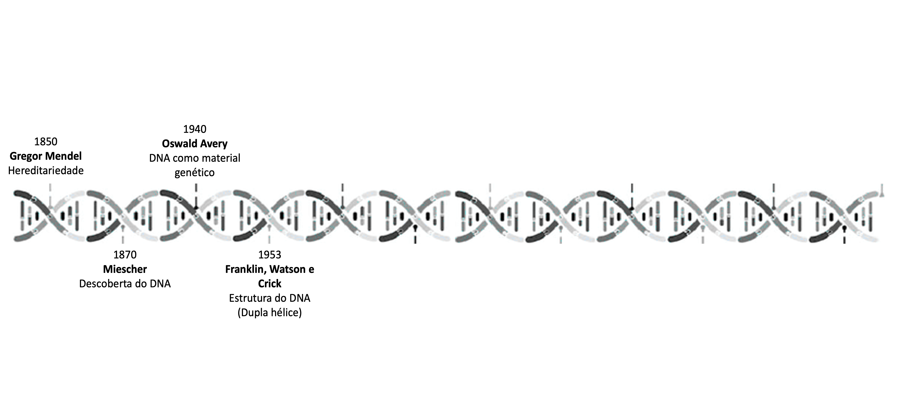
```
---
## A viagem pela história do sequenciamento do DNA
```{r, echo=FALSE, fig.align = 'center', out.width = "100%"}
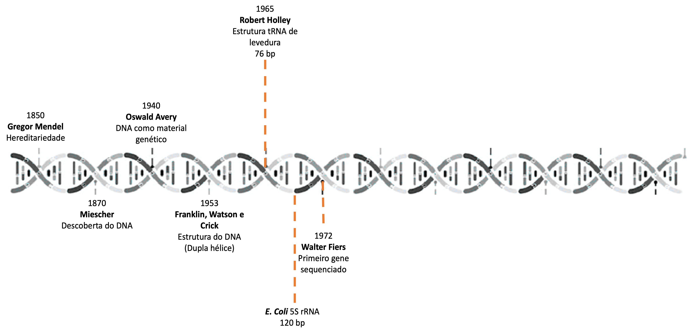
```
---
## A viagem pela história do sequenciamento do DNA
```{r, echo=FALSE, fig.align = 'center', out.width = "100%"}
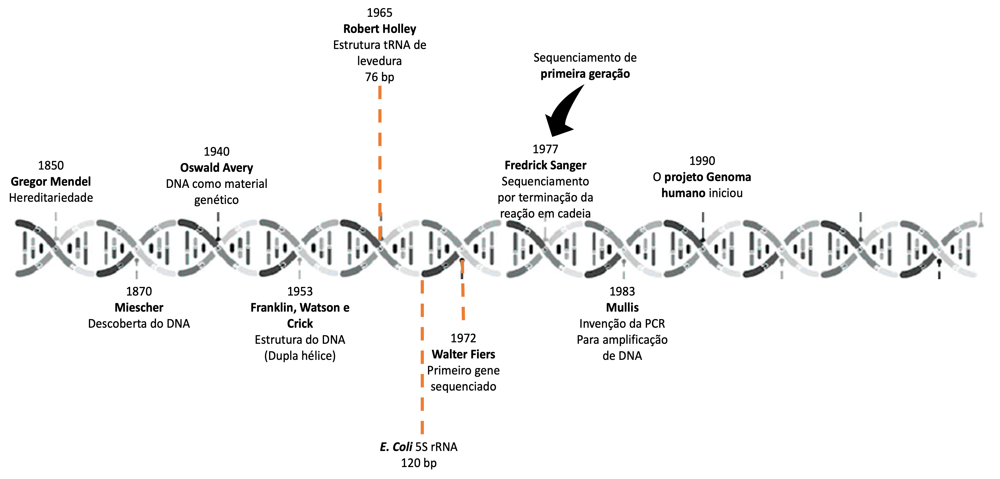
```
---
## A viagem pela história do sequenciamento do DNA
```{r, echo=FALSE, fig.align = 'center', out.width = "100%"}
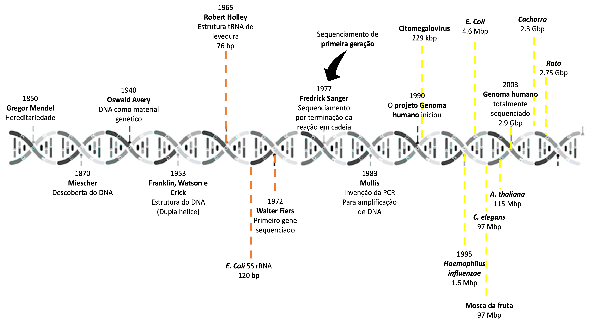
```
---
## A viagem pela história do sequenciamento do DNA
```{r, echo=FALSE, fig.align = 'center', out.width = "100%"}
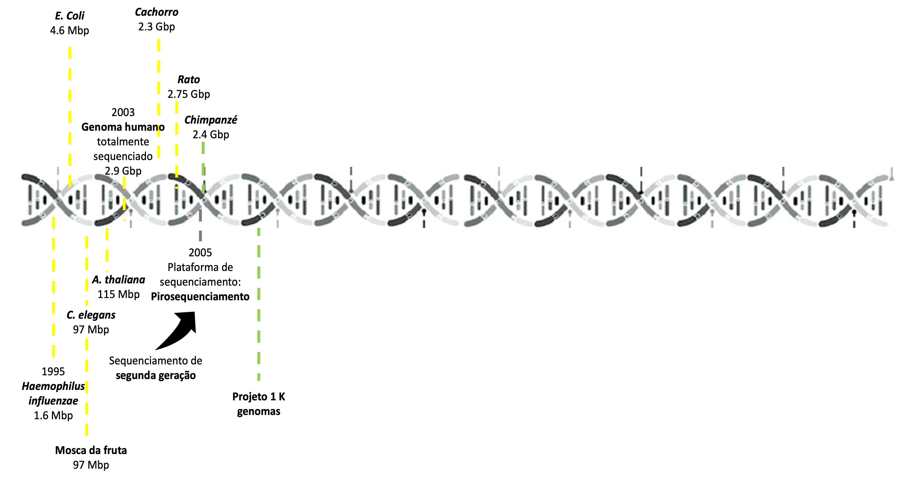
```
---
## A viagem pela história do sequenciamento do DNA
```{r, echo=FALSE, fig.align = 'center', out.width = "100%"}
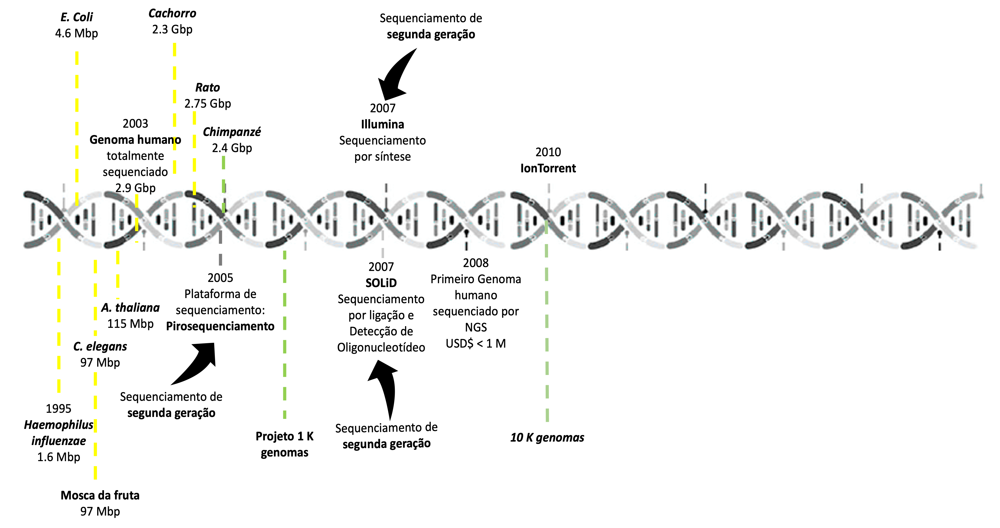
```
---
## A viagem pela história do sequenciamento do DNA
```{r, echo=FALSE, fig.align = 'center', out.width = "100%"}
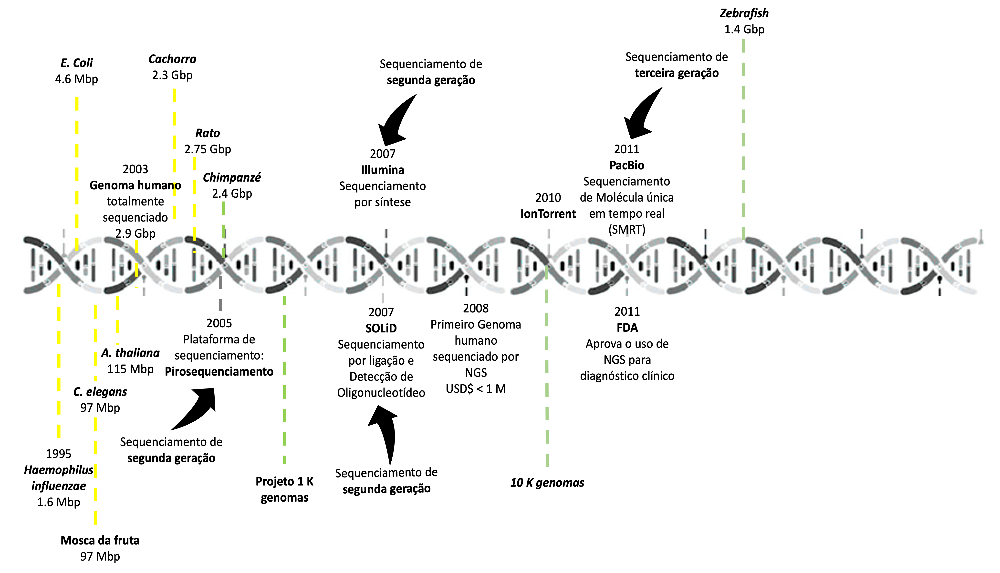
```
---
## A viagem pela história do sequenciamento do DNA
```{r, echo=FALSE, fig.align = 'center', out.width = "100%"}
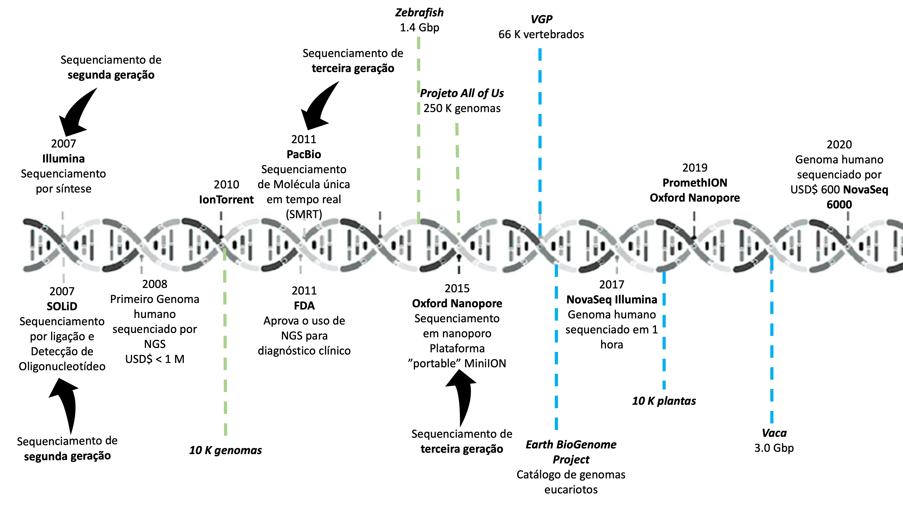
```
---
## Evolução do custo do sequenciamento do genoma humano
```{r, echo=FALSE, fig.align = 'center', out.width = "100%"}
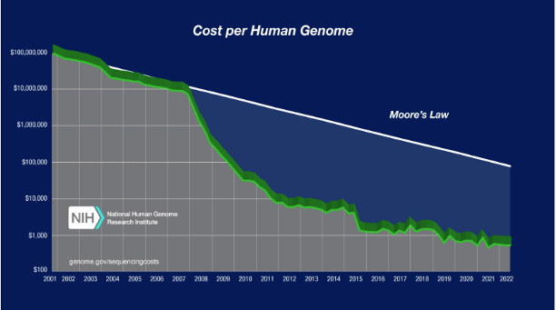
```
.tiny[
* Fonte: National Human Genome Research Institute
]

---
## Outros dados interessantes...
```{r, echo=FALSE, fig.align = 'center', out.width = "100%"}
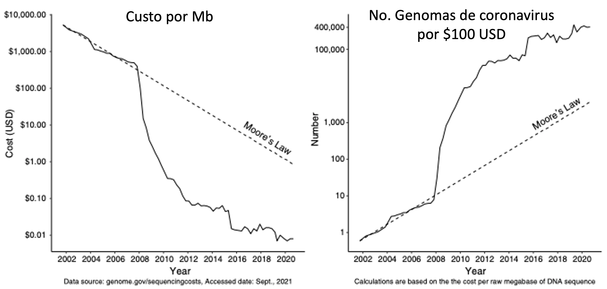
```
---
## Plataformas de sequenciamento
```{r, echo=FALSE, fig.align = 'center', out.width = "100%"}
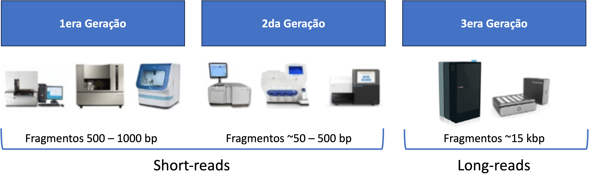
```
---
## Primeira Geração: Técnica Sanger
```{r, echo=FALSE, fig.align = 'center', out.width = "60%"}
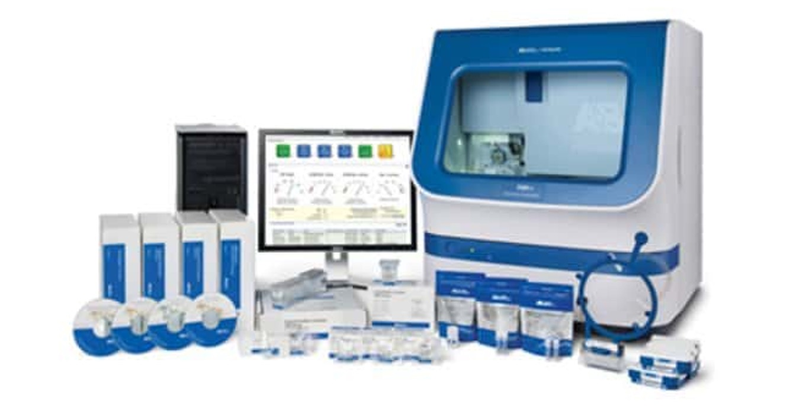
```
* Método de terminalização de cadeia
* Para isolados (não amostras mistas)
* Fragmentos de ~800 bp (F/R até ~1500 bp)
* Primeira máquina da Applied Biosystems (1986)
* Usada por Craig Venter para acelarar o Projeto Genoma Humano

---
## Primeira Geração: Técnica Sanger
* A reação de sequenciamento é muito similar a uma PCR
```{r, echo=FALSE, fig.align = 'center', out.width = "100%"}
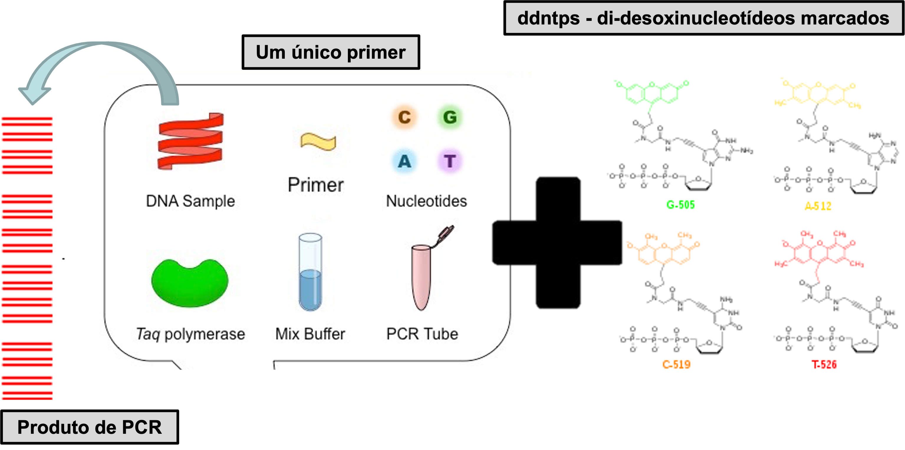
```
---
## Primeira Geração: Técnica Sanger
### dNTPs vs ddNTPs
* Ausença de um grupo 3'-hidroxil
```{r, echo=FALSE, fig.align = 'center', out.width = "80%"}
knitr::include_graphics("03.Images/dntps2.png")
```
---
## Primeira Geração: Técnica Sanger
### ddNTPs
* Não forma pontes fosfodiéster com outros dNTPs ou ddNTPs
```{r, echo=FALSE, fig.align = 'center', out.width = "70%"}
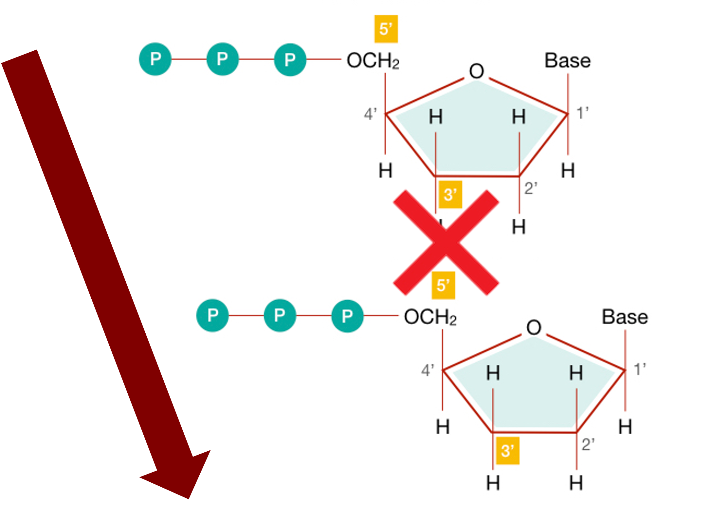
```
---
## Primeria Geração: Técnica Sanger
* Cada ddNTP é marcado com um fluoróforo diferente e emitirá uma "cor" diferente quando exitado
```{r, echo=FALSE, fig.align = 'center', out.width = "60%"}
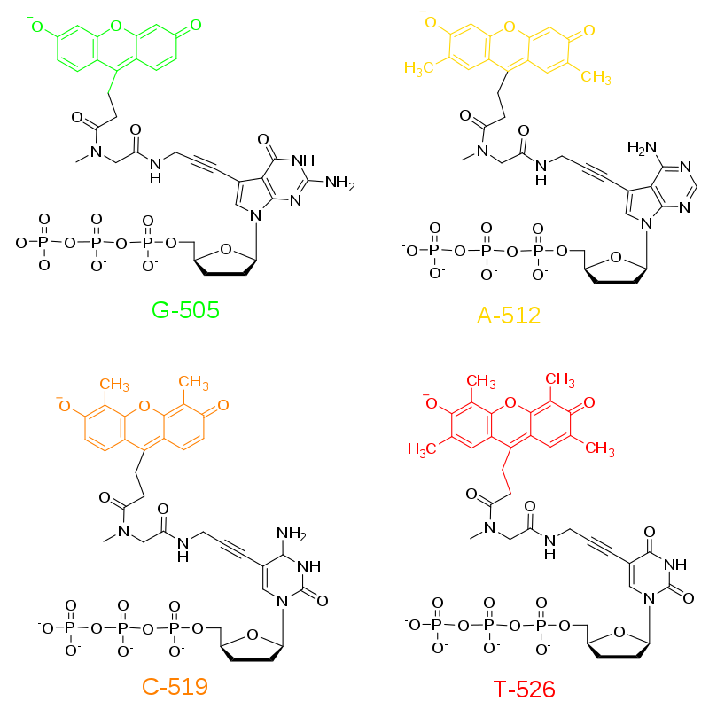
```
---
## Primeria Geração: Técnica Sanger
```{r setup, include=FALSE}
options(htmltools.dir.version = FALSE)
```
<iframe width="560" height="315"
src="https://www.youtube.com/embed/0ZVdROXCsi0?si=Wc9ryeKQvDwBgVof"
title="YouTube video player" frameborder="0" allow="accelerometer; autoplay;
clipboard-write; encrypted-media; gyroscope; picture-in-picture; web-share"
allowfullscreen></iframe>
---
## Primeria Geração: Técnica Sanger
### Interpretação dos resultados
* Ótimo
  * Picos bem distribuidos
  * Cada pico uma cor só
  * Altura dos picos pode variar 3 vezes
  * Ruido mínimo
```{r, echo=FALSE, fig.align = 'center', out.width = "100%"}
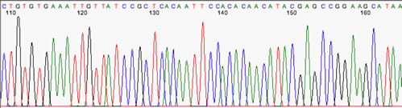
```
---
## Primeria Geração: Técnica Sanger
### Interpretação dos resultados
* Aceitável
  * Um pouco mais de ruído
  * Picos bem distribuídos
  * Cada pico uma cor só
```{r, echo=FALSE, fig.align = 'center', out.width = "100%"}
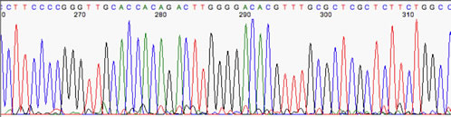
```
---
## Primeria Geração: Técnica Sanger
### Interpretação dos resultados
* Reprovado
  * Muito ruído
  * Picos de mais de uma cor nas posições 271, 273, 279
  * Algumas partes com picos desorganizados
  * Posição 310, não é claro qual é o nucleotídeo real
```{r, echo=FALSE, fig.align = 'center', out.width = "100%"}
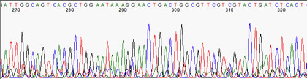
```
---
## Nova ou Segunda Geração
* Podem ser sequenciadas várias moléculas de DNA (Paralelismo)
* Mais rápido
* Gera maior volume de dados
* Baixo custo
* Menor comprimento dos fragmentos (short-reads)
* Requer preparação de bibliotecas
* Necessidade de novos algoritmos para processamento dos dados

---
## Nova ou segunda geração: Ion Torrent
* Sequenciamento por sínteses
* Similar ao pirosequenciamento (454 Roche)
* Detecção dos nucleotídeos por mudanças no pH (liberação de protons)
* Uso de semicondutores como sensor
* Fragmetos de 200 a 600 bp
* *Single-end*
```{r, echo=FALSE, fig.align = 'center', out.width = "100%"}
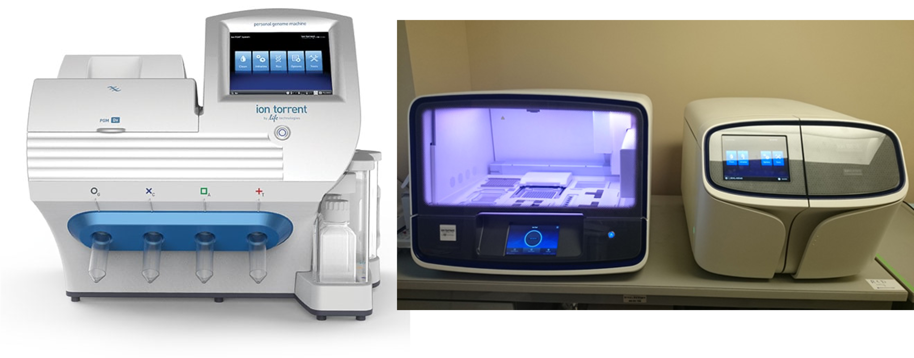
```
---
## Nova ou segunda geração: Ion Torrent
```{r, echo=FALSE, fig.align = 'center', out.width = "70%"}
knitr::include_graphics("03.Images/iontorrent2.png")
```
---
## Nova ou segunda geração: Ion Torrent
<iframe width="560" height="315"
src="https://www.youtube.com/embed/ltHX21vUJb0?si=fVFiE7bsvWb5nUFW"
title="YouTube video player" frameborder="0" allow="accelerometer; autoplay;
clipboard-write; encrypted-media; gyroscope; picture-in-picture; web-share"
allowfullscreen></iframe>

---
## Nova ou segunda geração: Illumina

--
* Sequenciamento por sínteses: identifica simultaneamente os nucleotídeos enquanto os incorpora na cadeia de DNA

--

* Nucleotídeos modificados, carregam um fluoróforo para serem detectados

--

* Os nucleotídeos também posuem um terminador **reversível** que bloqueia a incorporação da próxima base

--

* Detecção por fluorescencia

--

* Uma vez é detectado o nucleotídeo que foi adicionada na cadeia, o terminador é clivado para a próxima base possa se ligar e continuar o sequenciamento

--

* Maior custo-benefício: curto tempo de leitura, baixa taxa de erro e altamente escalável.

--
* Na mais recente plataforma NovaSeq 6000, podem ser analisadas até 798 amostras simultaneamente

--

* *Single-end* (sequenciamento de uma das pontas dos fragmentos, uma leitura por fragmento) e *paired-end* (sequenciamento das duas pontas dos fragmentos, duas leituras por fragmento)

---
## Nova ou segunda geração: Illumina
### *Single-end*  vs. *Paired-end*
```{r, echo=FALSE, fig.align = 'center', out.width = "70%"}
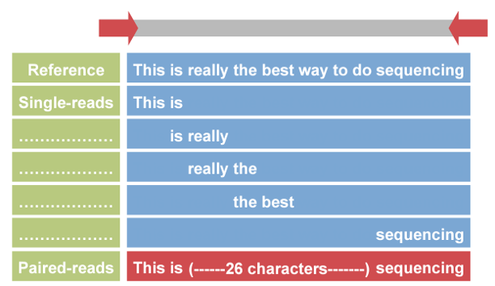
```
---
## Nova ou segunda geração: Illumina
### Preparação das bibliotecas (*paired-end*)
* Fragmentação aleatória do DNA (150 a 300 bp)
  * Métodos físicos de fragmentação (ex. sonicação e nebulização)
  * Métodos químicos (ex. enzimas de restrição)
  **Este processo tem que ser o mais aleatório possível**
* Ligação dos *Barcodes* (várias amostras simultáneamente).
* Ligação dos adaptadores nas extermidades de cada fragmento
  * Permitem se ligar aos adaptadores complementares numa placa de vidro (*flow cell*).
```{r, echo=FALSE, fig.align = 'center', out.width = "50%"}
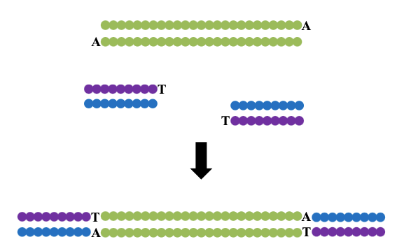
```
---
## Nova ou segunda geração: Illumina
### Preparação dos clusters
* Cada fragmento se ligará à placa por complementariedade dos adaptadores e gerará um cluster.
```{r, echo=FALSE, fig.align = 'center', out.width = "70%"}
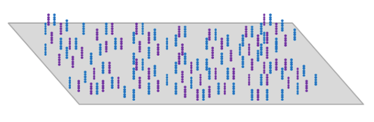
```
---
## Nova ou segunda geração: Illumina
### Preparação dos clusters
* Cada sequencia pressa na placa será amplificada por PCR gerando os *clusters*.
* Cada *cluster* contêm ~1 milhão de cópias do mesmo fragemento
* Amplificação em ponte
```{r, echo=FALSE, fig.align = 'center', out.width = "55%"}
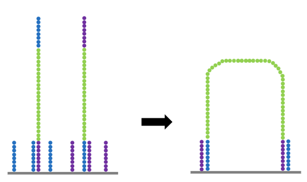
```
---
## Nova ou segunda geração: Illumina
### Preparação dos clusters
* Cada sequencia pressa na placa será amplificada por PCR gerando os *clusters*.
* Cada *cluster* contêm ~1 milhão de cópias do mesmo fragemento
* Amplificação em ponte
```{r, echo=FALSE, fig.align = 'center', out.width = "55%"}
knitr::include_graphics("03.Images/cluster3.png")
```
---
## Nova ou segunda geração: Illumina
### Preparação dos clusters
* Cada sequencia pressa na placa será amplificada por PCR gerando os *clusters*.
* Cada *cluster* contêm ~1 milhão de cópias do mesmo fragemento
* Amplificação em ponte
```{r, echo=FALSE, fig.align = 'center', out.width = "50%"}
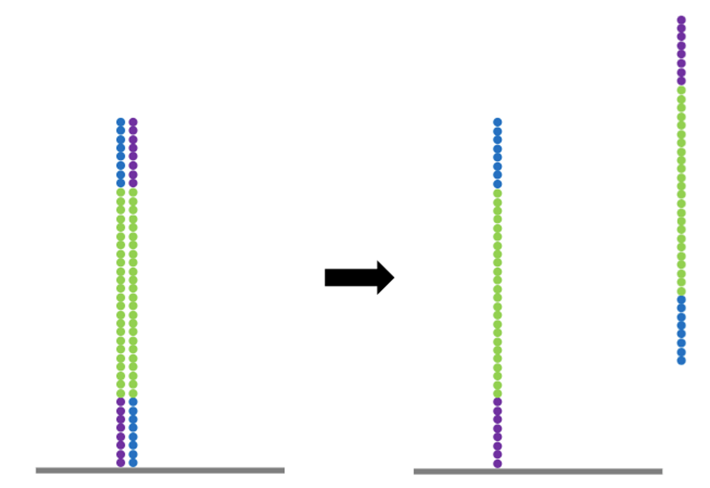
```
---
## Nova ou segunda geração: Illumina
### Preparação dos clusters
* Cada sequencia pressa na placa será amplificada por PCR gerando os *clusters*.
* Cada *cluster* contêm ~1 milhão de cópias do mesmo fragemento
* Amplificação em ponte
```{r, echo=FALSE, fig.align = 'center', out.width = "60%"}
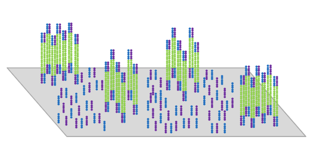
```
---
## Nova ou segunda geração: Illumina
### Preparação dos clusters
* Cada sequencia pressa na placa será amplificada por PCR gerando os *clusters*.
* Cada *cluster* contêm ~1 milhão de cópias do mesmo fragemento
* Amplificação em ponte
```{r, echo=FALSE, fig.align = 'center', out.width = "60%"}
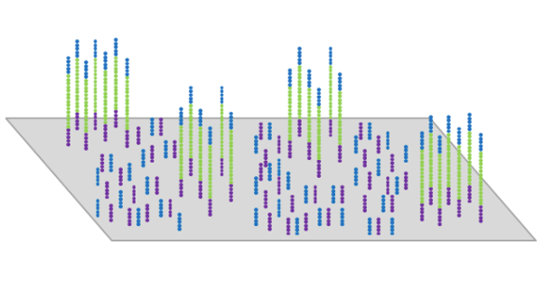
```
---
## Nova ou segunda geração: Illumina
### Sequenciamento por sínteses
* Os quatro nucleotídeos (*FI-NTPs*) são adicionados ao mesmo tempo
* São modificados, tem um fluoróforo diferente cada um e um bloqueador removível no extremo 3'
```{r, echo=FALSE, fig.align = 'center', out.width = "3C 0%"}
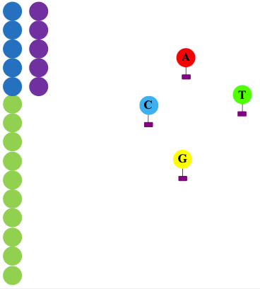
```
---
## Nova ou segunda geração: Illumina
### Sequenciamento por sínteses
* Os quatro nucleotídeos são adicionados ao mesmo tempo
* São modificados, tem um fluoróforo diferente cada um e um bloqueador removível no extremo 3'
```{r, echo=FALSE, fig.align = 'center', out.width = "30%"}
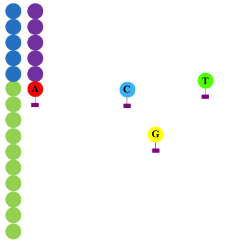
```
---
## Nova ou segunda geração: Illumina
### Sequenciamento por sínteses
* O laser excita o fluoróforo e o nucleotídeo adicionado é detectado
```{r, echo=FALSE, fig.align = 'center', out.width = "50%"}
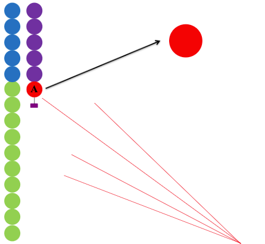
```
---
## Nova ou segunda geração: Illumina
### Sequenciamento por sínteses
* O terminador e o fluoróforo são clivados
```{r, echo=FALSE, fig.align = 'center', out.width = "40%"}
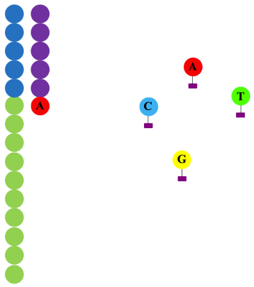
```
---
## Nova ou segunda geração: Illumina
### Sequenciamento por sínteses
* O seguinte nucleotídeo é adicionado
```{r, echo=FALSE, fig.align = 'center', out.width = "40%"}
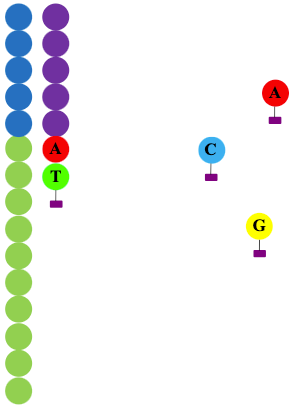
```
---
## Nova ou segunda geração: Illumina
### Sequenciamento por síntese
* E o processo é repitido até terminar de sintetizar o fragmento
```{r, echo=FALSE, fig.align = 'center', out.width = "50%"}
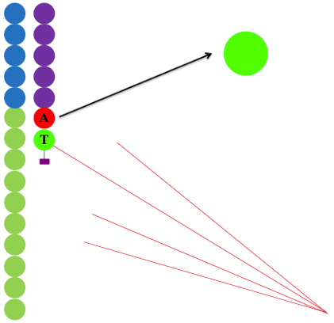
```
---
## Nova ou segunda geração: Illumina
### Sequenciamento por sínteses
* Imagem obtida a cada ciclo
* A imagem é transformada em bases (*basecalling*) e *reads* ou leituras.
* Sequenciamento *paired-reads* gerá um arquivo por cada extremo (R1 e R2)
```{r, echo=FALSE, fig.align = 'center', out.width = "60%"}
knitr::include_graphics("03.Images/seq7.png")
```
---
## Nova ou segunda geração: Illumina
### Sequenciamento por sínteses
```{r, echo=FALSE, fig.align = 'center', out.width = "70%"}
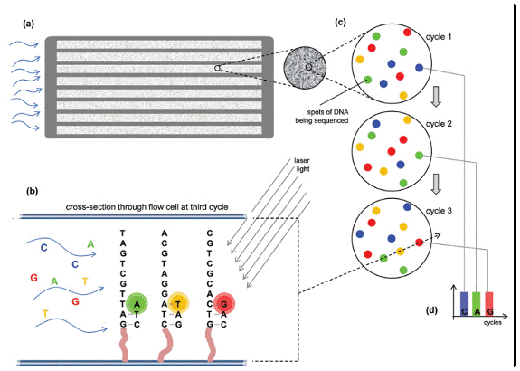
```
---
## Nova ou segunda geração: Illumina
<iframe width="560" height="315"
src="https://www.youtube.com/embed/fCd6B5HRaZ8?si=fNvVsJ2TlvSaXl1X"
title="YouTube video player" frameborder="0" allow="accelerometer; autoplay;
clipboard-write; encrypted-media; gyroscope; picture-in-picture; web-share"
allowfullscreen></iframe>
---
## Nova ou segunda geração: Illumina
```{r, echo=FALSE, fig.align = 'center', out.width = "100%"}
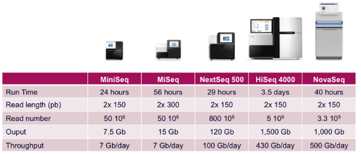
```
---
## Terceira geração: Oxford Nanopore
* *Long-reads* (~10 - 15 kbp). Facilita a montagem de genomas
* Sequenciamento de molécula única (SMS): Dispensa as etapas de amplificação por PCR, nas tecnologias anteriores
* Sequenciamento em tempo real
* Precio do equipamento desde $1.000 USD
* Taxa de erro mais alta que Illumina (~10%)
* O fragmento de DNA passa por um nanoporo proteico

---
## Terceira geração: Oxford Nanopore
* A corrente iônica sofre variações causadas pela ligação de vários nucleotídeos no mesmo poro
* As variações na corrente iônica é registrada em um modelo gráfico e interpretada para identificar a sequência gerando leituras "1D" ou "2D" (quando são lidas as duas fitas de DNA)
* O sequenciamento 1D, é mais rápido, o protocolo mais simples e barato
* O sequenciamento 2D, mais demorado, porém sequencia com maior confiabilidade
```{r, echo=FALSE, fig.align = 'center', out.width = "50%"}

```
---
## Terceira geração: Oxford Nanopore
* A assinatura elétrica detectada é usada para inferir as bases presentes
```{r, echo=FALSE, fig.align = 'center', out.width = "100%"}
knitr::include_graphics("03.Images/poro.webp")
```
---
## Terceira geração: Oxford Nanopore
### Preparação das bibliotecas
```{r, echo=FALSE, fig.align = 'center', out.width = "100%"}
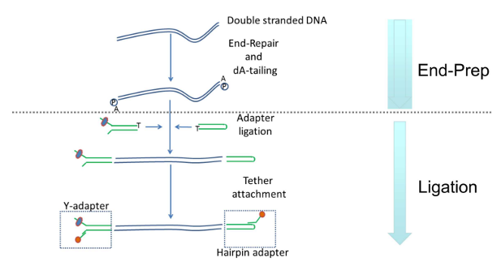
```
---
## Terceira geração: Oxford Nanopore
<iframe width="560" height="315"
src="https://www.youtube.com/embed/iT_A_ucWMls?si=vE2FHAXMAJQOrErf"
title="YouTube video player" frameborder="0" allow="accelerometer; autoplay;
clipboard-write; encrypted-media; gyroscope; picture-in-picture; web-share"
allowfullscreen></iframe>
---
## Terceira geração: Oxford Nanopore
### Equipamentos
```{r, echo=FALSE, fig.align = 'center', out.width = "100%"}
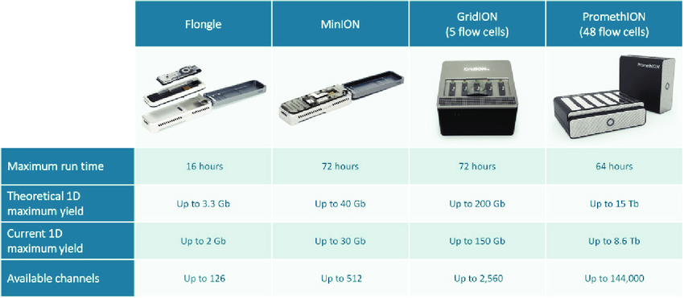
```
---
## Que plataforma escolher?
```{r, echo=FALSE, fig.align = 'center', out.width = "80%"}
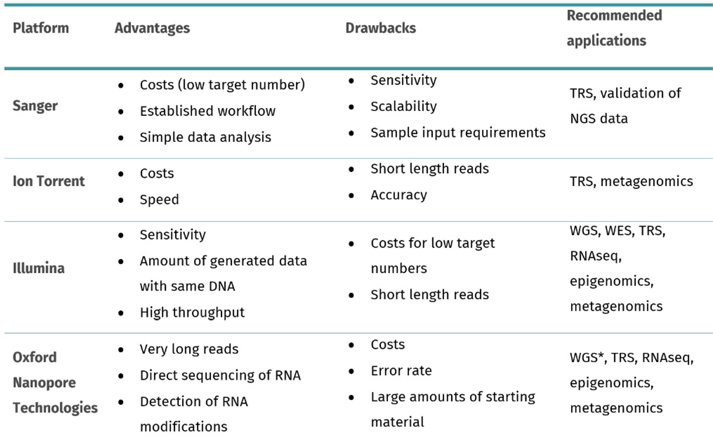
```
[Illumina](https://www.illumina.com/systems/sequencing-platforms/comparison-tool.html#/)
---
## Genômica vs Metagenômica
**Genômica**
* Sequenciamento de um microrganismos isolado
* Só cultiváveis
* Bioinformática mais simples
**Metagenômica**
* Sequenciamento do **DNA total** de uma amostra (ex. solo, agua, alimentos, biorreator)
* Não precisa métodos de cultivo
* Bioinformática mais complexa

---
## Até aqui aprendimos:
* Lembramos conceitos básicos de biologia molecular, especialmente relacionados com a estrutura do DNA.
* Uma viagem pela história do sequenciamento até nossos dias
* Revisão das principais tecnologias de sequenciamento, os principios, métodos, vavntagens e disvantagens

---
class: center, middle, inverse
.huge[ # 2. Noções de linguagem de programação: Linux ]
---
## Neste módulo vamos aprender:
* Linux como ferramenta de trabalho
* Lógica de programação, o básico do básico para processar dados de genômica e metagenômica
* Uso de ferramentas locais para análise de seus dados

---
## Neste módulo **Não** vamos a aprender:
* Detalhes dos algoritmos utilizados
* Programação direta (A maioria dos *scripts* já estão prontos)

---
## Sistema Operacional - GNU/LINUX
* Software livre e de código aberto
* A maioria das ferramentas de bioinformática foram desenvolvidas para este sistema operacional
* Distribuição mais famosa: *Ubuntu*
* Multitarefa
* Multiusuário
.center[  ]

---
## GUI vs CLI
* GUI: *Graphical User Interface*
  * Uso de teclado, mouse, voz.
  * Windows
  * Linux (sim também tem GUI)
  * Dificil automatização
  * Trabalho manual, maior possibilidade de erros
* CLI: *Command Line Interface*
  * Linha de comando (Tela preta + códigos)
  * Fácil automatização
  * Maioria das ferramentas de bioinformática usam linha de comando
  
---
## Shell
O *shell* do Linux é um interpretador da linha de comando. É uma ferramenta que
permite aos usuários executar tarefas complexas e poderosas, geralmente com
algumas linhas de código.
Usar o *shell* exigirá algum esforço e algum tempo para aprender. Você terá que
praticar os comandos como novo vocabulário de um idioma novo.
No entanto, aprendendo um pequeno número de "palavras" (comandos), você terá
percorrido já um longo caminho. Essas poucas porém essenciais palavras são as
que aprenderemos.
A gramática de um *shell* permite combinar ferramentas existentes em pipelines
poderosos e lidar automaticamente com grandes volumes de dados.
Sequencias de comandos podem ser escritas em um *script*, melhorando a
reprodutibilidade dos fluxos de trabalho.
---
class: center, middle, inverse
# Mãos a obra
.center[  ]
---
## Abrindo o *shell*
* Abra o aplicativo Ubuntu subsystem
Quando o *shell* é aberto, apresentará o que se conhece com *prompt*, o que
indica que o *shell* está pronto.
O *prompt* mais comúm é `$`
Nos exemplos das aulas sempre aparecerá primeiro o *prompt* `$`. Não é
necessário digitar o *prompt* quando façam comandos de exemplo. Só digitem o que
está **depois** do *prompt*.
As vezes, antes do *prompt* pode ter outras informações como o nome do usuário.
É hora de tentar o primeiro comando...

---
## Mais antes uma informação importante...
Ao igual que o Windows ou o Mac, o Linux está organizado em diretórios, portanto
todos os arquivos são guardados nos diretórios.
Depois a gente volta no conceito de estrutura dos diretórios no Linux.
---
## Navegando por arquivos e diretórios
O sistema responsável pelo gerenciamento dos arquivos e os diretórios é chamado
de *file system*.
Organiza os nossos dados dentro de arquivos, que carregam a informação, e
diretórios ou pastas, que carregam arquivos ou outros diretórios.
A continuação aprenderemos uma série de comandos que são usados frequentemente
para criar, inspeccionar, renomear e deletar arquivos e diretórios.
---
## `pwd` - *Print Working Directory*
.panelset[ .panel[.panel-name[`pwd`]
Os diretórios são como *lugares*, sempre que estamos usando o *shell*, estamos
exatamente em um lugar, chamado *current working directory* (diretório atual de
trabalho). Os comandos leem e gravam principalmente arquivos no diretório atual
de trabalho, ou seja, .yellow['aqui'], portanto é importantye saber onde você
está antes de executar um comando.
`pwd` mostra onde você esta:
.orange[Input] .code-bg-gray[
```
$ pwd
```
] .green[Output] .code-bg-gray[
```
/Users/macbook
```
] ]
.panel[.panel-name[Nota]
**Nota:** O caminho ao diretório atual pode aparecer diferente segundo o sistema operativo. Por exemplo em Linux pode ser `/home/macbook`, e em Windows, pode ser similar a `C:\Documents and Settigs\macbook` ou `C:\Users\macbook`. Isso pode variar inclusive entre versões de Windows. Nos próximo exemplos, usaremos o output de Mac como padrão. No Linux e Windows pode ser um pouquinho diferente.
]
.panel[.panel-name[Graficamente]
```{r, echo=FALSE, fig.align = 'center', out.width = "60%"}
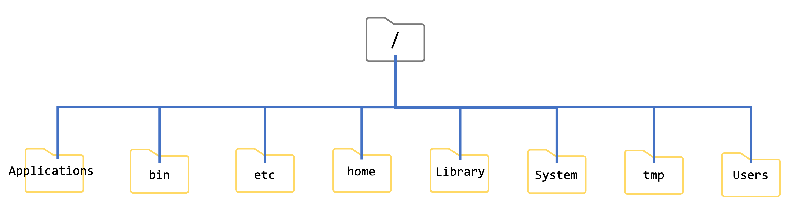
```
O sistema de arquivos do meu laptop, é algo assim. O diretório mais para cima, é
o chamado **root**, o qual tem todos os arquivos e pastas do meu laptop. Se
simboliza com a barra `/`. Essa barra é a mesma que está no `/Users/macbook`.
Dentro do diretório *root*, tem outros diretórios, como são: `Applications`,
`bin`, `etc`, `home`, `Users`, etc.
Então, agora a gente sabe que o meu diretório atual de trabalho é
`/Users/macbook` que está armazenado dentro `/Users`, porque `/Users` é a
primeira parte do caminho. E assim, também percebemos que `/Users` está
armazenado dentro do diretório *root* `/`, porque o caminho começa com `/`. ]
.panel[.panel-name[Nota 2]
Note que a barra `/` tem dois significados. Quando aparece na frente de um
arquicvo o diretório se refere ao diretório *root*. Quando aparece entre o
caminho, é um separador.
]
.panel[.panel-name[Explorando mais]
Explorando mais, a gente pode perceber que dentro de `/Users`, se encontram os
diretórios, *Shared* e *macbook*.
```{r, echo=FALSE, fig.align = 'center', out.width = "70%"}
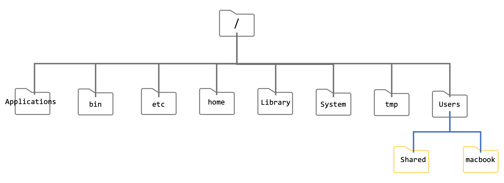
```
.blue[**Agora é sua vez...**]
* Qual é seu diretório de trabalho?
] ]

---
## `ls` - *list*
.panelset[ .panel[.panel-name[`ls`]
Agora sabemos qual é nosso diretório atual, mas e como podemos acceder ao
conteúdo deste diretório?. O comando `ls` listará o conteúdo do diretório atual.
.orange[Input]
.code-bg-gray[
```
$ ls
```
]
.green[Output]
.code-bg-gray[
```
anaconda3 snap
```
] ] .panel[.panel-name[`ls -F`]
Comumente os comandos podem ser acompanhados por argumentos, mudando o
resultado. Por exemplo se usarmos o argumento `-F`, pede para o `ls` classificar
o conteúdo do diretório pelo tipo de elemento, por exemplo, diretório, arquivo
ou executável. `/` : Diretório; `@` : é um link; `*` : executável.
.orange[Input]
.code-bg-gray[
```
$ ls -F
```
]
.green[Output]
.code-bg-gray[
```
anaconda3/ snap/
```
] ] .panel[.panel-name[Dica!]
**Nota:** Se você quiser limpar o seu terminal (*shell*), digite o comando `clear`. Usando as zetas ⬆️ ⬇️, podem ser recuperados linhas de comando digitadas anteriormente.
]
.panel[.panel-name[Ajuda]
Normalmente todos os comandos tem um menú de ajuda, onde você pode ver qual é a
função desse comando e os argumentos que pode usar.
.orange[Input]
.code-bg-gray[
```
$ ls --help
```
]
.blue[**Agora é sua vez...**]
* Liste o conteúdo do seu diretório atual
* Acceda ao menú de ajuda do comando `ls`
* Teste mais argumentos do comando `ls` (ex. `-r`, `-t`, `-l` e `-a`), e veja o que cada uma das opções faz.
]
.panel[.panel-name[Explorando mais]
`ls` não é somente para usar no diretório atual, também podem ser explorados
outros diretórios.
Dê uma olhada na pasta **anaconda3**, digitando `ls -F anaconda3`. Nesse exemplo
o comando é `ls`, a opção é `-F` e o argumento é `anaconda3`.
O argumento `anaconda3` diz para `ls` que queremos listar o conteúdo de um
diretório diferente ao atual, no caso o diretório `anaconda3`
Se o diretório `anaconda3` não existe no seu diretório atual, será retornado um
erro. Normalmente, o diretório `anaconda3` existe dentro de seu diretório
`home`.
] ]

---
## Sintaxe geral dos comandos no shell
Normalmente, um comando se divide em: comando, opções e argumentos.
.orange[Input]
.code-bg-gray[
```
$ ls -l Escritorio
```
]
```{r, echo=FALSE, fig.align = 'center', out.width = "60%"}
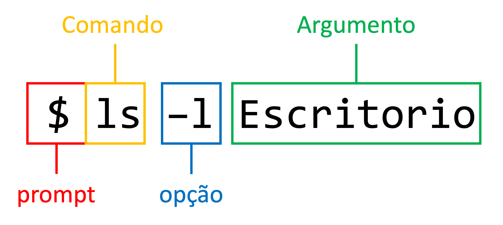
```
Também podem ser encontradas opções que além de começar com um traço simples
(`-`), conhecido como opção curta, podem começar com dois traços (`--`). As
opções mudam o comportamneto do comando e os argumentos falam para o comando a
qual elemento será aplicado o comando (p.e. arquivos e diretórios). As vezes os
argumentos também são chamados paramêtros. Um comando pode ter mais de uma opção
e mais de um argumento, porém não sempre se requer um arguemnto ou uma opção.
---
## `mkdir` - *Make Dir*
.panelset[ .panel[.panel-name[`mkdir`]
O comando `mkdir` serve para criar diretórios.
Antes de criar o nosso primeiro diretório, primeiro revisemos as boas práticas
para nomear arquivos e diretórios.
1. **Não** crie nomes com espaços. `curso_senai` é melhor que `curso senai` 2.
**Não** é permitido o uso de caracteres especiais, como: $%&*()+=¨;'?#@¡! 3.
**Não** comece com `-`, os comandos tratam os nomes que como começam com `-`
como as opções 4. Coloque nomes que sejam indicativos do que o arquivo ou
diretório contem. `curso_senai` é melhor que `curso` 5. **Recomendação:** para
trabalhos de passos sequenciais, facilita nomear os diretórios com números que
indiquem a etapa do trabalho. `00.DadosBrutos` melhor que `DadosBrutos`,
`01.Qualidade` melhor que `Qualidade` ]
.panel[.panel-name[Uso]
Criaremos um diretório para armazenar todo o relacionado ao curso. Esta será sua
pasta durante o curso todo.
.orange[Input]
.code-bg-gray[
```
$ mkdir curso_senai
```
]
* Como confirmaria que o diretório foi criado?
]
.panel[.panel-name[Conceito:Caminho]
Uma vez criado o diretório do curso, criaremos uma pasta dentro dele para
armazenar o relacioanado a nossa aula de comandos básicos de linux. Mas antes...
* Identifique onde você está?
Para conseguir criar o diretório dentro de `curso_senai`, primeiro temos que
aprender o conceito de **caminho**
O **caminho** de um diretório ou arquivo nada mais é que a localização completa
desse elemento. Por exemplo `/root/curso_senai`: A pasta `curso_senai`, está
dentro de `root` que a sua vez está dentro da pasta raiz `/`.
Existem **caminhos absolutos** e **caminhos relativos**. O exemplo anterior é um
caminho absoluto. O caracter `~` é interpretado por *shell* como o diretório
*home* do usuario, ou seja `~/curso_senai` é o mesmo que `/root/curso_senai`,
porque o diretório *home* no nosso caso é `/root/`.
]
.panel[.panel-name[Prática]
Entendido o conceito de caminho...
* Como criar um diretório dentro de outro?
.orange[Input]
.code-bg-gray[.can-edit[
```
$ mkdir
```
] ] ] ]
---
## `cd` - *Change Directory*
.panelset[ .panel[.panel-name[`cd`]
Até agora já aprendimos como nos localizar dentro do sistema de arquivos, o que
é caminho e como criar diretórios, porém como entramos e saimos dos diretórios?
O comando `cd` nos permite trocar entre diretórios, basta só indicar o caminho
da pasta.
Por exemplo, estando no diretório *home*, queremos ir à pasta que criamos
anteriormente `curso_senai`
.orange[Input]
.code-bg-gray[
```
$ cd curso_senai/
```
] ]
* Como você pode comprovar que mudou de diretório?
.panel[.panel-name[Atalhos]
Existem algumas convenções para alguns diretórios genéricos.
* Diretório atual: `.`
* Diretório contenedor do diretório atual: `..`
**Dica de ouro**
Você pode usar a tecla **Tab** para autocompletar as palavras. Assim, economiza
tempo, e evita erros de escrita, porque o sistema só vai completar nomes de
elementos existentes no sistema. Só tem que escrever as primeiras letras da
palavra e presionar tab, e o sistema autocompletará a palavra.
]
.panel[.panel-name[Prática]
.blue[**Agora é sua vez...**]
* Onde você está?
* Liste o conteúdo do seu diretório atual?
* Qual seria a linha de comando para entrar na pasta `comandos_basicos`.
* Como voltaria ao diretório contenedor de `comandos_basicos` ou seja `curso_senai`
.orange[Input]
.code-bg-gray[.can-edit[
```
$
```
] ] ] ]
---
class: inverse
## Quiz
Use o diagrama de embaixo, se `pwd` imprime na tela `/Users/thing`, que sairá
usando a linha de comando `ls -F ../backup`?
1. `../backup: No such file or directory` 2. `2012-12-01 2013-01-08 2013-01-27`
3. `2012-12-01/ 2013-01-08/ 2013-01-27/` 4. `original/ pnas_final/ pnas_sub/`
```{r, echo=FALSE, fig.align = 'center', out.width = "60%"}
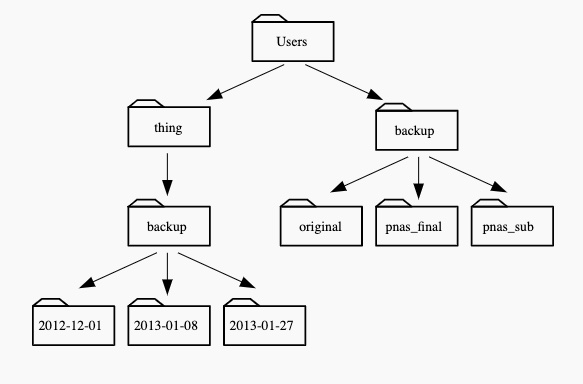
```
---
class: inverse
## Quiz
Estando no diretório `/root/curso_senai`, quais dos seguintes comando poderiamos
usar para navegar e chegar no diretório home, que é `/root`?
1. `cd .` 2. `cd /` 3. `cd /root` 4. `cd ../..` 5. `cd ~` 6. `cd home` 7. `cd
~/curso_senai/..` 8. `cd` 9. `cd ..`
---
class: inverse
## Quiz
Use o diagrama de embaixo, se `pwd` imprime na tela `/Users/backup`, e -r diz
para o `ls` imprimir o nomes dos elementos em ordem reversa, qual ou quais
comandos daria o seguinte output:
.green[Output] .code-bg-gray[
```
pnas_sub/ pnas_final/ original/
```
]
```{r, echo=FALSE, fig.align = 'center', out.width = "45%"}
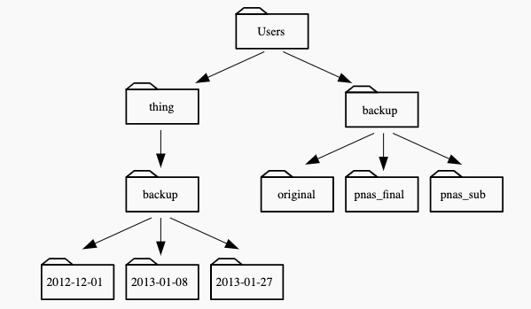
```
1. `ls pwd` 2. `ls -r -F` 3. `ls -r -F /Users/backup`
---
## `nano` - Editor de texto
.panelset[ .panel[.panel-name[`nano`]
`nano` é um editor de texto, com o qual podemos criar ou editar arquivos planos.
.orange[Input]
.code-bg-gray[
```
$ nano teste.txt
```
]
Para este curso vamos usar `nano` porque é um dos editores de texto plano mais
simples de usar. No entanto por essa mesma razão ele não é tão podereso e
flexível. Existem outros para Linux, como
[**Emacs**](https://www.gnu.org/software/emacs/) e
[**Vim**](https://www.vim.org/), porém ambos precisam de mais tempo para
aprender usá-los. Em Windows, pode ser usado **Notepad++**
]
.panel[.panel-name[Prática]
.blue[**Agora é sua vez...**]
* Se necessário use o comando `cd` para entrar na pasta `comandos_básicos`
* Crie um arquivo chamado `teste.txt`. Escreva dentro do arquivo: `Olá Mundo`
* Para sair do editor pressione ctrl + x, ele vai perguntar se você quer gravar, pressione S ou Y. Depois ele vai perguntar se quer manter o nome, se sim é só pressionar Enter.
* Descarregue os arquivos: `propanol.txt`, `etanol.txt`, `metanol.txt` e `pentanol.txt`. Armazene eles no diretório `~/curso_senai/comandos_basicos/`.
* Para entrar nos arquivos é só usar `nano nome_do_arquivo`
.orange[Input]
.code-bg-gray[
```
# Por exemplo
$ nano teste.txt
```
* Confira que conteúdo do diretório.
] ] ]

---
## `mv` - *Move*
.panelset[ .panel[.panel-name[`mv`]
O comando `mv` serve para mover arquivos de uma pasta a outra. Além este comando
também pode ser usado para mudar os nomes dos elementos. A sintaxe para mover
arquivos è:
.orange[Input]
.code-bg-gray[
```
$ mv arquivo.txt diretorio/
```
] ]
.panel[.panel-name[Prática 1]
.blue[**Agora é sua vez...**]
* Dentro da pasta `~/curso_senai/comandos_basicos`, crie um novo diretório que se chame `01.Exercicio`.
* Transfira o arquivo que criou com `nano` chamado `teste.txt` que está armazenado na pasta `~/curso_senai/comandos_basicos` para o diretório que acabou de criar.
* Que comando pode ser usado para confirmar as mudanças feitas?
.orange[Input]
.code-bg-gray[.can-edit[
```
$
```
] ] ]
.panel[.panel-name[Trocando o nome]
O `mv` também serve para trocar os nomes dos arquivos ou pastas. A sintaxe para
esta função é:
.orange[Input]
.code-bg-gray[
```
$ mv arquivo.txt novo_nome.txt
```
] ]
.panel[.panel-name[Prática 2]
.blue[**Agora é sua vez...**]
* Agora use o comando `mv` para trocar o nome do arquivo `teste.txt` para `arquivo.txt`
* Que comando pode ser usado para confirmar as mudanças feitas?
.orange[Input]
.code-bg-gray[.can-edit[
```
$
```
] ] ] ]
---
class: inverse
## Quiz
Depois de executar os seguintes comandos, João colocou os arquivos `genes.txt` e
`proteinas.txt` no diretório errado. Os arquivos deveriam estar no diretório
`dados`.
.yellow[BASH]
.code-bg-gray[
```
$ ls -F
analises/ dados/
$ ls -F analises
bacterias.txt genes.txt genomas.txt proteinas.txt
$ cd analises
```
]
Preencha os espaços para mover os arquivos para o diretório `dados/`
.yellow[BASH]
.code-bg-gray[.can-edit[
```
$ mv genes.txt proteinas.txt ___/___
```
] ]
---
## `cp` - *Copy*
.panelset[ .panel[.panel-name[`cp`]
O comando `cp` é similar ao `mv`, porém ele cópia o arquivo ao invés de
transferir ele. Ou seja, ficará uma versão do arquivo na pasta original.
A sintaxe deste comando é muito simples: .orange[Input]
.code-bg-gray[
```
$ cp diretorio_de_origem/arquivo.txt diretorio_de_destino/
```
] ]
.panel[.panel-name[Prática]
.blue[**Agora é sua vez...**]
* Use os comandos necessários para saber onde você está neste momento. Se você não estiver na pasta `~/curso_senai/comandos_basicos/`, vai até ela.
* Execute os comandos desde `~/curso_senai/comandos_basicos/`
* Copie o arquivo chamado `arquivo.txt` que está armazenado no diretório `~/curso_senai/comandos_basicos/01.Exercicio/` na pasta `~/curso_senai/comandos_basicos/`.
* Copie novamente `arquivo.txt` porem agora na pasta `~/curso_senai/`.
* Confira as mudançãs feitas
.orange[Input]
.code-bg-gray[.can-edit[
```
$
```
] ] ]
.panel[.panel-name[E diretórios?]
Para cópiar arquivos é só usar a opção ou paramêtro `-r`.
Lembrando que todos os comandos tem um menú de ajuda ao qual podem acessar com a
opção `-h` ou `--help`.
] ]
---
class: inverse
## Quiz
Suponha que você criou um arquivo de texto plano, no seu diretório atual que
contem uma lista de testes estatísticos que você precisa para analisar seus
dados e o chama de `estatsticos.txt`
Depois criar e salvar este arquivo, você percebeu que errou na escrita no nome,
e você quer corrigir o erro. Qual dos seguinte comando poderia ser usado para
isso?
1. `cp estatsticos.txt estatisticos.txt` 
2. `mv estatsticos.txt
estatisticos.txt` 
3. `mv estatsticos.txt .` 
4. `cp estatsticos.txt .`
---
## `rm` - *Remove*
.panelset[ .panel[.panel-name[`rm`]
Com o comando `rm` você pode remover arquivos e ou pastas. A sintaxe é:
.orange[Input] .code-bg-gray[
```
$ rm arquivo.txt
```
]
👀️**Neste tipo de sistemas não existe a lixeira, por tanto o que for deletado,
não poderá ser recuperado, CUIDADO!**
] .panel[.panel-name[Prática]
.blue[**Agora é sua vez...**]
* Ainda desde o diretório `~/curso_senai/comandos_basicos/`:
* Delete o arquivo chamado `arquivo.txt` do diretório `~/curso_senai/`
* Delete a cópia que está na pasta `~/curso_senai/comandos_basicos/`
* Confira, só deve ter esse arquivo (`arquivo.txt`) dentro da pasta `~/curso_senai/comandos_basicos/01.Exercicio/`
.orange[Input]
.code-bg-gray[.can-edit[
```
$
```
] ]
]
.panel[.panel-name[Dica!]
Para usar o uso do comando `rm` mais seguro, sempre use a opção `-i`. Esse
paramêtro faz com que o comando peça para o usuário que confirme se quer mesmo
deletar o arquivou e/ou diretório.
Faça o teste:
* Crie um arquivo plano, no diretório atual.
* Delete ele usando a opção `-i`
* O que aconteceu?
] ]

---
## Caracteres Curingas
.panelset[ .panel[.panel-name[Asterístico]
O caracter `*` é muito útil na linha de comando, pois ele representa zero ou
mais caracteres.
Por exemplo, no diretório `~/curso_senai/comandos_basicos/` temos os arquivos
`propanol.txt`, `etanol.txt` e `metanol.txt` e `pentanol.txt`., os quais
poderiam ser representados assim: `*.txt` (*tudo o que termina em `.txt`*).
Assim mesmo, os arquivos `propanol.txt` e `pentanol.txt` podem ser representados
como: `p*.txt` (*tudo o que começa com `p` e termina com `.txt`).
]
.panel[.panel-name[Interregocação]
O caracter `?` também é um caracter curinga, mas ele só pode representar um
único caracter. Por exemplo, `?etanol.txt` (*um caracter seguido de
`etanol.txt`*) representaria metanol enquanto `*etanol.txt` (*tudo o que termina
em `etanol.txt`*) representaria `etanol.txt` e `metanol.txt`.
Podem ser usados vários ao mesmo tempo. Por exemplo `????anol.txt`, o que indica
quatro caracteres seguidos de `anol.txt`, ou seja, `propanol.txt` e
`pentanol.txt`.
]
.panel[.panel-name[Prática]
Ok, mas na prática para que servem os caracteres curingas?
.blue[**Agora é sua vez...**]
* Liste o conteúdo do diretório `~/curso_senai/comandos_basicos/`
* Crie uma nova pasta chamada `02.Exercicio`
* Utilize os caracteres curingas para mover todos os arquivos que começam com `p` para a pasta `~/curso_senai/comandos_basicos/02.Exercicio`
* Utilize os caracteres curingas para copiar todos os arquivos que tem a sílaba `ta`, sem importar com o que termina e começa, para a pasta `~/curso_senai/comandos_basicos/02.Exercicio`
.orange[Input]
.code-bg-gray[.can-edit[
```
$
```
] ] ] ]
---
class: inverse
## Quiz
Quando executa dentro do diretório
`~/curso_senai/comandos_basicos/02.Exercicio`, qual dos comandos `ls` poderia produzir o seguinte *output*?

.green[Output] .code-bg-gray[
```
ethanol.txt metanol.txt
```
]

1. `ls *t*nol.txt` 
2. `ls *ta?ol.*` 
3. `ls *et?nol.txt` 
4. `ls etanol.*`

---
class: inverse
## Quiz
Suponha que você está iniciando um novo experimento e quer duplicar a estrutura
do diretório de experimentos previos para adicionar os novos dados.
Asuma que seu experimento previo esta em uma pasta chamada `18-09-2023`, que
contem a pasta `dados`, dentro da qual tem as pastas `brutos` e `processados`. O
objetivo é copiar a estrutura do diretório `18-09-2023` no diretório
`20-10-2023` para obter uma estrutura similar a esta:
```{r, echo=FALSE, fig.align = 'center', out.width = "45%"}
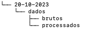
```
* Qual dos seguintes conjuntos de comandos poderiam atingir o objetivo?

---
class: inverse
## Quiz
```{r, echo=FALSE, fig.align = 'center', out.width = "45%"}

```
```
$ mkdir 20-10-2023
$ mkdir 20-10-2023/dados
$ mkdir 20-10-2023/dados/processados
$ mkdir 20-10-2023/dados/brutos
```
```
$ mkdir 20-10-2023
$ cd 20-10-2023
$ mkdir dados
$ cd dados
$ mkdir brutos processados
```
---
class: inverse
## Quiz
```{r, echo=FALSE, fig.align = 'center', out.width = "45%"}

```
```
$ mkdir 20-10-2023/dados/brutos
$ mkdir 20-10-2023/dados/processados
```
```
$ mkdir -p 20-10-2023/dados/brutos
$ mkdir -p 20-10-2023/dados/processados
```
```
$ mkdir 20-10-2023
$ cd 20-10-2023
$ mkdir dados
$ mkdir brutos processados
```
---
## Ainda temos muitos comandos para aprender
Para os seguintes comandos, crie uma pasta chamada `03.Exercicio`, dentro dela,
coloque os arquivos de texto, chamados `bssA_1.txt` e `bssA_2.txt`. Cada um
deles contém uma uma sequência do gene *bssA* que codifica para a enzima
*Benzylsuccinate synthase*.
* [Sequencia](https://www.ncbi.nlm.nih.gov/nuccore/MW762608.1?report=fasta) do arquivo `bssA_1.txt`
* [Sequencia](https://www.ncbi.nlm.nih.gov/nuccore/FJ810633.1?report=fasta) do arquivo `bssA_2.txt`
.orange[Input]
.code-bg-gray[.can-edit[
```
$
```
] ]
---
## Comandos para visualizuação de arquivos
.panelset[ .panel[.panel-name[`less`] Este comando permite ler o conteúdo de um
arquivo de texto que cabe no tamanho da janela. Não lê todo o arquivo.
.orange[Input]
.code-bg-gray[.can-edit[
```
$ less bssA_1.txt
```
] ]
Para sair presione `q`
]
.panel[.panel-name[`more`]
Este comando permite ler o conteúdo de um arquivo de texto uma página (uma tela)
por vez. `more` pode ler todo o arquivo. Presionando a tecla Enter, ele vai
passando linha por linha até o fim do arquivo.
.orange[Input]
.code-bg-gray[.can-edit[
```
$ less bssA_1.txt
```
] ]
Para sair presione `q`. ]
.panel[.panel-name[`head`]
Permite ler as primeiras 10 linhas do arquivo.
.orange[Input]
.code-bg-gray[.can-edit[
```
$ head bssA_2.txt
```
] ]
Se quiser aumentar ou diminuir o número de linhas, coloque o número de linhas
que deseja como um paramêtro
.orange[Input]
.code-bg-gray[.can-edit[
```
$ head -n 12 bssA_2.txt
```
] ] ]
.panel[.panel-name[`tail`]
Permite ler as últimas 10 linhas do arquivo.
.orange[Input]
.code-bg-gray[.can-edit[
```
$ tail bssA_2.txt
```
] ]
Ao igual que com o comando anterior, pode modificar o número de linhas que
quiser ler.
.orange[Input]
.code-bg-gray[.can-edit[
```
$ tail -n 8 bssA_2.txt
```
] ] ]
.panel[.panel-name[`cat`]
Imprime o conteúdo do arquivo que cabe na tela.
.orange[Input]
.code-bg-gray[.can-edit[
```
$ cat bssA_1.txt
```
] ]
Uma das opções (`-n`) deste comando, permite que as linhas sejam numeradas
.orange[Input]
.code-bg-gray[.can-edit[
```
$ cat -n bssA_2.txt
```
] ] ] ]
---
## Comandos para manipulação de arquivos
.panelset[ .panel[.panel-name[`wc`]
`wc` - *Word Count*, permite contar as linhas, palavras e caracteres de um
arquivo.
.orange[Input]
.code-bg-gray[.can-edit[
```
$ wc bssA_2.txt
```
] ]
.green[Output] .code-bg-gray[
```
12      21     842 bssA_2.txt
```
]
* Se você quisesse obter essa informação para os dois arquivos ao mesmo tempo, que linha de comando usaria?
.code-bg-gray[.can-edit[
```
$
```
] ]
* A opções `-l`, `-m` e `-w` mostram só o número de linhas, caracteres ou palavras, respetivamente.
]
.panel[.panel-name[`cat`]
O comando `cat` - *Concatenate*, além de ser usado para visualizar arquivos,
também é usado para manipular arquivos, especificamente para concatenação
(juntar) de arquivos.
.orange[Input] .code-bg-gray[.can-edit[
```
$ cat bssA_1.txt bssA_2.txt > bssA_all.txt
```
]]
O caracter `>`, diz paro sistema redirecionar a saída do comando para um
arquivo, ao invês de printar na tela. **CUIDADO**: Se o arquivo não existe, o
sistema criará o arquivo, porém se o arquivo já existe, ele será sobrescrito
silenciosamente, o que levará a uma perda de dados.
* Use os comandos de visualização para dar uma olhada no novo arquivo criado (`bssA_all.txt`)
]
.panel[.panel-name[`grep`]
O comando `grep` permite procurar padrões dentro de um arquivo. Dado um ou
vários caracteres para ele procurar, ele imprimirá na tela a linha completa onde
o padrão foi encontrado.
.orange[Input] .code-bg-gray[.can-edit[
```
$ grep 'CGACT' bssA_all.txt
```
]]
.green[Output] .code-bg-gray[
```
CAGGACGACTGCAACGAATTAACAGATGTGATTCTTGATGCAGCCTACAGCCTGCGGACACAAGAGCACT
TCCGAGGGCGGCGGTTCGATCTTCCCGGCGAAGCTGCTGGAAATCACCCTCAACGACGGCTACGACTGGT
ATGGCCAATTGGGAAGGCTACGAGGAAATGCGACTGGAGTTCAAGCGCGCGCCG
```
]
* A opção `-c`, diz para `grep` contar o número de linhas em que o padrão aparece. Sendo muito útil por exemplo para contar sequências.
]
.panel[.panel-name[`find`]
Procura arquivos
.orange[Input] .code-bg-gray[.can-edit[
```
$ find . -name '*.txt'
```
]]
.green[Output] .code-bg-gray[
 * O que significa `.` no código?
 * O que significa `*.txt`
]
* E se você quiser procurar por arquivos que começam com p, em todo seu diretório `home`. Qual seria a linha de comando?
.orange[Input] .code-bg-gray[.can-edit[
```
$
```
] ] ]
.panel[.panel-name[`gzip`]
Compactação de arquivos
.orange[Input] .code-bg-gray[.can-edit[
```
$ gzip *
```
]]
Assim, serão compactados todos os arquivos dentro do diretório atual. Use `ls`
para ver a nova extensão dos arquivos.
Para descompactar o comando é:
.orange[Input] .code-bg-gray[.can-edit[
```
$ gzip -d bssA_all.txt
```
]]
]
.panel[.panel-name[`tar`]
Compactação de arquivos
.yellow[BASH] .code-bg-gray[.can-edit[
```
$ tar -cvf arquivo.tar meudiretorio/
```
]]
Compacta o diretório `meudiretorio/` e o nome do arquivo será `arquivo.tar`
Para descompactar o comando é:
.yellow[BASH] .code-bg-gray[.can-edit[
```
$ tar -xvf arquivo.tar
```
]]
]
.panel[.panel-name[`zip`]
Compactação de arquivos
.yellow[BASH] .code-bg-gray[.can-edit[
```
$ zip -r meudiretorio.zip meudiretorio/
```
]]
Compacta o diretório `meudiretorio/` em um arquivo chamado `meudiretorio.zip`
Para descompactar o comando é:
.yellow[BASH] .code-bg-gray[.can-edit[
```
$ unzip meudiretorio.zip
```
]]
] ]
---
## Capturando o *output* dos comandos
Ao igual que a gente viu com a saida do comando `cat`, isso pode ser feito para tudo o que gera um *output* que é normalmente mostrado na tela.
Por exemplo: (dentro da pastas `~/curso_senai/comandos_basicos/exercicios/`)
.orange[Input] .code-bg-gray[.can-edit[
```
$ wc -l bss* > linhas.txt
```
]]
No arquivo `linhas.txt` ficou salvo a saída desse comando, ou seja do número de
linhas de todos os arquivos que começam com `bss` dentro de
`~/curso_senai/comandos_basicos/03.Exercicio/`, e o total.
.orange[Input] .code-bg-gray[.can-edit[
```
$ cat linhas.txt
```
]]
---
## Caturando o *output* dos comandos
O comando `sort` permite ordenar arquivos. Por *default* a ordenação é
alphanumerica. Se quisermos organizar só de maneira numerica, basta usar a `-n`.
.orange[Input] .cod-bg-gray[.can-edit[
```
$ sort -n linhas.txt
```
]]
.green[Output] .code-bg-gray[
```
 12 bssA_2.txt
 27 bssA_1.txt
 39 bssA_all.txt
 78 total
```
]
Assim mesmo poderiamos salvar o arquivo ordenado em um novo arquivo
.orange[Input] .code-bg-gray[.can-edit[
```
$ sort -n linhas.txt > linhas_ordenado.txt
```
]]
* Use os comandos de visualização para dar uma olhada no arquivo `linhas_ordenado.txt`

---
## Capturando o *output* dos comandos
Além do operador `>`, também temos um operado similar `>>`, o qual funciona um
pouco diferente que o primeiro. Vamos usar o comando `echo` para aprender a
diferença entre os dois. O `echo` nos permite imprimer texto na tela.
.orange[Input] .code-bg-gray[.can-edit[
```
$ echo O comando echo printa texto na tela
```
]]
.green[Output] .code-bg-gray[
```
O comando echo printa texto na tela
```
]
Agora vamos ver a diferença entre os dois operadores: .orange[Input]
.code-bg-gray[.can-edit[
```
$ echo olá > arquivo1.txt
```
] ]
.orange[Input] .code-bg-gray[.can-edit[
```
$ echo olá >> arquivo2.txt
```
]]
Execute duas vezes os últimos dois comandos e depois dê uma olhada nos arquivos.
Qual é a diferença?
---
class: inverse
### Quiz
.blue[**Agora é sua vez...**]
* Crie um novo diretório dentro de `~/curso_senai/comandos_basicos/`, chamado `04.Exercicio`
* Descarregue o arquivo `bacterias.csv` e armazene ele no diretório que acabou de criar. A extensão `.csv`, é outro tipo de arquivo de texto plano, se refere normalmente a informações organizadas em colunas separadas por vírgulas (*comma separated values*)
* Explore o arquivo, sem modificá-lo.
* Depois dos seguintes comandos, o que terá no arquivo `bacterias_sub.csv`:
.orange[Input] .code-bg-gray[.can-edit[
```
$ head -n 3 bacterias.csv  > bacterias_sub.csv
$ tail -n 2 bacterias.csv >> bacterias_sub.csv
```
]]
1. As primeiras três linhas de `bacterias.csv` 
2. As duas últimas linhas de
`bacterias.csv` 
3. As primeiras três e as últimas duas linhas de `bacterias.csv`
4. A segunda e a terceira linha de `bacterias.css`
---
## Combinando múltiplos comandos
Nada nos impede encadear comandos consecutivamente. Por exemplo, enviar a saída
de `wc` diretamente para `sort`, e em seguida enviar a saída para `head`. Esto
tira a necessidade de arquivos intermediarios. Para encadear comandos se usa o
operador `|`, chamado *pipe*.
.orange[Input] .code-bg-gray[.can-edit[
```
$ wc -l bssA* | sort -n
```
]]
.green[Output] .code-bg-gray[
```
      12 bssA_2.txt
      27 bssA_1.txt
      39 bssA_all.txt
      78 total
```
]
---
## Combinando múltiplos comandos
Podemos enviar esse output usando outro `|` a `head`
.orange[Input] .code-bg-gray[.can-edit[
```
$ wc -l bssA* | sort -n | head -n 1
```
]]
.green[Output] .code-bg-gray[
```
      12 bssA_2.txt
```
]
---
class: inverse
## Quiz
Suponha que você que encontrar os três arquivos com menor número de linhas. Qual
comando seria o correcto?
1. `wc -l * > sort -n > head -n 3` 
2. `wc -l * | sort -n | head -n 1-3` 
3. `wc -l * | head -n 3 | sort -n` 
4. `wc -l * | sort -n | head -n 3`
---
## Mais comandos úteis de Linux
```
wget # Permite descarreguar arquivos da web (p.e. bases de dados)
df    # Mostra o espaço em disco
free -g     # info da memória
uname -a    # Mostra a informação da máquina
du -sh    # mostra o espaço usado em disco
du sh *     # mostra o espaço usado em disco por arquivos e/ou diretórios
du -s * | sort -nr    # Mostra o espaço usado em disco por arquivos e/ou dirétorios ordenados por tamanho
top     # Mostra o top de consumidores de memoria e CPU
who     # Mostra quem está logado no sistema
ps    # Mostra os processos rodando pelo usuário
ps -e     # Mostra todos os processos rodando no sistema
ps -o %t -p <pid>     # Mostra quanto tempo leva rodando um determinado proceso (pid)
kill <pid>    # Mata o processo
```
---
class: inverse, center, middle
# *Loops*
## Aumenta a complexidade porém também o poder
---
## *Loops*
Os *loops* ou laços são uma construção de programação que nos permite repetir um
ou vários comandos para cada item de uma lista. Eles são fundamentais para
melhorias de produtividade através de automação.
Semelhante aos caracteres curingas e ao uso do tab para autocompletar palavras,
o uso de *loops* também reduz a quantidade de digitação necessária, reduzindo
também o número de erros de digitação.
---
## *Loops*
Imagine que tem centenas de arquivos com genomas de bacterias chamados `bacteria_a`, `bacteria_b` e `bacteria_c` (descarregue os arquivos). Para o exemplo só teremos esses três arquivos, mas os principios podem ser aplicados amuitos mais arquivos ao mesmo tempo.

A estrutura destes arquivos é a mesma, o nome abreviado, a classificação taxonômica e a data de atualização, estão nas primeiras três linhas, seguido de sequências de DNA en las demais linhas. Dê uma olhada nos arquivos. Mas antes, crie uma pasta chamada `05.Exercicio`, dentro do diretório `~/curso_senai/comandos_basicos/`. 

Coloque os arquivos dentro da nova pasta criada.

.orange[Output] .code-bg-gray[.can-edit[
```
$ head -n 5 bacteria_*
```
]]
---
## *Loops*
Gostariamos de imprimir a classificação de cada espécie (segunda linha). Para cada arquivo precisariamos executar o comando `head -n 2` e enviar a saída direto para `tail -n 1`. Usaremos um *loop* para resolver esse problema.

Mas antes, essa é a estrutura genérica de um *loop* em forma de pseudocódigo:

.code-bg-gray[
```
for i in lista_de_elementos
# A palavra 'for' indica o inicio de um for-loop
do
# A palavra 'do' indica o inicio da lista de comandos a ser executada
  comando $i
  # A indentação não é obrigatória, porém melhora a compreensão
done
# A palavra `done` indica o fim do loop
```
]
---
## *Loops*
No nosso exemplo, ficaria assim: 

.orange[Input] .code-bg-gray[.can-edit[
```
$ for arquivo in bacteria_a bacteria_b bacteria_c
> do
>   echo $arquivo
>   head -n 2 $arquivo | tail -n 1
> done
```
]]
.green[Output] .code-bg-gray[.can-edit[
```
bacteria_a
CLASSIFICAÇÃO: Pseudomonas putida
bacteria_b
CLASSIFICAÇÃO: Escherichia coli
bacteria_c
CLASSIFICAÇÃO: Bacillus subtilis
```
]]
---
## *Loops*
### Algumas explicações
* O prompt muda de `$` a `>` para nos lembrar que não temos completado o comando ainda. Volta ao normal quando o comando está terminado.
* Quando o sistema ve a palavra `for`, entende que deve repetir um o vários comandos para cada um dos elementos em uma lista. Cada vez que o *loop* é executado (chamado de iteração), um item da lista é atribuído à variável, e os comandos dentro do *loop* são executados, antes de passar para o próximo item da lista.
* Dentro do *loop* chamamos o valor da variável usando o `$`, para o sistema entender como uma variável e não como texto.

---
## *Loops*
**No nosso exemplo**

A nossa lista contém três arquivos: `bacteria_a`, `bacteria_b`, `bacteria_c`.
Cada vez que o *loop* itera: 
1. Usamos `echo` para imprimir o valor atribuido à variável `$arquivo` nessa iteração. Isto não é obrigatório, mas é uma boa prática para ter mais facilidade para acompanhar os resultados. 
2. É executado o comando `head` no elemento que está sendo iterado (valor de `$arquivo`), extraíndo as duas primeiras linhas do arquivo (*output*) 
3. O *output* do comando `head` é enviado diretamente pro comando `tail` que então imprime a segunda linha. Termina a primeira iteração. 
4. O processo começa de novo, com o seguinte item da lista, e assim vai até iterar em todos os elementos da lista.

* Lembrando o nome da variável pode ser o que a gente quiser, mas sempre é uma boa prática colocar um nome que indique ao que esta-se referindo. Outro bom nome para a variável no exemplo anterior poderia ser `$genoma`

---
class: inverse
## Quiz
* Tente escrever um *loop*, que use o comando `echo` para imprimir na tela os números de 0 a 9?

.orange[Input] 
.code-bg-gray[.can-edit[
```
$
```
]]
---
class: inverse
## Quiz
* No directório `~/curso_senai/comandos_basicos/02.Exercicio/` o comando `ls *.txt`

.green[Output] 
.code-bg-gray[.can-edit[
```
etanol.txt	metanol.txt	pentanol.txt	propanol.txt
```
]]

* Qual seria o *output* do seguinte código?
.code-bg-gray[.can-edit[
```
$ for alcool in *.txt
> do
>   ls *.txt
> done
```
]]
* E o resultado deste?
.code-bg-gray[.can-edit[
```
$ for alcool in *.txt
> do
>     ls $alcool
> done
```
]]
---
class: inverse
## Quiz
**Respostas**
.code-bg-gray[.can-edit[
```
etanol.txt	metanol.txt	pentanol.txt	propanol.txt
etanol.txt	metanol.txt	pentanol.txt	propanol.txt
etanol.txt	metanol.txt	pentanol.txt	propanol.txt
etanol.txt	metanol.txt	pentanol.txt	propanol.txt
etanol.txt	metanol.txt	pentanol.txt	propanol.txt
```
]]
* Em cada elemento que o *loop* itera, ele lista os elementos que terminam em `.txt`.

---
class: inverse
## Quiz
**Respostas**
.code-bg-gray[.can-edit[
```
etanol.txt
metanol.txt
pentanol.txt
propanol.txt
```
]]
*A cada iteração o *loop* chama o elemento assignado na variável.
---
class: inverse
## Quiz
* Qual seria a saída para o seguinte *loop*
.code-bg-gray[
```
$ for alcool in e*
> do
>   ls $alcool
> done
```
]
1. Não é listado nenhum arquivo 
2. Todos os arquivos são listados 
3. `metanol.txt`, `etanol.txt` e `pentanol.txt` são listados 
4. Só `etanol.txt` será listado
---
class: inverse
## Quiz
* E agora?

.code-bg-gray[
```
$ for alcool in *e*
> do
>   ls $alcool
> done
```
]
1. Os mesmos arquivos serão listados 
2. Todos os arquivos são listados desta vez
3. Nenhum arquivo será listado 
4. Os arquivos `metanol.txt`, `etanol.txt`,
`pentanol.txt` serão listados? 
5. Só o arquivo `etanol.txt` será listado
---
class: inverse
## Quiz
Ao igual que vimos antes, dentro de um *loop* também o possível salvar o
resultado dentro de um arquivo usando `>`.
* Qual seria o efeito do seguinte *loop*?
.code-bg-gray[
```
for alcool in *.txt
do
  echo $alcool
  cat $alcool > alcoois
done
```
]
1. Printa na tela `etanol.txt`, `metanol.txt`, `pentanol.txt` e `propanol.txt`,
e salva o conteúdo de `propanol.txt` num arquivo chamado `alcoois` 
2. Printa na tela `etanol.txt` e `metanol.txt`, e o texto dos outros dos arquivos é salvado dentro de `alcoois` 
3. Printa `etanol.txt`, `metanol.txt` e `pentanol.txt`, e o texto de `propanol.txt` é salvo no arquivo `alcoois` 
4. Nenhuma das anteriores
---
class: inverse
## Quiz
* Qual seria o efeito do seguinte *loop*:
.code-bg-gray[
```
$ for alcool in *.txt
do
  cat $alcool >> todos
done
```
]
1. O texto de todos os arquivos terminados em `*.txt` sera concatenado e salvado no arquivo chamado `todos` 
2. O texto de `etanol.txt` será salvado no arquivo `todos` 
3. O texto de todos os arquivos terminados em `*.txt` serão printados na tela e salvos no arquivo `todos`
---
## *Loops*
### Agora mais complexo ainda
Continuando com o nosso exemplo dos genomas das bacterias no diretório `~/curso-senai/comandos_basicos/05.Exercicio/`. 
Vamos ver um *loop* um pouco mais complexo:

.orange[Input] 
.code-bg-gray[.can-edit[
```
$ for genoma in bacteria_*
> do
>   echo $genoma
>   head -n 100 $genoma | tail -n 20
done
```
]]
A cada iteração é printado na tela o genoma iterado, as primeiras 100 linhas são enviadas diretamente para o `tail`, que extrai as últimas 20 linhas dessas 100 (linhas 81 - 100) e esse resultado é printado na tela.
---
## *Loops*
Agora vamos supor que a gente quer modificar os arquivos, porém quer manter as versões originais deles. Para isto vamos copiar os arquivos originais e vamos modificar os nomes para `original_bacteria_a`, `original_bacteria_b` e `original_bacteria_c`

.orange[Input] 
.code-bg-gray[.can-edit[
```
$ for $bacteria in bacteria_*
> do
>   cp $bacteria original_$bacteria
> done
```
]]
* Confira o resultado
* Que modificação faria ao comando para saber com que arquivo está trabalhando e/ou se o *loop* foi executado?

---

## *Loops*
### Graficamente
```{r, echo=FALSE, fig.align = 'center', out.width = "30%"}
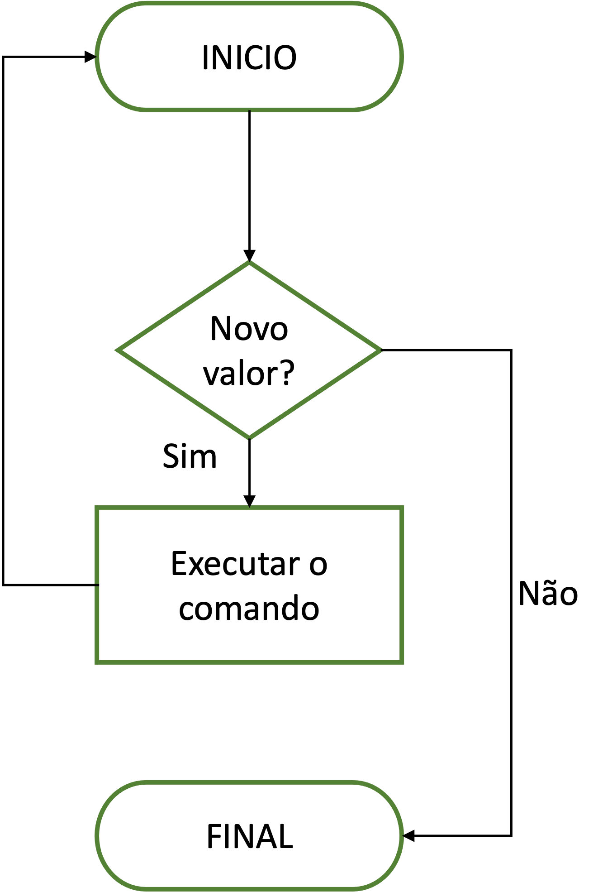
```
---
## `screen`
O `screen` é uma aplicação desenvolvida para linux, que tem como objetivo a multiplexação de terminais. Ou seja, ele divide o terminal físico em várias sessões virtuais. Quando você está trabalhando conectado remotamente a um servidor, e usa o `screen`, você pode deixar os seus processos em execução e desligar seu computador, eles ficaram rodando em *background*.
---
## `screen`
Para iniciar uma sessão: .orange[Input] .code-bg-gray[.can-edit[
```
$ screen -S minhaSessao
```
] ]

Para sair da sessão mantenha apertada a tecla **Ctrl**, enseguida aperte a tecla **a**, seguido da tecla **d**. Para voltar na sessão .orange[Input] 
.code-bg-gray[.can-edit[
```
$ screen -ls #Lista as sessões ativas, caso não lembre o nome
$ screen -r minhaSessao #entra na sessão desejada.
```
]]
---
## `scp` *Secure Copy Between Machines*
`scp` é um comando que permite copiar elementos entre um servidor e seu computador e viceversa.
.code-bg-gray[.can-edit[
```
$ scp origem destino
```
]]
* Exemplo 1: Do servidor para seu computador
.code-bg-gray[.can-edit[
```
$ scp user@143.109.85.222:caminho/ao/arquivo.txt caminho/no/seu/pc
```
]]
* Exemplo 2: Do seu computador para o servidor
.code-bg-gray[.can-edit[
```
$ scp caminho/no/seu/pc/arquivo.txt user@143.109.85.222:caminho/onde/quer/copiar/no/servidor/
```
]]
Se você quiser copiar um diretório completo basta colocar a opção `-r` após o
`scp`
---
class: inverse, center, middle
# ANACONDA

---
## Anaconda

**Anaconda** è uma distribuição livre e aberta de várias linguagens, entre elas *Python* e *R*, utilizada na ciência de dados e bioinformática. As diferentes versões dos programas se administram mediante um sistema de gestão chamado *conda*, o qual faz bastante simples instalar, executar e atualizar programas.

As instruções de instalação de conda estão [aqui](https://conda.io/projects/conda/en/latest/user-guide/install/index.html#regular-installation)

---
## Anaconda
* Ferrmentas de bioinformática escritas em diferentes linguagens e/ou versões.
* Sistema operacional com uma versão só
* Problema na instalação de programas.
* Com Anaconda podem ser criados vários ambientes virtuais com diferentes linguagens e versões

---
## Anaconda
Alguns comando do `conda` são:
.orange[BASH] .code-bg-gray[.can-edit[
```
$ conda create -n meuambiente # cria um ambiente chamado meuambiente
$ conda activate meuambiente # ativa o ambiente meuambiente
$ conda env list # lista todos os ambientes criados
$ conda list # executado dentro de um ambiente, lista as ferramentas instaladas nesse ambiente
```
]]
* Durante o processamento de genômica e metagenômica em linha de comando usaremos conda.

---
class: inverse, center, middle
.huge[ # 3. Estratégias de Análises Genômicas - *Command Line Interface* (CLI) ]

---
## Protocolo de sequenciamento Illumina

--

1. Extração de DNA/RNA

--

2. Verificação da qualidade da extração: Pureza e quantidade

--

3. Preparação das bibliotecas: Fragmentação do DNA, ligação dos adaptadores e opcionalmente dos *barcodes*.

--

4. Preparação dos cluster: ligação dos fragmentos na *flowcell*, amplificação em ponte

--

5. Sequenciamento por síntese: nucleotídeos modificados (fluoróforo e bloqueador removível), laser para a detecção da base: .red[A] .green[T] .blue[C] .yellow[G]

--
6. *Basecalling*: Transformar o sinal de fluorescencia em nucleotídeos .red[A] .green[T] .blue[C] .yellow[G], escritos em um arquivo de texto plano. **O FAMOSO ARQUIVO FASTAQ**

--

... Processamento bioinformático ...

---
## Workflows
```{r, echo=FALSE, fig.align = 'center', out.width = "80%"}
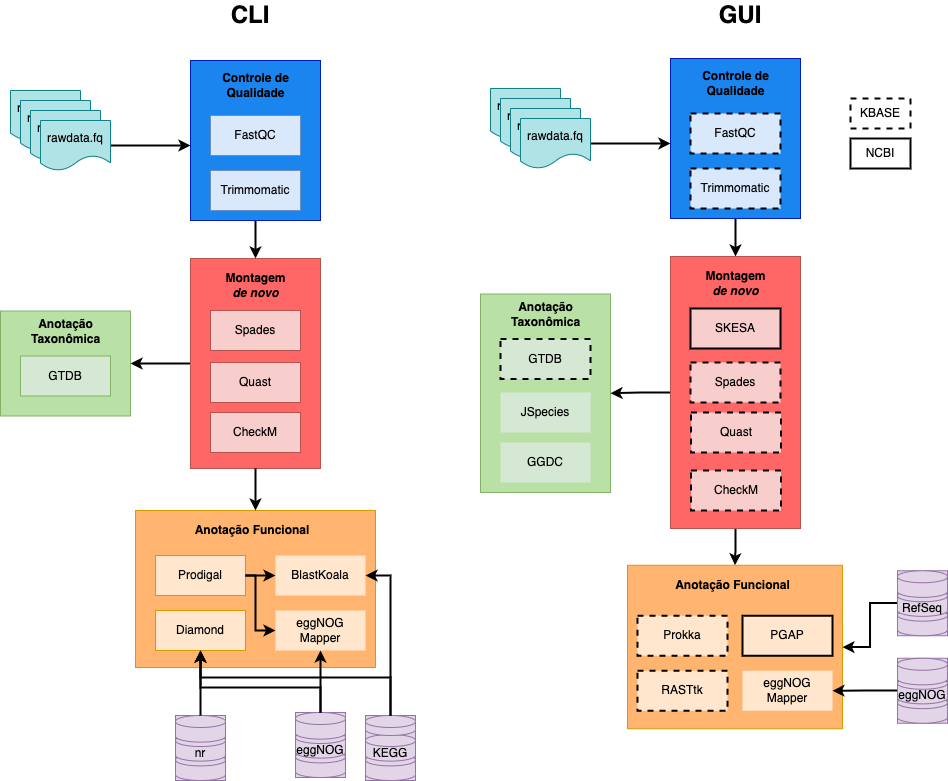
```
---
### Entendendo o arquivo `.fastq` ou `.fq`
```{r, echo=FALSE, fig.align = 'center', out.width = "80%"}
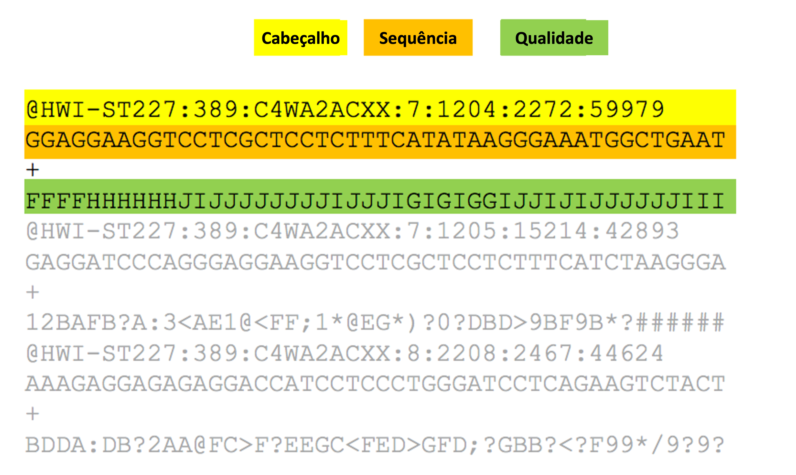
```
* Em sequenciamentos *paired-end*, são dois arquivos, um com as *reads* *forward* e outro com as *reads reverse*.

---
## Lembrando o que significa *paired-end*
```{r, echo=FALSE, fig.align = 'center', out.width = "80%"}
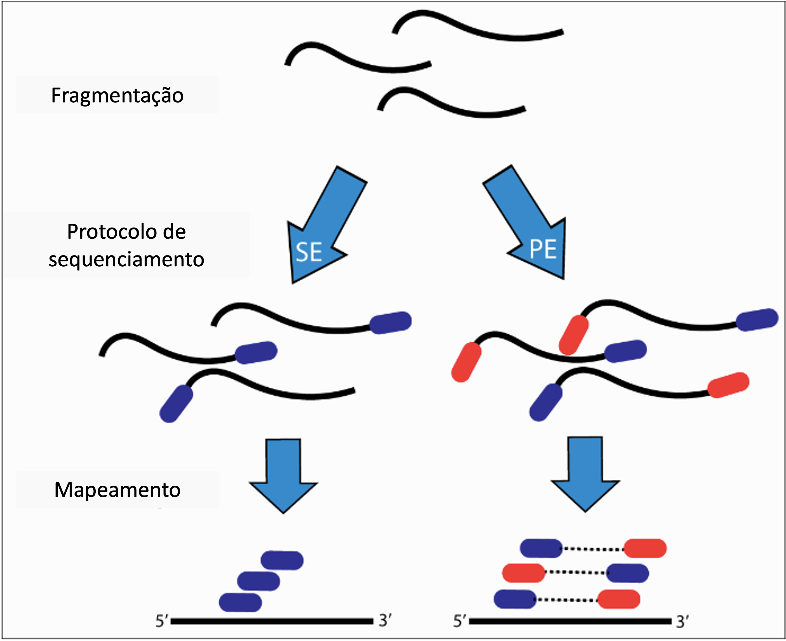
```
---
### Entendendo o arquivo `.fastq` ou `.fq`
```{r, echo=FALSE, fig.align = 'center', out.width = "60%"}
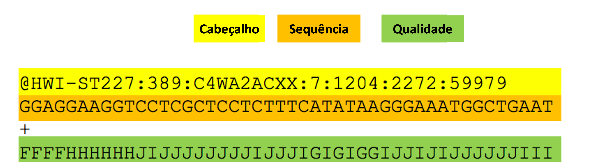
```

--
* Cabeçalho
  * Cada sequência começa com *@*
  * Informação da máquina de sequenciamento (ID)
  * Informação da *flowcell* (ID, coordenadas, bloco)
  * Número do par
  * Sequencia dos adaptadores
  
--

* Sequência
  * Tamanho em Illumina de até 300 bp
  
--

* Símbolo *+*
  * Nem sempre está. A função é separador de informações
  
--

* Qualidade

---
### Phred Quality Score

* A qualidade das sequências está determinada por la nota o *score Phred (q)*

Segundo a seguinte equação:

$$q = -10 * log_{10}(P)$$ 

Onde, 

$q$ é a nota *Phred*

e $P$ é a probabilidade que a base esteja errada.

Assim então:

* $q = 10$ é 1 base errada a cada 10 (90%); $p = 0.1$

* $q = 20$ é 1 base errada a cada 100 (99%); $p = 0.01$

* $q = 30$ é 1 base errada a cada 1000 (99.9%); $p = 0.001$

--

**Mínimo aceitável é** $q > 20$, o **ideal** é $q > 30$

---
### Phred Quality Score
Para facilitar a escrita e leitura da informação de qualidade, é usada a table
*ASCII*, para transformar os dois dígitos da nota *Phred* em um único caráter,
para bater com cada base da sequência.
[ASCII table](https://www.asciitable.com/)

---
## Como avaliar a qualidade das sequências
`FASTQC` é uma ferramenta que permite visualizar a informação de qualidade das
sequências de uma manera gráfica e interativa.

---
## Trimmagem (Filtragem)
É o processo de remoção de `reads` com baixa qualidade. É possível filtrar
sequências baseado no el *score Phred*, remoção de adaptadores, remoção de bases
ao ínicio ou final das sequências. Também é possível trimar por tamanho, por
exemplo eliminar todas as `reads` menores de 50 bp.
Alguns programas:
* Trimmomatic
* Trimgalore
* Fastx tool kit

---
class: inverse, middle, center
## Tempo de colocar em prática!
.center[  ]

---
### Prática I
**Conteúdo**
* Que é conda?
* Instalação de programas
* Importação de sequências
* Análises de qualidade das sequências
* Trimmagem

---
## Workflow
### Avaliação da qualidade com `fastqc`
```{r, echo=FALSE, fig.align = 'center', out.width = "70%"}
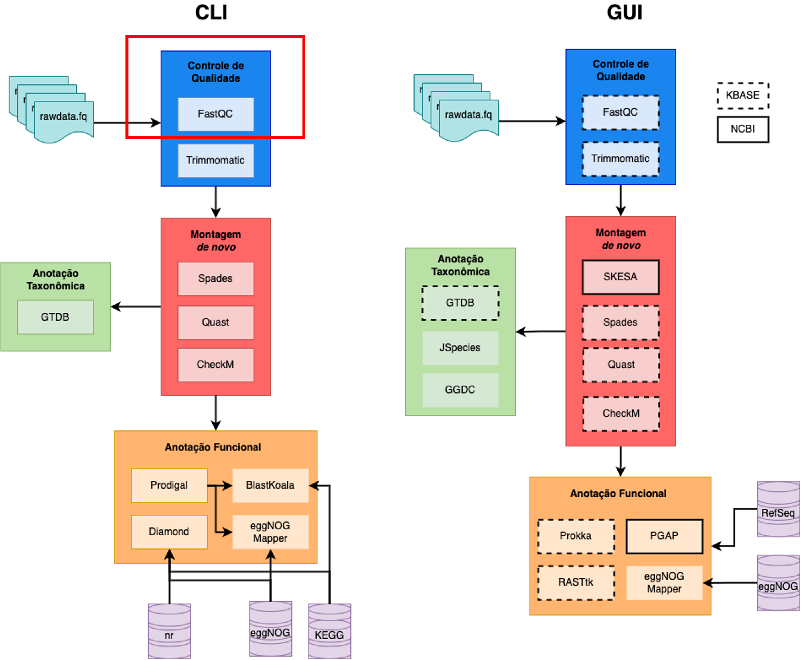
```
---
### Por que é necessário revisar a qualidade das sequências?
Todas etapas do sequenciamento são suceptíveis de ter erros:

--

* Amplificação por PCR

--

* Adição das bases pela polimerase

--

* *Base-calling*

--

* Taxa de erro da Illumina ~0.1%**

--

[**Prática**](https://github.com/khidalgo85/CURSO_SENAI/tree/master#0-organiza%C3%A7%C3%A3o-dos-dados)

---
class: center, middle, inverse

# Montagem de Genomas

---

.center[## Montagem de Genomas *de Novo*]
.center[##Sem referência)]

```{r, echo=FALSE, fig.align = 'center', out.width = "70%"}
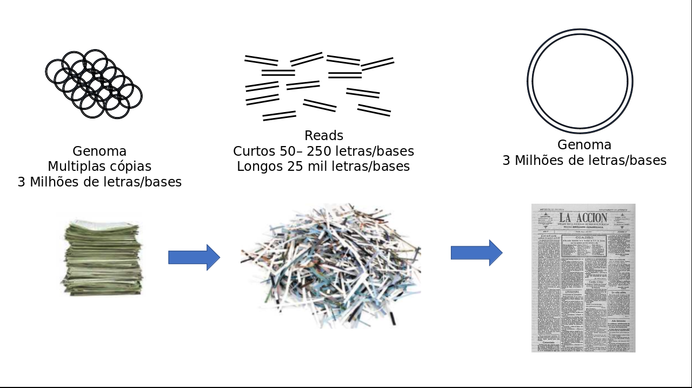
```

* Como é possível re-armar o jornal a partir dos fragmentos?

---
## Mas antes de "montar" o genoma
### Uma consideração importante é a **Cobertura**

A cobertura é quantas vezes em média cada base do genoma foi sequenciada. Pode ser calculado pela seguinte equação:

$$C = (L*N)/G$$

Onde:
$L$ é o tamanho das *reads*,
$N$ é igual ao número de leituras e
$G$ é igual ao tamanho aproximado do genoma

**Exemplo**
Foi sequenciado o genoma de uma bactéria com tamanho aproximado de 2 Mbp. Se obtiveram 3 milhões de *reads* paired end de 100 bp. O cálculo da cobertura para esse genoma é:

$$C = ((100*2)*3.000.000)/2.000.000$$
$$C = 300x$$

Entre maior seja a cobertura a qualidade da montagem também será maior. Para Illumina $100$, PacBio $50x$

> **Desafio**
> Considerando que o nosso genoma exemplo tem um tamanho de genoma aproximado de 4.8 Mbp. Qual seria a cobertura do sequenciamento?

---

### Mas, e que é o que significa "montar" um genoma

A partir dos fragmentos (pedacinhos) armar o genoma (página do jornal). Porém sem molde, como sabemos qual é a ordem das peças? 

.center[

]

---

## A montagem se organiza em:

* Contigs:  Sequências contiguas, formadas pela sobreposição de um conjunto de *reads*

```{r, echo=FALSE, fig.align = 'center', out.width = "70%"}
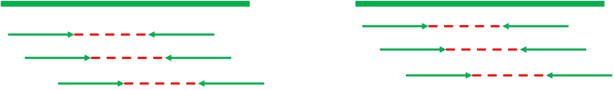
```

* Scaffolds: União de contigs

```{r, echo=FALSE, fig.align = 'center', out.width = "70%"}
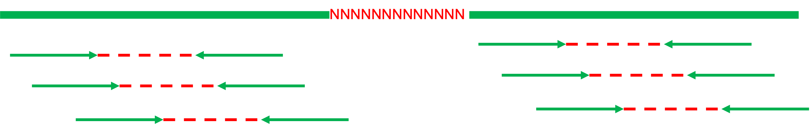
```

---

## Algorítmos

Existem diferentes algorítmos para montar genomas, e devem ser usados segundo o tipo de sequências (curtas ou longas).

.center[

]

---
## O que é um algorítmo?

Sequência de instruções ou comandos realizados de forma sistemática com a finalidade de resolver um problema ou executar uma determinada tarefa. Ou é um conjunto específico de instruções lógicas para executar uma tarefa ou resolver um problema.

**Exemplo: Algorítmo "Dia a dia pro trabalho"**
1. Acordar
2. Tomar banho
3. Vestir-se
4. Tomar café
5. Tirar o carro da garagem
6. Dirigir até o trabalho

---
## O que é um algorítmo?

Sequência de instruções ou comandos realizados de forma sistemática com a finalidade de resolver um problema ou executar uma determinada tarefa. Ou é um conjunto específico de instruções lógicas para executar uma tarefa ou resolver um problema.

```{r, echo=FALSE, fig.align = 'center', out.width = "30%"}
knitr::include_graphics("03.Images/tarefa-algoritmo.png")
```

---
## Algorítmos

Existem diferentes algorítmos para montar genomas, e devem ser usados segundo o tipo de sequências (curtas ou longas).


* Overlap - Layout - Consensus
  * PacBio
  
```{r, echo=FALSE, fig.align = 'center', out.width = "70%"}
knitr::include_graphics("03.Images/olc.png")
```
---
## Algorítmos
* Grafo de De Bruijn
  * Illumina

```{r, echo=FALSE, fig.align = 'center', out.width = "70%"}
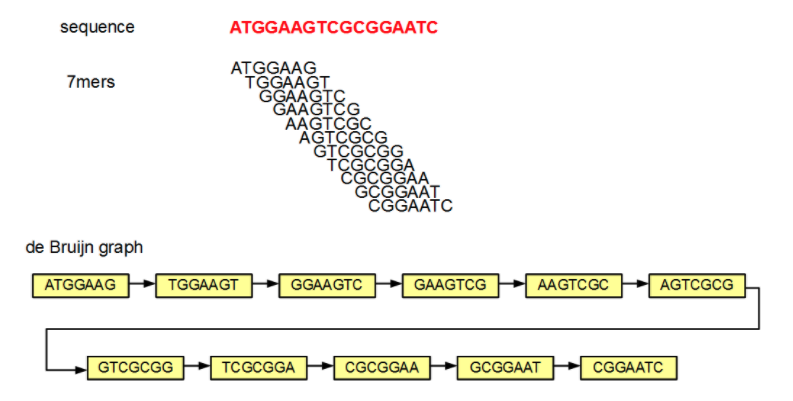
```
---
## *Short reads* vs *Long reads*

```{r, echo=FALSE, fig.align = 'center', out.width = "70%"}
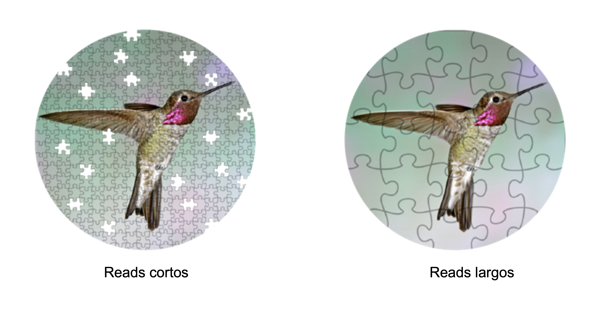
```
---
## As repetições são um grande problema!

```{r, echo=FALSE, fig.align = 'center', out.width = "70%"}

```
---
### *Short reads*

```{r, echo=FALSE, fig.align = 'center', out.width = "70%"}

```
---
### *Long reads*

```{r, echo=FALSE, fig.align = 'center', out.width = "70%"}

```

---
## Resumindo...

1. Entre menores sejam as peças (*short reads*) mais complicado será o processo de montagem
2. Peças maiores (*long reads*) facilitam o processo de montagem
3. Pode ser usado um molde (genoma de referêcia) porém deve ser **muito** próximo.
4. Um genoma de referência "distante" gera montagens errados
5. Genomas com alta porcentagem de repetições são mais difíceis de montar.

---
## Programas para montagem de genomas


* Megahit (sequências curtas)
* Spades (sequências curtas e longas)
* Canu (sequências longas)
* Velvet, SOAP, IDBA, etc.

---
## Como avaliar a qualidade da montagem?

1. Número de contigs 
2. Tamanho dos contigs
3. Tamanho do maior contig
4. N50
5. Tamanho total da montagem
6. Completude/ Contaminação

<font size=3> Programa para avaliar a montagem, QUAST (1-5), BUSCO/CheckM (6) </font>

---
## N50

50% do total de bp que estão no 50% dos contigs.

**Exemplo**

Um genoma de 300 Mbp fou montado em 8 contigs. Os tamanhos dos contigs são: 15 Mbp, 39 Mbp, 24 Mbp, 3 Mbp, 33 Mbp, 45 Mbp, 117 Mbp e 54 Mbp.

1. Ordene de maior a menor os tamanhos dos contigs

> 117, 54, 45, 39, 33, 24, 15, 3, 3

2. Calcule a metade do genoma

> 150 Mbp

3. Some os contigs até passar de 150 Mbp, o tamanho desse contig é o N50
> 54 Mbp

---
class: center, middle, inverse

# Tempo para colocar en práctica!
.center[

]
---

## Práctica II

**Conteúdo**
* Montagem do genoma com Spades
* Avaliação da qualidade da montagem com Quast e CheckM


```{r, echo=FALSE, fig.align = 'center', out.width = "50%"}

```

[**Prática**](https://github.com/khidalgo85/CURSO_SENAI/tree/master#2-montagem-de-novo)
<<<<<<< HEAD
=======

>>>>>>> e55d08db7c7362d5db107eb40b4dc556668ae3f0
